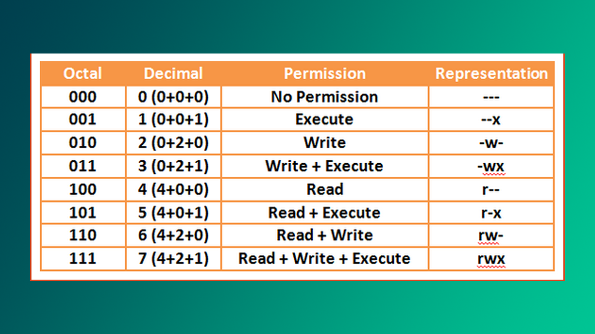

Keling, an'anaga rioya qilgan holda "Salom Dunyo" kodini yozamiz. Terminal oynasini ochib quyidagi buyruqni yozing:

```bash
$ echo "Salom, dunyo!" 
Salom, dunyo!
```

> [!question]- Terminal nima?
> **Terminal** matnli interfeys bo'lib, buyruqlarni kiritish orqali tizim bilan o'zaro muloqot qilish imkonini beradi. Grafik interfeys (GUI) paydo bo'lishidan oldin kompyuter bilan ishlashning yo'li faqat shu edi.

## Parolni yangilash

Linux-da joriy foydalanuvchining parolini o'zgartirish `passwd` (password) buyrug'i yordamida amalga oshiriladi. Agar buyruq **root** tomonidan yozilsa,  u holda faqatgina **root** foydalanuvchisining paroli o'zgaradi.

```bash
$ passwd 
Enter your first password: **** 
Enter your new password: **** 
Password set successfully!
```

>[!info] **root** foydalanuvchisi
>**root** foydalanuvchisi tizimdagi barcha buyruqlar va fayllarga **to'liq** kirish huquqiga ega bo'lgan superfoydalanuvchi hisoblanadi. Buni Windows-dagi admin-ga ham qiyoslash mumkin. 

## Joriy papka

`pwd` (print-working-directory) terminaldagi joriy ishchi manzilini chop etadi. Etibor bering, `$` belgisi oddiy foydalanuvchiga, `#` esa **root** foydalanuvchiga ishora qiladi. 

Terminalda `#` belgisini ko'rsangiz, bilingki, siz tizim ustidan to'liq boshqaruv kuchiga egasiz; xaker sifatida bu katta yutuq hisoblanadi. 🙂

```bash
$ pwd
/home/khumoyun
```

## Papka yaratish & o'chirish

`mkdir` (make-directory) buyrug'i yordamida bir nechta papka yaratish mumkin.

```bash
$ mkdir papka1 papka2 papka3
```

**Bo'sh** papkani o'chirish uchun `rmdir` (remove-directory) buyrug'idan foydalaning. Agar papka bo'sh bo'lmasa, buyruq bekor qilinadi - papka o'chirilmaydi.

```bash
$ rmdir papka1 papka2 papka3
```

**To'ldirilgan** papkani quyidagi buyruq orqali o'chirish mumkin:

```bash
$ rm -r toldirilgan-papka
```

Ya'ni, bu yerda `-r` (recursive) opsiyasi papka ichidagi fayllarni hammasiga `rm` buyrug'ini beradi.

>[!tip]- `rm -i`
>`rm -i` bilan foydalanuvchi har bir fayl o‘chirilishidan oldin tasdiqlash uchun so‘rov oladi.

## Fayllarni ro'yxatlash

```bash
$ ls
```

Agar `-l`  (long-listing) opsiyasini qo'shsangiz, u ruxsatlar (permissions), o'zgartirilgan sana (last-modified-date), fayl yoki papkaga egalik qiluvchi kimsalar (owners) va boshqa ma'lumotlarni ko'rsatadi.

```bash
$ ls -l
total 36
drwxr-xr-x  4 khumoyun khumoyun 4096 Aug  7 19:10 Desktop
drwxr-xr-x  3 khumoyun khumoyun 4096 Aug  7 16:40 Documents
drwxr-xr-x  2 khumoyun khumoyun 4096 Aug  7 01:32 Downloads
...
```

Odatda, `ls` buyrug'i yashirin fayllarni ko'rsatmaydi chunki ular ko'pincha ahamiyatsiz. Buni ustiga, ekranda ortiqcha joy egallaydi. Yashirin fayllarni majburiy ko'rsatish uchun `-a` (all) opsiyasini yozish kifoya.

```bash
$ ls -a
```

Ba'zan siz fayl nomlarini qatorma-qator (ortiqcha ma'lumotlarsiz) ekranga chiqarishni hoxlaysiz:

```bash
$ ls -1
```

Natija (faraziy):

```
file1.txt 
file2.txt 
papka1 
papka2 
rasm.png 
script.sh
```

### Qiziq xolat

Hmm, biz `ls / > list.txt` buyrug'i "list.txt" ichiga quyidagicha natijani kiritishini kutamiz:

```
bin   dev  home  lib32  libx32      media  opt   root  sbin  srv       sys  usr
boot  etc  lib   lib64  lost+found  mnt    proc  run   snap  swap.img  tmp  var
```

Lekin aslida:

```
bin
boot
dev
etc
home
lib
lib32
lib64
libx32
lost+found
media
mnt
...
```

Yuqoridagi variant dasturchilarga qulayroq bo'lgani sababli, faylga huddi shunday tartibda yoziladi. O'ylab ko'ring, agar fayl nomlari qatorma-qator yozilsa, ularni manipulatsiya qilish ancha ossonroq bo'ladi. Masalan, pentesterlar ishlatadigan wordlist-ni oling. 

>Ko'rinib turibdiki, ba'zi buyruqlarning natijalari faylga siz kutgandek yo'naltirilmaydi va buning ortida "yaxshiroq" sabab bor.

## Standart chiqish

stdout ya'ni "standart output" - dastur chiqish ma'lumotlarini yozadigan oqimdir. Odatda, buyruq natijalari ekranda ko'rinadi, ammo ularni keyinchalik ishlov berish uchun faylga yoki umuman boshqa buyruqga ham yo'naltirsak bo'ladi.

Quyidagi buruq `yangi-fayl.txt` nomli fayl ichiga "bu oddiy satr" matnini kiritadi. Diqqat, agar fayl mavjud bo'lmasa, yangisi yaratiladi; agar fayl ichida biror nima bo'lsa, u **qaytadan yoziladi**:

```bash
$ echo "bu oddiy satr" > yangi-fayl.txt
```

Faylga qo'shib yozish `>>` ishorasi yordamida amalga oshiriladi:

```bash
$ echo "bu oddiy satr" >> yangi-fayl.txt
```

Shunday qilib, fayl ichida:

```
bu oddiy satr
bu oddiy satr
```

Tushunarli, lekin natijani qanday qilib bir nechta fayllarga bir vaqtning o'zida yozish mumkin, deb so'rasangiz, bu juda ham oddiy:

```bash
$ dastur | tee file1.txt file2.txt
```

> [!info] `tee` buyrug'i 
> Dastur natijasini bir yoki bir nechta manzillarga yozadi. Pipe operatori (|) dastur-dan chiqqan natijani `tee` buyrug'iga yo'naltirmoqda. Usbu operator haqida keyingi darslarda batafsil to'xtalib o'taman.

## Faylni nusxalash

Faylni nusxalash:

```bash
$ cp fayl ../masofa/fayl
```

>[!tip] `./masofa/fayl` o'rniga shunchaki `./masofa/` deb yozsangiz ham bo'ladi.

Bir nechta fayllarni nusxalash:

```bash
$ cp fayl1 fayl2 fayl3 fayl4 masofa/
```

Bo'sh papkani nusxalash:

```bash
$ cp papka ../masofa/papka
```

Bo'sh bo'lmagan papkani nusxalash, `-r` (recursive) opsiyasi bilan:

```bash
$ cp -r papka masofa/
```

## Fayl qidirish

Bizga kerakli buyruq ba'zi distributivlarda mavjud emas. Shu sababli, `apt` yoki o'zingiz foydalanayotgan distributivda mavjud bo'lgan paket menejeridan `plocate` dasturini o'rnating.

```bash
$ sudo apt install plocate
$ locate hi.txt
/root/hello/hi.txt
```

>[!info] `sudo` - super user do
>Sizga vaqtinchalik admin vazifalarni bajarish uchun imtiyoz beradi. Esingizda bo'lsin: *katta kuch katta mas'uliyat talab qiladi* - undan oqilona foydalaning!

Agar u siz qidirayotgan narsani topolmasa, ma'lumotlar bazasini yangilang:

```bash
$ updatedb
$ locate hi2.txt
/root/hello/hi2.txt
```

>[!info] Ilova menejeri 
>Dastur o'rnatish, yangilash, sozlash va o'chirish uchun mo'ljallangan dastur. `apt` - Ubuntu kabi Debian-ga asoslangan tizimlar uchun standart paket menejeri.

## Fayl ruxsatlari

Linux-da fayl yoki papkani kim o‘qishi, yozishi yoki bajarishi mumkinligini belgilash mumkin.

- **D**: Katalog (jild)
- **L**: Havola (yorliq)
- **F**: Fayl

Masalan, `ls -l` fayl ruxsatlarini bunday ko'rsatadi:

```
dr-xr-x---
```

Bu yerda `d` papkani bildiradi.

1. `r-x` - egasi faylni o‘qiy oladi (r) va dastur sifatida ishga tushira oladi (x), lekin yoza olmaydi (-).
2. `r-x` - guruh a’zolari faylni o‘qiy oladi (r) va dastur sifatida ishlata oladi (x), ammo yoza olmaydi (-).
3. `---` - boshqalar faylni o‘qiy olmaydi (-), yoza olmaydi (-), va ishga tushira olmaydi (-).

>[!info] Yozish va bajarish
>Faylni yozish deganda uni o'chirishni ham nazarda tutamiz. Papkaga kirishning o'zi ham bajarish hisoblanadi.

Pastdagi jadvalni yodlab olishni maslahat beraman - juda kerak bo'ladi:



## Ruxsatlarni o'zgartirish

Yuqoridagi jadvalga qarab, fayl yoki papkaning ruxsatlarini o‘zgartirsak bo'ladi. Faylni bajariladigan qilish quyidagicha amalga oshiriladi (siz uni xuddi Windows-dagi  `.exe` yoki `.bat` fayllari singari dastur sifatida ochishingiz mumkin):

```bash
$ chmod +x fayl_nomi.sh
```

Boshqa foydalanuvchilar shaxsiy malumotlaringizni o'qishini oldini olish (root-dan tashqari):

```bash
$ chmod 600 shaxsiy.txt
```

"6" - faqat siz ya'ni ega yozish va o'qishi mumkin.
"00" - gurux a'zolari hamda boshqalar uchun hech qanday ruxsat yo'q.

## Eng xavfli buyruq

Hech kimga **o‘qish + yozish + bajarish** ruxsatini bermang - bu juda katta xato. Tizimga ruxsatsiz kirib olgan begona shaxslar fayllarni o‘zgartirish va dasturlarni ishga tushirish imkoniyatiga ega bo‘ladi, bu esa xavfsizlikka jiddiy tahdid soladi.

```bash
$ chmod 777 file.txt
$ # Yoki
$ chmod guo+rwx file.txt
```

 `777` ruxsatini berish xuddi "Xakerlar, marhamat, kiravering!" degan yozuvni osib qo‘yishga o'xshaydi. 🙂 

>[!info] Bilib qo'ygan yaxshi
>Yuqoridagi buyruq tushunarsiz bo'lsa ham, uni eslab qoling va kelajakda foydalanmang.

## Foydalanuvchi qo'shish va o'chirish

Foydalanuvchi qo'shish juda oddiy. Quyidagi buyruqni kiriting so'ngra siz foydalanuvchi uchun yangi parol o'rnatishingiz va bir nechta ixtiyoriy savollarga javob berasiz. Ushbu vaziyatda Khumoyun ismli foydlanuvchi yaratildi:

```bash
$ adduser Khumoyun
```

Foydalanuvchini o'chirib tashlash:

```bash
$ deluser Khumoyun
```

## Foydalanuvchilarni almashtirish

`su` (switch-user) buyrugi yordamida siz kompyuteringizdagi istalgan foydalanuvchining hisobiga kirishingiz mumkin. Agar **root** foydalanuvchisiga o'tayotgan bo'lsangiz, `sudo`  ishlatishingiz zarur.

```bash
$ sudo su root
```

Enter bosib root parolini tering.

## `/etc/passwd`

`/etc/passwd` fayli tizimga kirishda zarur bo'lgan ma'lumotlarni, ya'ni foydalanuvchilarning hisob ma'lumotlarini saqlaydi (nom, shifrlangan parol, UID va h.k). Batafsil [bu yerda](https://www.cyberciti.biz/faq/understanding-etcpasswd-file-format/)

## `/etc/shadow`

`/etc/shadow` faylida barcha parollaringiz shifrlangan formatda saqlanadi. Faylni faqat root foydalanuvchisi ko'ra oladi. 

`Hashcat` va `JohnTheRipper` kabi dasturlar shifrlangan parollarni buzish uchun ishlab chiqilgan.  Parol qanchalik kuchli bo'lsa, buzish shunchalik murakkab. Masalan, parol 8 ta harf va raqamdan iborat bo'lsa, uni buzish uchun bir necha daqiqadan bir necha soatgacha vaqt ketishi mumkin. Lekin, agar parol 12 ta harf, raqamlar va maxsus belgilarni o'z ichiga olsa, buzish uchun yuzlab yillar kerak bo'ladi! Shuning uchun murakkab va uzun parollarni tanlash xavfsizlikni oshiradi.

## `/var/log/auth.log`

Bu fayl tizimga kirgan/chiqqan foydalanuvchilar ro'yxatini saqlaydi. Quyidagi buyruq har soniyada `auth.log` tarkibini ekranga chiqarib turadi:

```bash
$ watch "cat /var/log/auth.log"
```

>[!info] `watch` real vaqtda o'zgarishlarni kuzatib borishda yordam beradi.

## Sizning ikkinchi eng yaxshi do'stingiz...

Ba'zi buyruqlar yoki opsiyalarning tariflarini unutishingiz mumkin, ammo `man` deyarli barcha buyruqlarni yetarlicha tavsifini offline tarzda chiqarib beradi. Bu Google'dan keyingi ikkinchi eng yaxshi do'stingiz 🙂

```bash
$ man buyruq_nomi
```

Shuni yodda tutish kerakki, `man` ba'zi buyruqlar tavsifini chiqarmaydi, masalan `cd`, `exit`, `source`, `type`, `export` va hokazo. Nega bunday deb o'ylaysiz?

>[!tip] **q** tugmasini bosib `man` sahifasidan chiqish mumkin.

## Linux buyruqlari - cheatsheet

Ba'zi buyruqlar esingizdan chiqishi mumkin, shu sababli ushbu cheatsheet-ni o'rnatib olishni maslahat beraman: **["cheatsheet" uchun xavola](https://raw.githubusercontent.com/comoyun/linux-guide/main/images/linux-commands-cheatsheet.png)**

```bash
$ alias cheatsheet="$(xdg-open '/.../cheatsheet.png')"
```

`alias` - taxallus ya'ni uzun buyruqlar uchun yorliq. Bu sizga tezroq yozish uchun qisqa buyruqlar yaratish imkonini beradi. Misol uchun, ob-havoni `wtr` maxsus buyrug'i orqali ko'rsatadigan yorliq: `alias wtr='curl https://wttr.in/Fergana'`

Agar buyruqni bir nechta terminal seanslarida ishlashini hoxlasangiz, uni uy manzilida joylashgan `.bashrc` faylining ichiga qo'shib qo'ying. Darvoqe, `.bashrc` fayli terminal oynasi ochilganda birgalikda ishga tushadigan skript hisoblanadi.

## Samaradorlikni oshiring

1. **CTRL + L** - terminal oynasini tezkor tozalaydi
2. **CTRL + U** - kursordan chapga tozalaydi
3. **CTRL + K** - kursordan o'ngga tozalaydi
4. **CTRL + A** - kursorni satr boshiga qo'yadi
5. **CTRL + E** - kursorni satr oxiriga qo'yadi
6. **CTRL + ALT + T** - terminal oyna ochadi
7. **SUPER + TAB** - oynalarni tezkorlik bilan alishtiradi
8. **CTRL + ALT + STRELKA** - boshqa ish maydoniga olib o'tadi

---

## Topshiriq

1. **Terminalda navigatsiya**  
   Navigatsiya qilishni mashq qiling. Papkalarga sakrash, joriy papkani aniqlash kabilar. 

2. **Fayllar yaratish**  
   Quyidagi fayllarni yarating va har bir faylga `echo` buyrug'i yordamida ixtiyoriy matn yozing:
   - `main.py`
   - `utils.py`
   - `config.py`

3. **Fayllarni o'chirish**  
   Yaratilgan papkalar va fayllarni o'chiring. 

**Keyingi dars:** [[02-dars]]