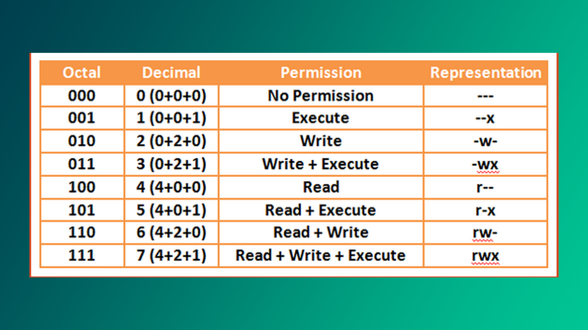
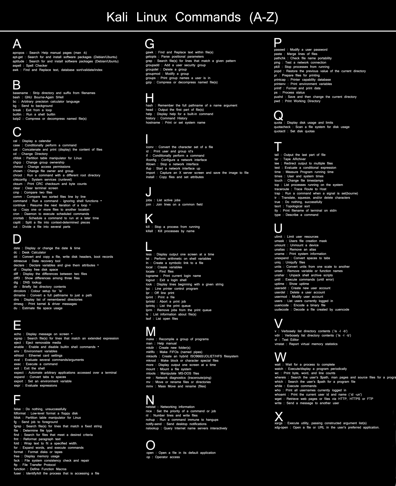

## Salom, dunyo!

Keling, an'anaga rioya qilgan holda "Salom Dunyo" dasturini yozamiz. Kompyuteringizda terminal oynasini ochib quyidagi buyruqni kiriting. (`CTRL` + `ALT` + `T`)

```bash
$ echo "Salom, dunyo!"
Salom, dunyo!
```

## Foydalanuvchi parolini o'zgartirish

Linuks'da joriy foydalanuvchi parolini o'zgartirish `passwd` buyrug'i yordamida amalga oshiriladi. U birinchi navbatda avvalgi parolingizni so'raydi; to'g'ri kiritsangiz, parol yangilanadi. Agar buyruq **"root"** foydalanuvchi tomonidan berilsa,  u holda **"root"** foydalanuvchisining paroli o'zgartiriladi. 

~~~bash
$ passwd
Enter your first password: ****
Enter your new password: ****
Password set successfully!
~~~

## Joriy katalogni chop etish

`pwd` (print-working-directory) terminaldagi joriy ishchi manzilini chop etadi. 

~~~bash
$ pwd
/home/khumoyun
~~~

## Papka yaratish & o'chirish

`mkdir` (make-directory) buyrug'i yordamida bir nechta bo'sh papka yaratishingiz mumkin.

```bash
$ mkdir papka1 papka2 papka3
```

Bo'sh papkani o'chirish uchun `rmdir` buyrug'idan foydalaning. Agar papka bo'sh bo'lmasa, buyruq bekor qilinadi - papka o'chirilmaydi.

```bash
$ rmdir papka1 papka2 papka3
```

## Fayl & papkalarni ro'yxatini olish

```bash
$ ls
```

Agar siz `-l`  (long-listing) optsiyasini qo'shsangiz, u ruxsatlar (permissions), o'zgartirilgan sana (last-modified-date), fayl yoki papkaga egalik qiluvchi foydalanuvchilar (owners) va boshqa foydali ma'lumotlarni o'z ichiga oladi.

```bash
$ ls -l
total 36
drwxr-xr-x  4 khumoyun khumoyun 4096 Aug  7 19:10 Desktop
drwxr-xr-x  3 khumoyun khumoyun 4096 Aug  7 16:40 Documents
drwxr-xr-x  2 khumoyun khumoyun 4096 Aug  7 01:32 Downloads
...
```

Odatda, `ls` buyrug'i yashirin fayllarni ko'rsatmaydi. Yashirin fayllarni ham ko'rish uchun `-a` (all) opsiyasini qo'shishingiz kerak.

## StdOut'ni faylga yo'naltirish

Quyidagi buruq `new_file.txt` nomli fayl ichiga **"this is string"** matnini kiritadi. Diqqat, agar joriy katalogda ushbu fayl mavjud bo'lmasa, u yangi yaratiladi. Agar fayl ichi bo'sh **bo'lmasa**, fayl qaytadan yoziladi (eski kontent o'chirilib tashlanadi).

```bash
$ echo "this is string" > new_file.txt
```

Faylga qo'shish quyidagi buyruq yordamida amalga oshiriladi:

```bash
$ echo "this is string" >> new_file.txt
```

Natija:

```new_file.txt
this is string
this is string
```

## Fayl/papkalarni nusxalash

Faylni nusxalash:

```bash
$ cp file ../destination/path/file
```

Bo'sh bo'lmagan papkani nusxalash:

```bash
$ cp folder ../destination/path/folder
```

## Fayl/papkani qidirish

Biz ko'rib chiqmoqchi bo'lgan buyruq ba'zi Linux distro'larida mavjud bo'lmasligi mumkin:

```bash
$ sudo apt install plocate
$ locate hi.txt
/root/hello/hi.txt
```

Agar u siz qidirayotgan narsani topib berolmasa, ma'lumotlar bazasini yangilang.

```bash
$ updatedb
$ locate hi2.txt
/root/hello/hi2.txt
```

## Fayl/papka permissions (ruxsatlar)

**Sintaks:**
	*FAYL TIPI + FOYDALANUVCHI RUXSATLARI + GURUX RUXSATLARI + BOSHQALAR*

**Fayl tiplari:** 
- **D**: directory (papka)
- **L**: link (havola)
- **F**: file (fayl)

**Misol:** 

```
dr-xr-x---
```



## Ruxsatlarni o'zgartirish 

Yuqoridagi tablitsaga qarab, faylni boshqa foydalanuvchilar tomonidan bajarilish yoki o'qilmasligini belgilashingiz mumkin. Faylni bajariladigan qilish quyidagicha:

```bash
$ chmod +x file_name.sh
```

Siz boshqa foydalanuvchilarning shaxsiy malumotlaringizni o'qishini oldini olishingiz mumkin:

```bash
$ chmod 600 shaxsiy.txt
```

## Eng xavfli buyruq

Hech kimga o'qish+yozish+bajarish ruxsatini bermang, bu juda katta xato.

```bash
$ chmod 777 file.txt 
$ chmod guo+rwx file.txt
```

## Foydalanuvchi qo'shish/o'chirish

Foydalanuvchi qo'shish juda oddiy. Quyidagi buyruqni kiriting so'ngra siz foydalanuvchi uchun yangi parol o'rnatishingiz va bir nechta ixtiyoriy savollarga javob berishingiz kerak bo'ladi. Quyida Bob ismli foydlanuvchi yaratiladi:

```bash
$ adduser Bob
```

Foydalanuvchini o'chirib yuborish:

```bash
$ deluser Bob
```

## Foydalanuvchilarni almashtirish

`su` (switch-user) buyrugi yordamida siz istalgan foydalanuvchiga otishingiz mumkin. E'tibor bering, agar siz root foydalanuvchisiga o'tayotgan bo'lsangiz, sudo qo'shishingiz kerak.

```bash
$ sudo su root
```

Enter bosilgach, sizdan "root" foydalanuvchisining paroli so'raladi.

## /etc/passwd

**/etc/passwd** fayli tizimga kirishda zarur bo'lgan ma'lumotlarni saqlaydi. Boshqacha qilib aytganda, u foydalanuvchilarning hisob ma'lumotlarini saqlaydi. **/etc/passwd** oddiy matnli fayldir.  U har bir hisob uchun foydalanuvchi identifikatori, guruh identifikatori, uy katalogi, qobiq va boshqalar kabi foydali ma'lumotlarni taqdim etadi. Batafsil [bu yerda](https://www.cyberciti.biz/faq/understanding-etcpasswd-file-format/)

## /etc/shadow

**/etc/shadow** faylida barcha parollaringiz shifrlangan formatda saqlanadi. Faylni faqat "root" foydalanuvchisi ko'rishi mumkin.

**P.S.** Hashcat va JohnTheRipper kabi dasturlar xeshlangan parollarni buzish uchun qo'llaniladi. Parol qanchalik kuchli bo'lsa, shuncha yaxshi.

## /var/log/auth.log

Ushbu fayl tizimga kirgan va chiqayotgan foydalanuvchilarni kuzatib boradi. Quyidagi kod har soniyada auth.log faylining kontentini chiqaradi.

```bash
$ watch "cat /var/log/auth.log | grep 'khumoyun'"
```

## Sizning ikkinchi eng yaxshi do'stingiz...

Siz ba'zi buyruqlar yoki optsiyalarni unutishingiz mumkin, ammo `man` buyrug'i deyarli barcha buyruqlarni yetarlicha tavsifini chiqarib beradi. Bu Google'dan keyingi ikkinchi eng yaxshi do'stingiz. Sintaksi quyidagicha:

```bash
$ man kerakli_kommanda_shu_yerda
```

**Q** tugmasini bosish orqali "man" sahifasidan chiqish mumkin.

## Foydali

1. **CTRL + L** - terminalni tezkor tozalaydi
2. **CTRL + U** - kursordan chapga tozalaydi
3. **CTRL + K** - kursordan o'ngga tozalaydi
4. **CTRL + A** - kursorni satr boshiga qo'yadi
5. **CTRL + E** - kursorni satr oxiriga qo'yadi
6. **CTRL + ALT + T** - yangi terminal oyna ochish 
7. **SUPER + TAB** - oynalarni tezkorlik bilan alishtirish
8. **CTRL + ALT + ARROW_KEYS** 

## Linux buyruqlari - cheatsheet

Siz ushbu kodni `.bashrc` fayl ichiga qo'shishingiz va uni terminalda buyruq sifatida ishlatishingiz mumkin:

```bash
alias cheatsheet="$(xdg-open '/path/to/image.png')"
```



[02-kun >](02-kun.md)
