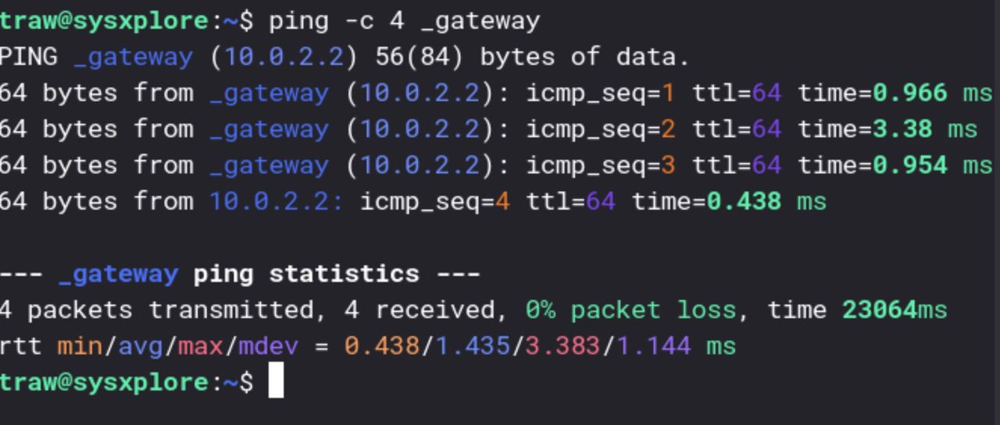

---
tags:
  - tarmoq
  - ping
title: 02 - Tarmoq Buyruqlari
description: Ushbu darsda terminal orqai IP manzillar va mavjud Wi-Fi adapterlar ro'yhatini olishni o'rganamiz.
sort: 2
---
## Tarmoq ma'lumotlarini ko'rsatish

Mahalliy IP manzilingizni Windows'dagi `ipconfig` buyrug'iga o'xshash tarzda ko'rsatish uchun Linux tizimida quyidagi buyruqlardan foydalanishingiz mumkin:

```bash
$ ifconfig
```

Yoki, yanada zamonaviy va ko'proq tarqatmalarda mavjud bo'lgan buyruq:

```bash
$ ip a
```

Muayyan Wi-Fi adapteri haqida ma'lumot olish uchun:

```bash
$ ifconfig wlan0
```

Agar `ifconfig` o'rnatilmagan bo'lsa, `ip` buyrug'idan foydalanishingiz mumkin yoki `sudo apt install net-tools` buyrug'i orqali `ifconfig` dasturini o'rnatishingiz mumkin.

## Xost tirik yoki yo'qligini tekshirish

Xostning tirik yoki yo'qligini tekshirish uchun `ping` buyrug'ini ishlating:

```bash
$ ping localhost
PING localhost (127.0.0.1) 56(84) bytes of data.
64 bytes from localhost (127.0.0.1): icmp_seq=1 ttl=64 time=0.030 ms
64 bytes from localhost (127.0.0.1): icmp_seq=2 ttl=64 time=0.039 ms
64 bytes from localhost (127.0.0.1): icmp_seq=3 ttl=64 time=0.040 ms
^C
--- localhost ping statistics ---
3 packets transmitted, 3 received, 0% packet loss, time 2050ms
rtt min/avg/max/mdev = 0.030/0.036/0.040/0.004 ms
```

`localhost` **127.0.0.1** bilan barobar. Ba'zilar `ping` buyrug'ini xostning IP manzilini aniqlash uchun ishlatadilar.

> `ping` dasturidan chiqish uchun **CTRL + C** tugmalarini bosing yoki `ping -c 3 localhost` buyrug'ini bering, shunda dastur 3 marta so'rov yuboradi va tamomlagach avtomatik chiqadi.

### Bilarmidingiz?



Linux-da `ping` buyrug'i yordamida shlyuz IP manzilini osongina topish mumkin:

```bash
$ ping _gateway
```

## IP manzillarni MAC manzillari bilan bog'lash

MAC manzillar ARP keshida saqlanadi. Ko'rish uchun quyidagi buyruqni kiriting:

```bash
$ arp -a
Internet Address       Physical Address       Type
192.168.1.1            00-11-22-33-44-55     dynamic
192.168.1.10           10-22-33-44-55-66     dynamic
192.168.1.20           20-33-44-55-66-77     dynamic
```

Kompyuterdagi ochiq portlar va ular bilan bog'langan dasturlarni bilish uchun `netstat` buyrug'idan foydalaning:

```bash
$ netstat -tul
```

- **-t**: TCP bog'lanishlarini ko'rsatadi.
- **-u**: UDP bog'lanishlarini ko'rsatadi.
- **-l**: Faqat ochiq portlarni ko'rsatadi.

## Buyruqlar tarixini qanday ko'rish mumkin?

Buyruqlar tarixini ko'rish uchun:

```bash
$ history
  1  sudo apt update
  2  sudo apt upgrade
  3  clear
  4  history
```

Yoki `.bash_history` faylini ko'rish orqali:

```bash
$ cd ~
$ cat .bash_history
```

Tarixni tozalash uchun:

```bash
$ history -c
$ history
```

**Eslatma**: Tarixni tozalashdan so'ng, `history` buyrug'i hech qanday tarix ko'rsatmaydi.

## "Uy"ga qaytish

`cd` (change-directory) buyrug'i orqali terminalni istalgan manzilga yo'naltirishingiz mumkin. Uyga qaytish uchun:

```bash
$ cd ~
```

Siz `cd` buyrug'ini hech qanday argumentlarsiz yozish orqali ham bir xil natijaga erishishingiz mumkin.

```bash
$ pwd
/home/khumoyun/Downloads/never-gonna-give-you-up/
$ cd
$ pwd
/home/khumoyun
```

## Fayl kontentini ko'rish

`cat` (concatenate) asosan fayllarni bir-biriga bog'lash uchun ishlatiladi, lekin kichik fayllar ichidagi kontentni ko'rish uchun ham ishlatishingiz mumkin:

```bash
$ echo "Linux ajoyib!" > linux.txt
$ cat linux.txt
Linux ajoyib!
```

Fayllarni bir-biriga bog'lash (natija `file-4.txt` bo'ladi):

```bash
$ cat file.txt file-2.txt file-3.txt > file-4.txt
```

**Eslatma**: Katta fayllar uchun `less` yoki `more` buyruqlarini ishlatish tavsiya etiladi.

## Bo'sh bo'lmagan papkalarni o'chirish

Bo'sh bo'lmagan papkalarni o'chirish uchun:

```bash
$ rm -rf papka papka2 papka3
```

Bu yerda:

- **-r** (recursive) optsiyasi: Kataloglar va ularning tarkibidagi fayllarni o'chirish imkonini beradi.
- **-f** (force) optsiyasi: Majburiy o'chirishni bildiradi va ogohlantirishlarsiz davom etadi.

## Linux - `touch`

`touch` buyrug'i fayl yaratishdan tashqari, mavjud faylning oxirgi o'zgartirilgan sanasini yangilash uchun ishlatiladi:

```bash
$ ls -l grass
-rw-rw-r-- 1 khumoyun khumoyun 1044 Aug  6 22:45 grass
$ touch grass
$ ls -l grass
-rw-rw-r-- 1 khumoyun khumoyun 1044 Aug 12 05:16 grass
```

## Linux - `nano`


`nano` - bu terminaldagi kod muharriri. U turli kengaytmadagi fayllarni qo'llab-quvvatlaydi: `.py`, `.js`, `.html`, `.c`, `.sh` va boshqalar.

```bash
$ nano hello-world.py
```

- `nano` dasturidan chiqish uchun: **CTRL + X**
- `nano` haqida ko'proq ma'lumot olish uchun: `man nano`

Agar `nano` kompyuteringizda o'rnatilmagan bo'lsa, quyidagi buyruqlarni bajarishingiz mumkin:

```bash
$ sudo apt update
$ sudo apt upgrade
$ sudo apt install nano
```

## Samaradorlikni oshirish

- **CTRL + SHIFT + T** (terminalda) - Yangi terminal "tab" ochish
- **ALT + F4** - Aktiv oynani yopish
- **CTRL + TAB** (brauzerda) - Tablarni almashtirish
- **CTRL + Pg Up** (brauzer + terminal) - Tablarni chapga/o'ngga almashtirish
- **ALT + 1..9** (brauzer + terminal) - Tablarni indeks bo'yicha almashtirish

---

## Topshiriq

1. **Tarmoq Ma'lumotlari**  
   - Kompyuteringizning tarmoq interfeyslarining ma'lumotlarini olish uchun ishlatishingiz mumkin bo'lgan buyruqlarni aniqlang va ularning qanday natijalarni ko'rsatishini tushuntiring.
   
2. **xumoyun.uz serverini `ping` qiling**  

3. **ARP Keshini Tekshirish**  
   - IP manzillar va MAC manzillar orasidagi farqlarni aniqlang. ARP keshini qanday ko'rish mumkin?

**Keyingi dars:** [[03-dars]]