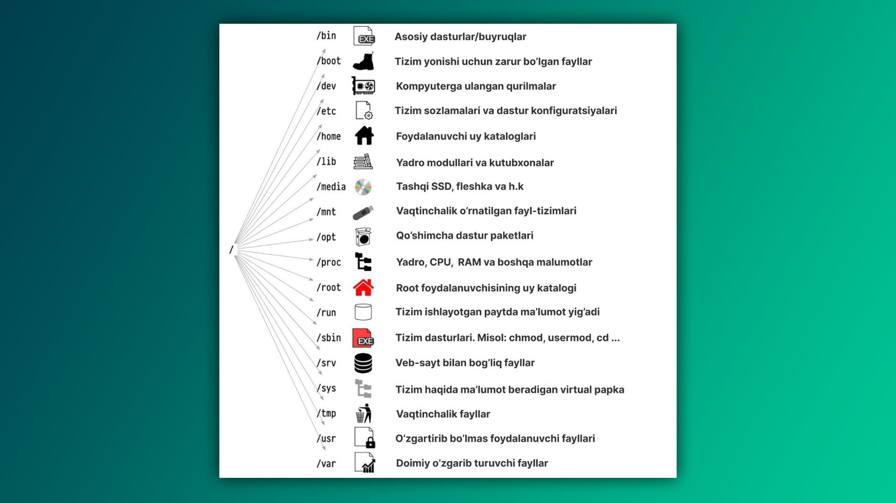

Linux fayl tizimi haqiqatan ham ajoyib, chunki barcha tarmoq tizimlari, disklar va USB drayvlar fayl ko'rinishida ifodalanadi. Misol uchun, Windows'dagi **C** drayver, **D** drayver va h.k. Linux-ning `/dev/` (devices) katalogida oddiygina fayl sifatida ko'rinadi.

>[!info] Sezgir nomlar
>Barcha fayl nomlari katta-kichik harflarga sezgir, ya'ni `/boot`, `/Boot` va `/BOOT` uchta **turli** papkani ifodalaydi.


| Papka         | Tavsif                                                                                                                |
| ------------- | --------------------------------------------------------------------------------------------------------------------- |
| `/home`       | Shaxsiy papkangiz. Sizga tegishli fayllar va dasturlar shu yerda saqlanadi.                                           |
| `/var`        | Vaqt o'tishi bilan o'zgaradigan, tartibsiz fayllar bilan to'la joy.                                                   |
| `/tmp`        | Vaqtinchalik fayllar saqlanadigan joy.                                                                                |
| `/usr`        | Dasturlar foydalanadigan kutubxonalar joylashgan.                                                                     |
| `/root`       | Super foydalanuvchining (root) uy papkasi.                                                                            |
| `/mnt`        | Fleshka, disk, SSD, telefon xotirasi va boshqa tashqi qurilmalar joylashadi.                                          |
| `/lost+found` | Fayl tizimi buzilganda qisman tiklash uchun ishlatiladi; odatda bo‘sh bo‘ladi.                                        |
| `/dev`        | Fleshka, disk va boshqa kompyuterga ulangan qurilmalar turadi.                                                        |
| `/proc`       | Maxsus virtual fayl tizimi. Linux yadrosi (kernel) tomonidan boshqariladi va tizim haqidagi ma'lumotlarni ko'rsatadi. |

>[!success] Bilarmidingiz?
>FBI va xakerlar ko'pincha `dd` (disk-destroyer) yordamida `/dev` papkasidagi butun diskni boshqa kompyuterga ko'chirib analiz qilishadi (yoki tiklab bo'lmas darajada o'chirib yuborishadi).
>
>Masalan, bu butun diskni oddiy faylga yozadi:
>
>```bash
>sudo dd if=/dev/sda of=backup.img bs=4M status=progress
>```

## `cd` haqida batafsil

`cd` (change-directory) buyrug‘i bilan tanish bo‘lishingiz aniq, chunki u Windows, MacOS, KolibriOS va boshqa operatsion tizimlarda ham bor. `cd` yordamida boshqa papkalarga sakrash mumkin. Misol uchun, siz fayl yaratganingizda, u terminal ochilgan papkaga saqlanadi. Aytaylik, joriy ish manzili `/home/khumoyun/experiments/` bo‘lsa:

```bash
$ touch file
$ ls
file papka
$ pwd
/home/khumoyun/experiments
```

Endi faylni "papka" ichida yaratmoqchi bo‘lsangiz, buni ikki xil usulda amalga oshirish mumkin:

- **Birinchi yo'l**: Faylni to'g'ridan-to'g'ri "papka" ichida yaratish:

  ```bash
  $ touch papka/file
  $ ls papka/
  file
  ```

- **Ikkinchi yo'l**: Avval papkaga o'tib, so'ng fayl yaratish:

  ```bash
  $ cd papka
  $ touch file
  $ ls
  file
  ```

Joriy katalogdan bir daraja yuqoriga chiqish uchun `cd ..` buyrug'ini ishlatishingiz mumkin:

- `cd .` - Joriy papkani o'zini anglatadi.
- `cd ..` - Joriy papkadan bir daraja yuqoriga chiqadi.

>[!tip] `./papka/file` = `papka/file`

Agar uchta papka yuqoriga chiqmoqchi bo'lsangiz:

```bash
$ cd ../../../
```

Yoki (tajribasiz usul):

```bash
$ cd ..
$ cd ..
$ cd ..
```

Qisqartmalar:

| Qisqartma                | Natija                                                               |
| ------------------------ | -------------------------------------------------------------------- |
| `cd`                     | Uy papkaga sakraydi.                                                 |
| `cd -`                   | Ishchi manzilni avvalgi ishchi manzilga o'zgartiradi.                |
| `cd ~foydalanuvchi_nomi` | Foydalanuvchi nomi ko'rsatilgan uyga o'tadi. Masalan, `cd ~khumoyun` |

## Samaradorlikni oshiring

1. **CTRL + SHIFT + C** - matnni nusxalaydi
2. **CTRL + SHIFT + V** - nusxalangan matnni qo'yadi

---

## Topshiriq

1. `cd` buyrug'i yordamida bir papkadan boshqa papkaga qanday o'tish mumkin?
2. Joriy papkadan ikki daraja yuqoriga chiqmoqchi bo'lsangiz qanday qilasiz?
3. Yashirin papkalarni ko'rish uchun qaysi buyruq/opsiyani yozish kerak?

**Keyingi dars:** [[03-dars]]