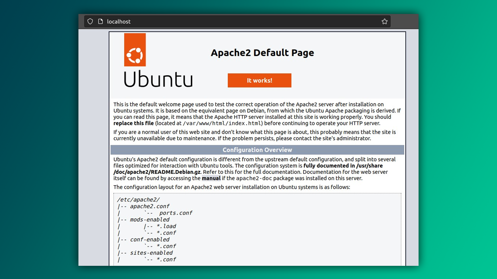

---
tags:
  - xizmatlar
title: 03 - Xizmatlar
description: Linux-dagi turli-xil xizmatlar va ularning boshqaruvi haqida gaplashamiz.
sort: 3
---
## Muhim!

Agar Linux o‘rganayotgan bo‘lsangiz, IP manzillar, subnet, OSI modeli, TCP/UDP protokollari, tunnellash, port va xost kabi tarmoq bilan bog‘liq atamalarni uchratasiz. Bu tushunchalar kompyuter tarmoqlari va xizmatlarini boshqarishda juda muhim rol o'ynaydi. Shuning uchun, ushbu atamalar haqida Internetdan chuqurroq ma’lumot izlashingizni tavsiya etaman. Eng muhimi, dangasalik qilmang. Siz buni uddalaysiz!

- **Networking Fundamentals** - Tarmoq asoslari
- **CCNA Course** - Cisco tarmoq kursi
- **[Networking for Dummies](https://edu.anarcho-copy.org/TCP%20IP%20-%20Network/Networking%20For%20Dummies.pdf)** (kitob) - Dumbullar uchun tarmoq darslari
- **Network Administration Course** - Tarmoq ma'murlash kursi

## Fayllar yaratish va o'chirish

Linux tizimida fayllarni yaratish va o'chirish juda oddiy. `touch` buyrug'i yordamida yangi fayllar yaratishingiz yoki mavjud fayllarning o'zgartirilgan sanasini yangilashingiz mumkin:

```bash
$ touch fayl-1 fayl-2 fayl-3 fayl-4 fayl-5
$ ls
fayl-1  fayl-2  fayl-3  fayl-4  fayl-5
```

Barcha fayllarni o'chirish uchun `rm *` buyrug'idan foydalanamiz:

```bash
$ rm *
```

> Ba'zan internetda `sudo rm -rf /` buyrug'i bilan "meme"larga duch kelasiz. Bu buyruq **tizimdagi barcha fayllarni o'chirib tashlaydi** va bu qaytarib bo'lmas jarayon.


## Ommaviy IP manzilni aniqlash

Ommaviy IP manzilingizni aniqlash uchun quyidagi buyruqni kiriting:

```bash
$ curl ifconfig.me
xxx.xx.xx.xxx
```

Muqobil ravishda, [ifconfig.me](https://ifconfig.me) saytiga tashrif buyurishingiz ham mumkin (aytgancha, men proxy'dan foydalanayapman).


## `service` va `systemctl`

Xizmatlarni boshqarishda `service` va `systemctl` buyrug'lari ishlatiladi. `service` eski usul bo'lib, tizim xizmatlarini boshqarish uchun ishlatiladi, `systemctl` esa yangilangan va keng qamrovli imkoniyatlarga ega.

- **systemctl** = yangi usul
- **service** = eski usul

Misol uchun, Apache2 veb-server xizmatini boshqarish uchun:

```bash
$ systemctl start apache2
$ systemctl status apache2
$ systemctl stop apache2
```

Yoki eski usulda:

```bash
$ service apache2 start
$ service apache2 status
$ service apache2 stop
```

## Veb-server yaratish

Veb-server yaratish uchun `apache2` dasturini o'rnatish va ishga tushirish kerak:

```bash
$ sudo apt install apache2
$ service apache2 start
```

Veb-server muvaffaqiyatli ishga tushganini tekshirish uchun quyidagi buyruqni kiritishingiz mumkin:

```bash
$ service apache2 status
```

Brauzeringizda "[localhost](http://localhost)" yoki [127.0.0.1](http://127.0.0.1) manzilini ochib, veb-sahifangizni ko'ring. Sahifani o'zgartirish uchun `/var/www/html/` papkasiga o'zgartirishlar kiriting.



## SSH serverni ishga tushirish

SSH (Secure Shell) orqali kompyuteringizga masofadan ulanish uchun `openssh-server` dasturini o'rnatish zarur:

```bash
$ sudo apt install openssh-server
$ service ssh start
```

SSH xizmatining holatini tekshirish uchun:

```bash
$ service ssh status
```

Endi SSH orqali kompyuteringizga bog'lanishingiz mumkin. Buning uchun:

```bash
$ ssh root@192.168.43.5
password: ****
successfully logged in as user "root"
root~#
```

SSH haqida qo'shimcha ma'lumot uchun quyidagi resurslarga murojaat qiling:

- **[SSH nima?](https://www.websiterating.com/uz/web-hosting/glossary/what-is-ssh/)**
- **[Ubuntu'da SSH server o'rnatish](https://uz.termotools.com/8299-installing-ssh-server-in-ubuntu.html)**

## Xizmatlar boshqaruvi - `systemctl`

Xizmatlarni boshqarish uchun `systemctl` buyrug'idan foydalaning. `systemctl` sizga xizmatlarni yoqish, o'chirish va qayta ishga tushirish imkonini beradi.

### Xizmatni yoqish

```bash
$ systemctl start ssh
```

### Xizmatni o'chirish

```bash
$ systemctl stop ssh
```

### Xizmatni qayta ishga tushirish

```bash
$ systemctl restart ssh
```

### Xizmatlar haqida umumiy ma'lumot

Xizmatlar tizimning asosiy funksiyalarini amalga oshiradi. Masalan, Apache2 veb-server xizmatini ishga tushirganingizda, siz web sahifalaringizni onlayn qilib ko'rsatish imkoniyatiga ega bo'lasiz. Shuningdek, SSH server yordamida masofadan kompyuteringizga bog'lanishingiz mumkin. Har bir xizmat o'zining `.conf` keygaytmasiga ega `/etc/xizmat/` papkasida joylashgan konfiguratsiya fayli orqali boshqariladi.

## Bilish zarur!

- **CTRL + C** - ko'pincha skript yoki dasturdan chiqish uchun ishlatiladi.
- **CTRL + D** - terminal yoki dasturdan chiqish uchun ishlatiladi.
- **CTRL + SHIFT + C** - terminalda belgilangan matnni nusxalaydi | brovzerda dasturchi panelini ochadi.
- **CTRL + SHIFT + V** - nusxalangan matnni belgilangan joyga qo'yadi.

---

## Topshiriq

#### Tarmoqni tahlil qilish
1. `nmap` yordamida o'z kompyuteringizdagi barcha ochiq portlarni aniqlang va ularga qanday xizmatlar bog'langanligini tahlil qiling.
2. `/etc/hosts` fayli haqida batafsil o'rganing.

#### Veb-serverni sozlash
1. Apache2 veb-serverini o'rnating va ishga tushiring. O'z veb sahifalaringizni `/var/www/html/` papkasiga qo'ying.

#### SSH serverni boshqarish
1. SSH orqali boshqa bir serverga ulanib, birorta fayl yuklab oling.
2. SSH xizmatining xavfsizligini oshirish uchun konfiguratsiyani sozlang. Misol uchun, `root` hisobini qulflang.

**Keyingi dars:** [[04-dars]]