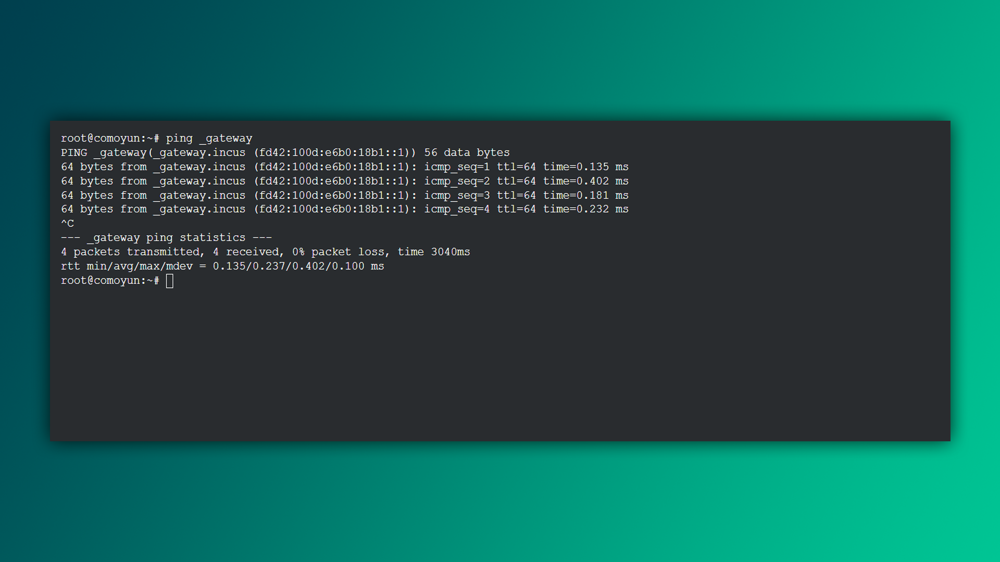

Keyinchalik IP manzillar, subnet, OSI modeli, TCP/UDP protokollari, tunnellash, port va xost kabi tarmoq bilan bog‘liq atamalarni uchratasiz. Ularni bilish muhim. Shu sababli, ushbu atamalar haqida Internetdan chuqurroq ma’lumot izlang. Eng muhimi, dangasalik qilmang. Siz buni uddalaysiz!

- **Networking Fundamentals** - Tarmoq asoslari
- **CCNA Course** - Cisco tarmoq kursi
- **[Networking for Dummies](https://edu.anarcho-copy.org/TCP%20IP%20-%20Network/Networking%20For%20Dummies.pdf)** (kitob) - Dumbullar uchun tarmoq darslari
- **Network Administration Course** - Tarmoq ma'murlash kursi

## Tarmoq ma'lumotlarini ko'rsatish

Mahalliy IP manzilingizni Windows-dagi `ipconfig` buyrug'iga o'xshash tarzda ko'rsatish uchun quyidagi buyruqlardan foydalanishingiz mumkin:

```bash
$ ifconfig
```

Yoki, yanada zamonaviy va ko'proq distributivlarda mavjud bo'lgan buyruq orqali:

```bash
$ ip a
```

Muayyan Wi-Fi adapteri haqida ma'lumot olish:

```bash
$ ifconfig wlan0
```

>Agar `ifconfig` o'rnatilmagan bo'lsa, `sudo apt install net-tools` buyrug'i orqali o'rnatishingiz mumkin.

## Xost tirik yoki yo'qligini tekshirish

Xost ya'ni serverni tirik yoki yo'qligini tekshirish uchun `ping` buyrug'ini ishlating:

```bash
$ ping localhost
PING localhost (127.0.0.1) 56(84) bytes of data.
64 bytes from localhost (127.0.0.1): icmp_seq=1 ttl=64 time=0.030 ms
64 bytes from localhost (127.0.0.1): icmp_seq=2 ttl=64 time=0.039 ms
64 bytes from localhost (127.0.0.1): icmp_seq=3 ttl=64 time=0.040 ms
^C
--- localhost ping statistics ---
3 packets transmitted, 3 received, 0% packet loss, time 2050ms
rtt min/avg/max/mdev = 0.030/0.036/0.040/0.004 ms
```

>[!info] `localhost` - **127.0.0.1** ya'ni uy manzili bilan barobar. 

Ba'zilar `ping` buyrug'ini xostning IP manzilini aniqlash uchun ishlatadilar. `ping` dasturidan chiqish uchun **CTRL + C** tugmalarini bosing yoki oldindan `ping -c 3 localhost` buyrug'ini bering, shunda dastur 3 marta so'rov yuborib avtomatik chiqadi. Asosiysi `ping senat.uz` buyrug'ini yozib, esingizdan chiqib qolib ketmasin 🙂

### Bilarmidingiz?



Linux-da `ping` buyrug'i yordamida shlyuz IP manzilini osongina topish mumkin:

```bash
$ ping _gateway
```

Shlyuz IP - ko'pincha bu hotspot yoki routerning IP-manzilidir.

## IP manzillarni MAC manzillari bilan bog'lash

MAC manzillar ARP keshida saqlanadi. Ko'rish uchun quyidagi buyruqni kiriting:

```bash
$ arp -a
Internet Address       Physical Address       Type
192.168.1.1            00-11-22-33-44-55     dynamic
192.168.1.10           10-22-33-44-55-66     dynamic
192.168.1.20           20-33-44-55-66-77     dynamic
```

Kompyuterdagi ochiq portlar va ular bilan bog'langan dasturlarni bilish uchun `netstat` buyrug'idan foydalaning:

```bash
$ netstat -tul
```

- **-t**: TCP bog'lanishlarini ko'rsatadi.
- **-u**: UDP bog'lanishlarini ko'rsatadi.
- **-l**: Faqat ochiq portlarni ko'rsatadi.

## Ommaviy IP

Ommaviy IP manzilingizni aniqlash uchun quyidagi buyruqni kiriting:

```bash
$ curl ifconfig.me
xxx.xx.xx.xxx
```

Muqobil ravishda, [ifconfig.me](https://ifconfig.me) saytiga tashrif buyurishingiz ham mumkin (aytgancha, men proxy'dan foydalanayapman).


## Buyruqlar tarixi

Ba'zan IP va MAC manzillarni qaytadan yozishga erinamiz. Yaxshiyamki, bizda buyruqlar tarixini ko'rish imkoniyati bor:

```bash
$ history
  1  sudo apt update
  2  sudo apt upgrade
  3  ping 7.7.7.7
  4  history
```

Yoki uy katalogida joylashgan `.bash_history` yashirin faylini ko'rish orqali:

```bash
$ cd /home/khumoyun
$ cat .bash_history
```

Tarixni tozalash uchun:

```bash
$ history -c
$ history
```

>[!tip] Strelka tugmalari
>Yuqori va pastgi strelka tugmalari orqali buyruqlar tarixini ko'rish mumkin.

## "Uy"ga qaytish

`cd` (change-directory) buyrug'i orqali terminalni istalgan manzilga yo'naltirishingiz mumkin. Uyga qaytish uchun:

```bash
$ cd ~
```

`cd` buyrug'ini hech qanday argumentlarsiz yozish orqali ham bir xil natijaga erishish mumkin.

```bash
$ pwd
/home/khumoyun/Downloads/never-gonna-give-you-up/
$ cd
$ pwd
/home/khumoyun
```

## Fayl tarkibini ko'rish

`cat` (concatenate) asosan fayllarni bir-biriga bog'lash uchun ishlatiladi, lekin kichik fayllar tarkibini ko'rish uchun ham ishlatishingiz mumkin:

```bash
$ echo "Linux ajoyib!" > linux.txt
$ cat linux.txt
Linux ajoyib!
```

>MB hajmdagi fayllarni `cat` yordamida o'qish joriy terminal seansni qotirib qo'yishi yoki crash-ga olib kelishi mumkin. 

Fayllarni bir-biriga bog'lash (natija `file-4.txt` bo'ladi):

```bash
$ cat file.txt file-2.txt file-3.txt > file-4.txt
```

**Eslatma**: Katta fayllar uchun `less` yoki `more` buyruqlarini ishlatish tavsiya etiladi. Chunki ular faylning butun tarkibini bir vaqtning o'zida yuklamaydi, faqat kerakli qismini sahifalab ko'rsatadi.

## To'ldirilgan papkalarni o'chirish

Bu haqida avvalgi darsda yozilgan, lekin qayta ko'rib chiqish ziyon qilmaydi. Bo'sh bo'lmagan papkalarni o'chirish uchun:

```bash
$ rm -rf papka papka2 papka3
```

Bu yerda:

- **-r** (recursive) opsiyasi: Kataloglar va ularning tarkibidagi fayllarni har biriga `rm` buyrug'ini beradi.
- **-f** (force) opsiyasi: Majburiy o'chirishni bildiradi va ogohlantirishlarsiz bajaradi.

## `/etc/hosts` faylini o'zgartirish

`/etc/hosts` fayli domen nomlarini har qanday IP manzillariga bog'lash imkonini beradi. Siz undan saytlarni test yoki blokirovka qilish uchun ishlatishingiz mumkin.

```bash
$ sudo nano /etc/hosts
```


Fayl tarkibi:

```
127.0.0.1 localhost 
192.168.1.10 myserver.local
```

Yuqoridagi misolda **127.0.0.1** `localhost` bilan bog'lanadi, ya'ni brovzerga `localhost` deb yozganingizda so'rovlarni **127.0.0.1** IP manziliga yuboradi. **192.168.1.10** IP-manzili `myserver.local` bilan bog'lanadi. 

>[!info] `/etc/hosts` faylini lokal DNS server sifatida tasavvur qilishingiz mumkin.

## Fayl vaqtini yangilash

Faylning oxirgi o'zgartirilgan sanasini yangilash uchun `touch` buyrug'idan foydalanishingiz mumkin. `/etc/hosts` kabi tizim fayllarini yangilash `sudo` talab qiladi:

```bash
$ sudo touch /etc/hosts
```

>`touch` buyrug'i fayllar yaratish yoki ularning o'zgartirilgan sanalarini yangilash maqsadida foydalaniladi.

## Samaradorlikni oshirish

- **CTRL + SHIFT + T** (terminalda) - Yangi terminal "tab" ochish
- **ALT + F4** - Aktiv oynani yopish
- **CTRL + TAB** (brauzerda) - Tablarni almashtirish
- **CTRL + PG UP** (brauzer + terminal) - Tablarni chapga/o'ngga almashtirish
- **ALT + 1..9** (brauzer + terminal) - Tablarni indeks bo'yicha almashtirish

---

## Topshiriq

1. **Tarmoq ma'lumotlari**  
   - Kompyuteringizning tarmoq interfeyslarining ma'lumotlarini olish uchun ishlatishingiz mumkin bo'lgan buyruqlarni aniqlang.
2. **xumoyun.uz serveriga 10 marta `ping` so'rovini yuboring**
3. **ARP keshini tekshirish**  
   - IP manzillar va MAC manzillar orasidagi farqlarni aniqlang. ARP keshini qanday ko'rish mumkin?

**Keyingi dars:** [[04-dars]]