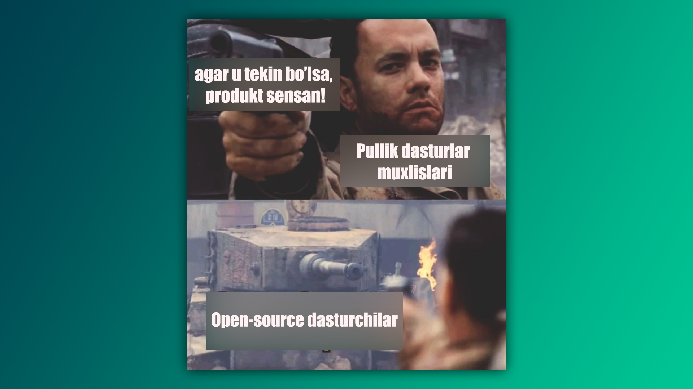

---
tags:
  - cloud-shell
title: 05 - Foydali Buyruqlar
description: Linux-da terminalga oid ayrim faktlar va foydali buyruqlar bilan tanishamiz.
sort: 5
---
## Google Cloud Shell

Google Cloud Shell sizga [cloud.google.com](https://cloud.google.com) platformasida Linux tizimidan foydalanish imkonini beradi. Ushbu bepul xizmat orqali dasturiy ta'minotni boshqarish, skriptlarni ishga tushirish yoki veb serverlarni sozlash mumkin. Bu yerdagi bilimlarni amalda qo'llash uchun yaxshi joy.

Masalan, `neofetch` buyrug'ini ishlatib, tizim haqida ma'lumot olish mumkin:

```bash
khumoyun@cloud:~$ neofetch
```


## Ochiq dasturlar

Tizimda faoliyat yuritayotgan dasturlarni ko'rish va boshqarish uchun quyidagi buyruqlarni ishlatishingiz mumkin:

- **`ps`**: Bu buyruq tizimda ishlayotgan protseslarni ko'rsatadi. Minimal ma'lumot beradi.

- **`ps aux`**: Bu buyruq tizimdagi barcha protseslar haqida kengroq ma'lumot beradi, shu jumladan foydalanuvchi, CPU va xotira foydalanish statistikasini ko'rsatadi.

- **`top`**: Bu buyruq tizimda faoliyat yuritayotgan jarayonlarning real vaqt ma'lumotlarini ko'rsatadi. O'zgaruvchan ma'lumotlar bilan doimiy ravishda yangilanadi.

- **`htop`**: `top`ning yaxshilangan versiyasi bo'lib, interaktiv grafik interfeysni taqdim etadi va tizimdagi resurslarni boshqarishni osonlashtiradi. U standart dastur emas, shu sababli uni avval o'rnatish kerak: `sudo apt install htop -y`

## Dastur joylashuvini topish

Agar siz ma'lum bir dastur yoki buyruqning tizimdagi joylashuvini bilmoqchi bo'lsangiz, `whereis` buyrug'idan foydalanishingiz mumkin. Bu buyruq dastur yoki buyruq fayllarini qayerda saqlanganligini aniqlaydi.

Sintaksis:

```bash
$ whereis buyruq
```

Misol:

```bash
$ whereis aircrack-ng
aircrack-ng: /usr/bin/aircrack-ng /usr/include/aircrack-ng /usr/share/man/man1/aircrack-ng.1.gz
```

Bu yerda, `aircrack-ng` dasturining o'rnatilgan joylari ko'rsatiladi.

> **Pro maslahat:**
> Buyruq yoki dastur haqida qo'shimcha ma'lumot olish uchun ko'pincha `--help` yoki qisqacha `-h` optsiyalarini ishlatishingiz mumkin. Misol uchun:
> `python --help`

## Biroz off-topic

Bepul dasturlar, ayniqsa VPN xizmatlaridan foydalanganda ehtiyot choralarini ko'rishni tavsiya qilaman .

>**"If it is free, then you're the product"** - Agar biror narsa bepul bo'lsa, demak siz mahsulotsiz. 



---

## Topshiriq

#### Google Cloud Shell’da ishlash
1. Google Cloud Shell’da ishlayotgan barcha jarayonlarni aniqlang va ularning resurs iste'mol qilish ma'lumotlarini ko'ring. `ps`, `top`, va `htop` buyruqlarini solishtirib ko'ring.
2. Google Cloud Shell’da `neofetch` yordamida tizim haqida batafsil ma'lumot oling va tizim konfiguratsiyasi bilan tanishing.

#### Dastur joylashuvini aniqlash
1. `whereis` buyrug’ini ishlatib, ayrim o'rnatilgan dasturlarning joylashuvini aniqlang. `whereis cd` qanday natija beradi deb o'ylaysiz? 

**Keyingi dars:** [[06-dars]]
