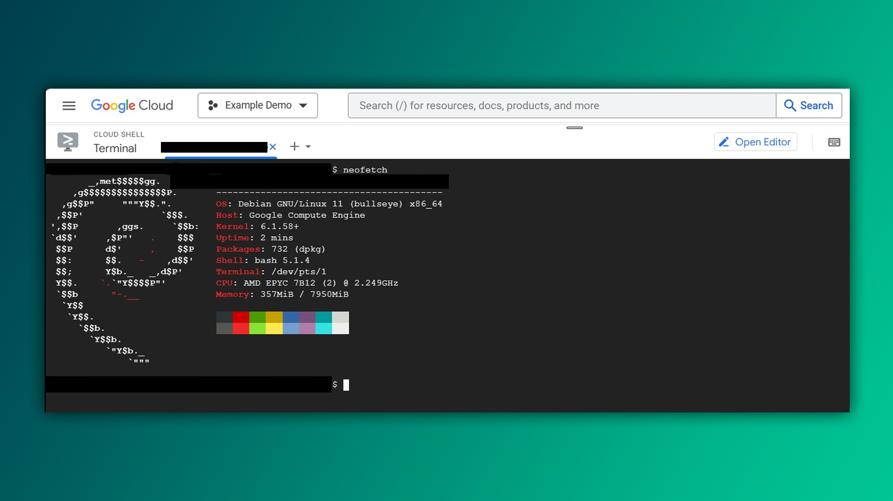

Google Cloud Shell sizga [cloud.google.com](https://cloud.google.com) platformasida Linux tizimidan foydalanish imkonini beradi. Ushbu bepul xizmat orqali dasturiy ta'minotni boshqarish, skriptlarni ishga tushirish yoki veb serverlarni sozlash mumkin. Bilimlaringizni amalda qo'llash uchun yaxshi joy.

`neofetch` buyrug'ini ishlatib, tizim haqida ma'lumot olish mumkin:



## Ochiq dasturlar

Tizimda faoliyat yuritayotgan dasturlarni ko'rish va boshqarish uchun quyidagi buyruqlarni ishlatishingiz mumkin:

- **`ps`**: Bu buyruq tizimda ishlayotgan protseslarni ko'rsatadi. Minimal ma'lumot beradi.

- **`ps aux`**: Bu buyruq tizimdagi barcha protseslar haqida kengroq ma'lumot beradi, shu jumladan foydalanuvchi, CPU va xotira foydalanish statistikasini ko'rsatadi.

- **`top`**: Bu buyruq tizimda faoliyat yuritayotgan protsesslarni real vaqtda ko'rsatadi.

- **`htop`**: `top`ning zamonaviy versiyasi. Interaktiv grafik interfeysni taqdim etadi va tizimdagi resurslarni boshqarishni osonlashtiradi. U standart dastur emas, shu sababli uni avval o'rnatish kerak: `sudo apt install htop -y`

Protsesslarni tahlil qilish yo'llari ko'p (top, htop, task manager), lekin ps orqali bo'lsa buni yozasiz: 

## Protsesslarni tekshirish

Protsesslarni tahlil qilish yo'llari ko'p (top, htop, task manager), lekin `ps` (process-status) orqali bo'lsa buni yozasiz: 

```bash
$ ps aux
```

Bu yerda 'a' hamma foydalanuvchilarni protsesslarini ko'rsatadi. 'u' batafsilroq ma'lumot chiqaradi. 'x' terminalga biriktirilmagan protsesslarni chiqaradi, masalan, firefox.

U doimiy ishlab turmaydi, faqat bir marta o'sha vaqtni o'zida ishlayotgan protsesslarni ko'rsatadi. Doimiy ishlashi uchun - `watch ps aux`

| Ustun | Tavsifi                                                               |
| ----- | --------------------------------------------------------------------- |
| PID   | Protsess ID-si                                                        |
| TTY   | Qaysi terminalda ishlayapti                                           |
| TIME  | Qancha CPU vaqtini sarfladi                                           |
| CMD   | Protsessni boshlagan buyruq (masalan, 'grep -R satr .' yoki 'ps aux') |

TIME ustunida ko‘pincha 0 qiymati bo'ladi. Bu degani protsess hozirda hech qanday ish qilgani yo'q yoki qilib bo'ldi. 

Protsess to'xtovsiz ishlasa, TIME qiymati ortib boraveradi. Masalan, dasturlashdan xabaringiz bo'lsa, `while (true) {}` cheksiz ishlaydi, o'zimiz to‘xtatmaguncha. Ayni paytda `watch ps au` buyrugini yozsangiz, TIME asta-sekin ko‘tarilib borayotganini ko'rasiz.

## Dastur joylashuvini topish

Agar siz ma'lum bir dastur yoki buyruqning tizimdagi joylashuvini bilmoqchi bo'lsangiz, `whereis` buyrug'idan foydalanishingiz mumkin. Bu buyruq dastur yoki buyruq fayllarini qayerda saqlanganligini aniqlaydi.

```bash
$ whereis buyruq
```

Misol:

```bash
$ whereis aircrack-ng
aircrack-ng: /usr/bin/aircrack-ng /usr/include/aircrack-ng /usr/share/man/man1/aircrack-ng.1.gz
```

Bu yerda, `aircrack-ng` dasturining o'rnatilgan joylari ko'rsatiladi.

> [!tip]- **Pro maslahat:**
> Buyruq yoki dastur haqida qo'shimcha ma'lumot olish uchun ko'pincha `--help` yoki qisqacha `-h` optsiyalarini ishlatishingiz mumkin. Misol uchun:
> `python --help`

## Yoyish

Barcha fayllarni o'chirish uchun `rm *` buyrug'idan foydalanamiz:

```bash
$ rm *
```

>[!danger] `rm -rf /*`
>Ba'zan internetda `sudo rm -rf /` buyrug'i bilan "meme"larga duch kelasiz. Bu buyruq **tizimdagi barcha fayllarni o'chirib tashlaydi** va bu qaytarib bo'lmas jarayon.>


Yana bir qancha yoyish usullari bilan jadvalda tanishingiz mumkin:

| Usul                      | Mos keladi                                                                  |
| ------------------------- | ---------------------------------------------------------------------------- |
| `*`                       | Barcha fayllar                                                              |
| `d*`                      | d harfi bilan boshlanuvchi barcha fayllar                                   |
| `kitob*.pdf`              | kitob bilan boshlanuvchi va .pdf bilan tugaydigan barcha fayllar            |
| `Rasm???`                 | Rasm bilan boshlanib, aniq uchta belgidan iborat fayllar                    |
| `[xyz]*`                  | x, y yoki z harflaridan biri bilan boshlanuvchi barcha fayllar              |
| `ARXIV.[0-9][0-9]`        | ARXIV. bilan boshlanib, ikkita raqamdan iborat fayllar                      |
| `[[:lower:]]*`            | Kichik harf bilan boshlanuvchi barcha fayllar                               |
| `[![:upper:]]*`           | Katta harf bilan boshlanmaydigan barcha fayllar                             |
| `*[[::digit::]].png`      | Raqam bilan tugaydigan va .png kengaytmali barcha fayllar                   |

## Biroz off-topic

Bepul dasturlar, ayniqsa VPN xizmatlaridan foydalanganda ehtiyot choralarini ko'rishni tavsiya qilaman .

>[!quote] 
>**If it is free, then you're the product** - Agar biror narsa bepul bo'lsa, demak siz mahsulotsiz. 


---

## Topshiriq

### Google Cloud Shell

1. Google Cloud Shell-da ishlayotgan barcha protsesslarni aniqlang va ularning resurs iste'mol qilish ma'lumotlarini ko'ring. `ps`, `top`, va `htop` buyruqlarini solishtirib ko'ring.
2. Google Cloud Shell-da `neofetch` yordamida tizim haqida ma'lumot oling.

### Dastur joylashuvini aniqlash

1. `whereis` buyrug’ini ishlatib, ayrim o'rnatilgan dasturlarning joylashuvini aniqlang. `whereis cd` qanday natija beradi deb o'ylaysiz? 
2. `file` va `reset` buyruqlarini yozib ko'ring.

**Keyingi dars:** [[06-dars]]
