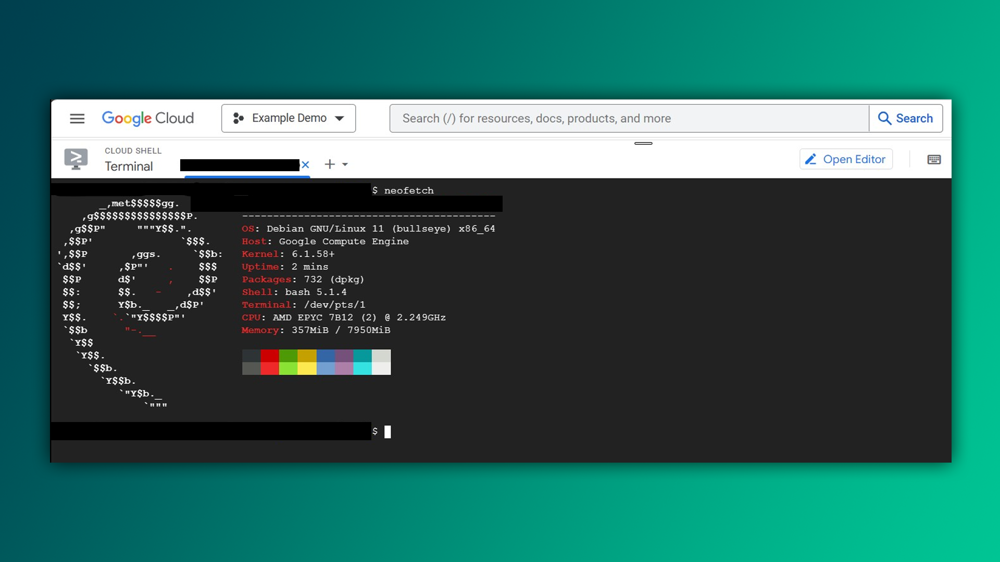

## Google Cloud Shell

Siz https://cloud.google.com platformasida Linuxni kompyuteringizga o'rnatmasdan bemalol ishlatishingiz mumkin:

```bash
khumoyun@cloud:~$ neofetch 
```



## Ochiq dasturlar

Joriy ochiq dasturlarni ko'rish uchun ishlatadigan buyruqlar ro'yxati:

```
$ ps
```

```
$ ps aux
```

```
$ top
```

`htop`  keng qo'llanilgan buyruqlardan biri, lekin bu standart dastur hisoblanmaydi. Shu sababli, uni avval dastur-menejeri orqali o'rnatish zarur:

```
$ sudo apt install htop -y
```

## Dastur joylashuvini topish

Sintaks: 

```bash
$ whereis buyruq
```

Misol:

```bash
$ whereis aircrack-ng
aircrack-ng: /usr/bin/aircrack-ng /usr/include/aircrack-ng /usr/share/man/man1/aircrack-ng.1.gz
```

> **If it is free, then you're the product** - ya'ni agar biror narsa bepul bo'lsa, unda siz maxsulotsiz. Shu sababli, ayrim bepul dasturlarni ayniqsa VPN ustanovka qilayotganda ehtiyot choralarini ko'rishingizni maslahat beraman.

![[images/free-product-meme.jpg]]

[< 04-kun](./04-kun.md) | [06-kun >](./06-kun.md)