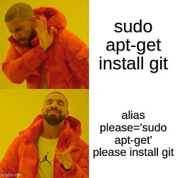
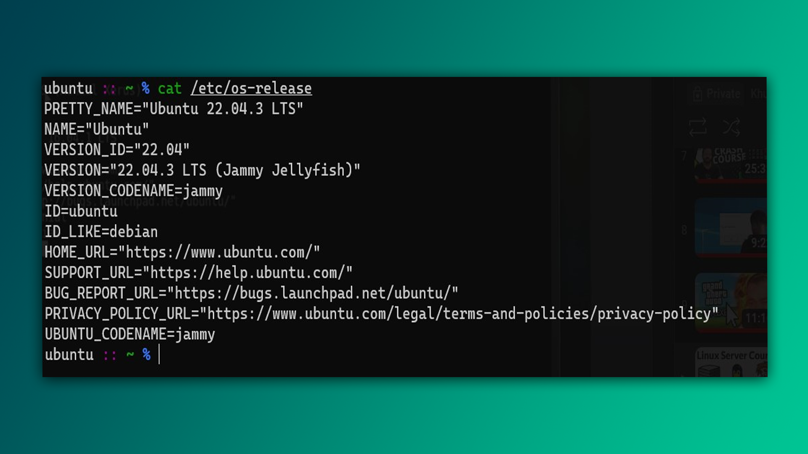
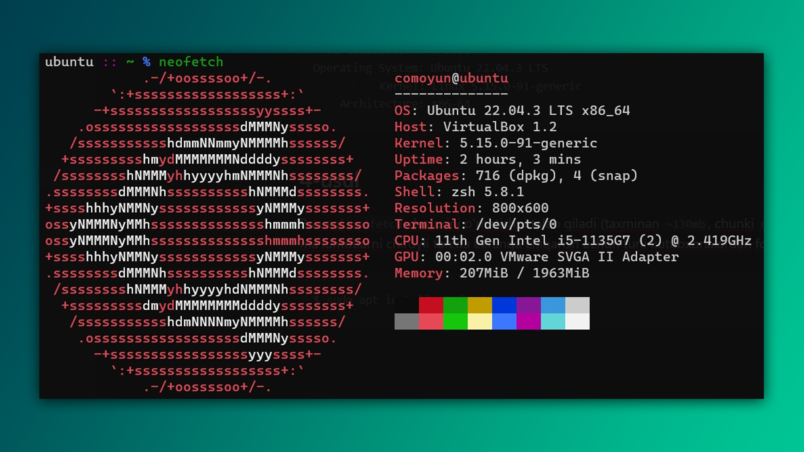

---
tags:
  - ilovalar
  - apt
title: 06 - Ilova Menejeri
description: Linux-da qanday qilib ilova o'rnatish, o'chirish yoki yangilash mumkin? Ushbu maqolada bu savollarga batafsil javob yozilgan.
sort: 6
---
## Ilova menejeri buyruqlari

Ilova menejeri (package-manager) internetdan dasturlarni o'rnatish, mavjud dasturlarni yangilash yoki o'chirish kabi xizmatlarni taqdim etadi. Har bir Linux distributivida ilova menejeri turlicha nomlanadi. Masalan, Ubuntu va Debian'ga asoslangan distributivlarda `apt`, Arch'ga asoslangan distributivlarda `pacman` ishlatiladi. Bu darsda `apt` yordamida turli buyruqlarni ko'rib chiqamiz.

**P.S.** `apt-get`, `aptitude` va `apt` buyruqlari bir xil vazifani bajaradi, ammo `apt` buyrug'idan foydalanish tavsiya etiladi, chunki u yangi, qulay va intuitiv interfeysga ega.

### 1. Kompyuterdagi barcha ilovalarni yangilash

Tizimning optimal ishlashini ta'minlash uchun dasturlarni muntazam ravishda yangilab turish kerak. Buning uchun quyidagi buyruqlarni ishlatamiz:

- **`sudo apt update`**: Tizimdagi paket ro'yxatini yangilaydi. Bu buyruq yangilanishlar haqida ma'lumot olish uchun kerak.
  
  ```bash
  $ sudo apt update
  ```

- **`sudo apt upgrade`**: Mavjud dasturlarni yangilaydi.

  ```bash
  $ sudo apt upgrade
  ```

- **`sudo apt dist-upgrade`**: Yangilanish jarayonida muammolarni hal qilish va eski dasturlarni olib tashlash orqali tizimni yaxshilaydi. Bu buyruq tizimni eng yangi versiyaga yangilaydi va kerakli bo'lmagan paketlarni olib tashlaydi.

  ```bash
  $ sudo apt dist-upgrade
  ```

### 2. Ilovalarni APT bilan o'rnatish

APT yordamida dasturlarni o'rnatish juda oson. Misol uchun, VLC Media Player-ni o'rnatish jarayoni:

```bash
$ sudo apt install vlc -y
```

`-y` optsiyasi dastur o'rnatish jarayonida avtomatik ravishda "ha" deb javob beradi. Bu Windows'da ilova o'rnatayotganda "next" tugmasini bosish kabi ishlaydi.



#### 2.5 Ilovalarni `dpkg` orqali o'rnatish

Agar siz `deb` kengaytmali faylni o'rnatmoqchi bo'lsangiz, `dpkg` buyrug'idan foydalanishingiz mumkin. Bu Windows’dagi “.exe” fayllarni o'rnatish kabi ishlaydi:

```bash
$ sudo dpkg -i ilova.deb
```

- `-i` (install) optsiyasi faylni o'rnatishni bildiradi.

Agar qaram dasturlar yetishmayotganligi haqida xatolik yuzaga kelsa, kerakli fayllarni o'rnatish uchun:

```bash
$ sudo apt install -f
```

### 3. Ilovalarni APT yordamida o'chirib tashlash

Agar siz dasturdan voz kechmoqchi bo'lsangiz, uni o'chirish uchun quyidagi buyruqni ishlating:

```bash
$ sudo apt remove dastur-nomi
```

Masalan, VLC dasturini o'chirish uchun:

```bash
$ sudo apt remove vlc
```

### 4. O'rnatish mumkin bo'lgan ilovalarni qidirish

Agar siz tizimda mavjud bo'lmagan dasturlarni qidirmoqchi bo'lsangiz, quyidagi buyruqni ishlatishingiz mumkin:

```bash
$ sudo apt search dastur-nomi
```

### 5. `autoremove` / `autoclean`

`autoremove` va `autoclean` buyruqlari tizimni toza va samarali saqlash uchun ishlatiladi.

#### `autoremove`

O'chirilgan dasturlarga qaram bo'lgan paketlar tizimda qolib ketishi mumkin. `autoremove` bu kerak bo'lmagan paketlarni tozalaydi:

```bash
$ sudo apt autoremove
```

#### `autoclean`

APT tizimga o'rnatilgan va yangilangan dasturlar uchun `.deb` fayllarini yuklab oladi. `autoclean` eskirgan fayllarni tozalaydi va diskni bo'shatishga yordam beradi:

```bash
$ sudo apt autoclean
```

Ikkala buyruqni birgalikda ishlatish tizimni toza va samarali saqlashga yordam beradi:

```bash
$ sudo apt autoremove && sudo apt autoclean
```

## Qanday qilib ma'lum bir port bilan bog'langan dasturni topish mumkin?

Port bilan bog'langan dasturlarni aniqlash uchun `lsof` (list-open-files) buyrug'idan foydalaniladi. Misol:

```bash
$ sudo lsof -i:port_raqami
```

Misol uchun, 80-port bilan bog'langan dastur uchun:

```bash
$ sudo lsof -i:80
```

Ko'pchilik `netstat -tulpn | grep :port_raqami` buyrug'idan foydalanadi, lekin bu ba'zi dasturlar uchun samarali bo'lmasligi mumkin.

## Linux haqida ma'lumot olish

Masofaviy kompyuterlarda yoki bulutli serverlarda kompyuter nomi va versiya to'g'risida ma'lumot olish uchun bir nechta usullar mavjud.

### 1-usul

Unix'ga o'xshash tizimlarda `/etc/` katalogi tizim va ilovalar uchun konfiguratsiya fayllarni saqlaydi. `/etc/os-release` faylini o'qib, operatsion tizim haqida ma'lumot olish mumkin:

```bash
$ cat /etc/os-release
```



### 2-usul

`uname` buyrug'i tizim ma'lumotlarini, jumladan yadro versiyasini ko'rsatadi. `-a` optsiyasi barcha ma'lumotlarni ko'rsatadi:

```bash
$ uname -a
```

### 3-usul

`hostnamectl` buyrug'i tizimning nomi, virtualizatsiya turi va boshqa ma'lumotlarni ko'rsatadi:

```bash
$ hostnamectl
```

### 4-usul

`neofetch` dasturini o'rnatib, tizim haqida chiroyli tarzda ma'lumot olish mumkin:

```bash
$ sudo apt install neofetch -y
$ neofetch
```



---

## Topshiriq

1. APT yordamida tizimdagi barcha ilovalarni qanday qilib yangilash mumkin? `update`, `upgrade`, va `dist-upgrade` buyruqlarining vazifalarini tushuntiring.
2. `dpkg` yordamida `.deb` faylini qanday o'rnatish mumkin? Agar o'rnatishda xatolik yuzaga kelsa, qanday choralar ko'rish kerak?
3. `lsof` buyrug'idan foydalanib, 80-port bilan bog'langan dasturlarni qanday topsa bo'ladi?

**Keyingi dars:** [[07-dars]]
