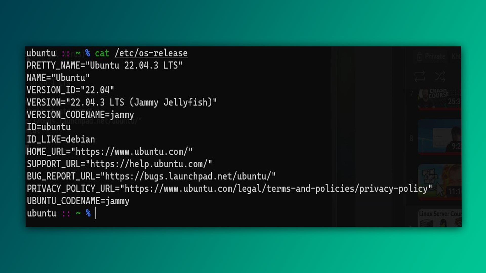

Ilova menejeri (package-manager) internetdan dasturlarni o‘rnatish, mavjud dasturlarni yangilash yoki o‘chirish kabi xizmatlarni taqdim etadi. Har bir Linux distributivida ilova boshqaruvchisi turlicha nomlanadi. Misol uchun, Ubuntu va Debian asosidagi distributivlarda `apt`, Arch asosidagi distributivlarda esa `pacman` ishlatiladi. Biz `apt` yordamida turli buyruqlarni ko‘rib chiqamiz.

>`apt-get`, `aptitude` va `apt` buyruqlari bir xil vazifani bajaradi, ammo `apt` buyrug'idan foydalanish tavsiya etiladi, chunki u yangi va qulay.

## Barcha ilovalarni yangilash

Tizimning optimal ishlashini ta'minlash uchun dasturlarni muntazam ravishda yangilab turish kerak. Buning uchun quyidagi buyruqlarni ishlatamiz:

- **`sudo apt update`**: Bu buyruq yangilanishlar haqida ma'lumot olish uchun kerak.
  
  ```bash
  $ sudo apt update
  ```

- **`sudo apt upgrade`**: Mavjud dasturlarni yangilaydi.

  ```bash
  $ sudo apt upgrade
  ```

- **`sudo apt dist-upgrade`**: Bu buyruq tizimni eng yangi versiyaga yangilaydi va kerak bo'lmagan paketlarni olib tashlaydi.

  ```bash
  $ sudo apt dist-upgrade
  ```

## Ilovalarni `apt` bilan o'rnatish

`apt` yordamida dasturlarni o'rnatish juda oson. Misol uchun, VLC Media Player-ni o'rnatish uchun:

```bash
$ sudo apt install vlc -y
```

`-y` optsiyasi dastur o'rnatish jarayonida paydo bo'ladigan savollarga avtomatik ravishda "ha" deb javob beradi. Bu Windows-da ilova o'rnatayotganda "next" tugmasini bosishga o'xshaydi.


## Ilovalarni `dpkg` orqali o'rnatish

Agar siz `deb` kengaytmali faylni o'rnatmoqchi bo'lsangiz, `dpkg` buyrug'idan foydalanishingiz mumkin. Bu Windows’dagi “.exe” fayllarni o'rnatish kabi ishlaydi:

```bash
$ sudo dpkg -i ilova.deb
```

- `-i` (install) optsiyasi o'rnatishni bildiradi.

Agar qaram dasturlar yetishmayotganligi haqida xatolik yuzaga kelsa, qaram dasturlarni o'rnatish uchun ushbu buyruqni yozing:

```bash
$ sudo apt install -f
```

## Ilovalarni o'chirib tashlash

Dasturni o'chirish uchun quyidagi buyruqni yozing:

```bash
$ sudo apt remove dastur-nomi
```

Masalan, VLC dasturini o'chirish uchun:

```bash
$ sudo apt remove vlc
```

## O'rnatish mumkin bo'lgan ilovalar

Agar siz tizimda mavjud bo'lmagan dasturlarni qidirmoqchi bo'lsangiz, quyidagi buyruqni ishlatishingiz mumkin:

```bash
$ sudo apt search dastur-nomi
```

## `autoremove` /  `autoclean`

`autoremove` va `autoclean` buyruqlari tizimni toza va samarali saqlash uchun ishlatiladi.

### `autoremove`

O'chirilgan dasturlarga qaram bo'lgan paketlar tizimda qolib ketishi mumkin. `autoremove` bu kerak bo'lmagan paketlarni tozalaydi:

```bash
$ sudo apt autoremove
```

### `autoclean`

`apt` tizimga o'rnatilgan va yangilangan dasturlar uchun `.deb` fayllarini yuklab oladi. `autoclean` eskirgan fayllarni tozalaydi va diskni bo'shatishga yordam beradi:

```bash
$ sudo apt autoclean
```

Ikkala buyruqni birgalikda ishlatish tizimni toza va samarali saqlashga yordam beradi:

```bash
$ sudo apt autoremove && sudo apt autoclean
```

## Ma'lum bir port bilan bog'liq dasturni topish

Port bilan bog'langan dasturlarni aniqlash uchun `lsof` (list-open-files) buyrug'idan foydalanamiz. Misol:

```bash
$ sudo lsof -i:port_raqami
```

Misol uchun, 80-port bilan bog'langan dastur uchun:

```bash
$ sudo lsof -i:80
```

Ko'pchilik `netstat -tulpn | grep :port_raqami` buyrug'idan foydalanadi, lekin bu ba'zi dasturlar uchun samarali bo'lmasligi mumkin.

## Linux haqida ma'lumot olish

Masofaviy kompyuterlarda yoki bulutli serverlarda kompyuter nomi va versiya to'g'risida ma'lumot olish uchun bir nechta usullar mavjud.

### `/etc/os-release`

Unix-ga o'xshash tizimlarda `/etc/` katalogi tizim va ilovalar uchun konfiguratsiya fayllarni saqlaydi. `/etc/os-release` faylini o'qib, operatsion tizim haqida ma'lumot olish mumkin:

```bash
$ cat /etc/os-release
```



### `uname`

`uname` buyrug'i tizim ma'lumotlarini, jumladan yadro versiyasini ko'rsatadi. `-a` optsiyasi barcha ma'lumotlarni ko'rsatadi:

```bash
$ uname -a
```

### `hostnamectl`

`hostnamectl` buyrug'i tizimning nomi, virtualizatsiya turi va boshqa ma'lumotlarni ko'rsatadi:

```bash
$ hostnamectl
```

### `neofetch`

`neofetch` dasturini o'rnatib, tizim haqida chiroyli ko'rinishda ma'lumot olish mumkin:

```bash
$ sudo apt install neofetch -y
$ neofetch
```


---

## Topshiriq

1. `apt` yordamida tizimdagi barcha ilovalarni qanday qilib yangilash mumkin? `update`, `upgrade`, va `dist-upgrade` buyruqlarining vazifalarini tushuntiring.
2. `dpkg` yordamida `.deb` faylini qanday o'rnatish mumkin? Agar o'rnatishda qaram dasturlar yetishmovchiligi to'g'risida xatolik yuzaga kelsa, qanday choralar ko'rish kerak?
3. `lsof` buyrug'idan foydalanib, 80-port bilan bog'langan dasturlarni qanday topsa bo'ladi?

**Keyingi dars:** [[07-dars]]
