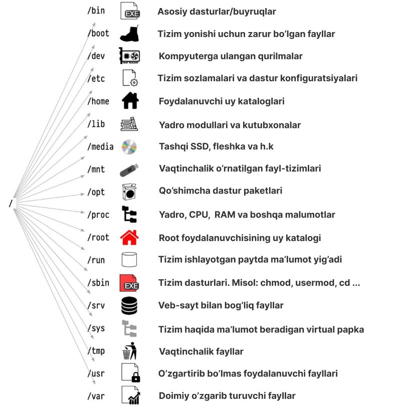
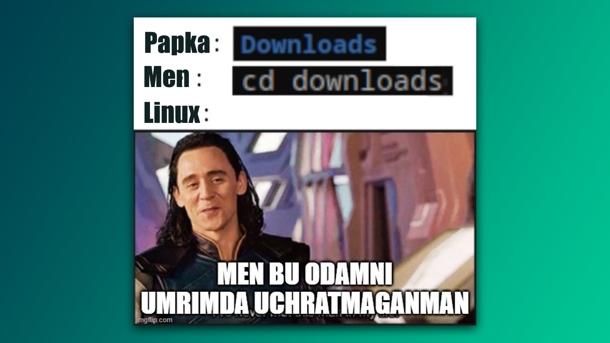

---
tags:
  - fayl-tizimi
  - fayllar
title: " 07 - Linux Fayl Tizimi"
description: Linux fayl tizimi va terminalda qanday qilib boshqa kataloglarga "sakrash" haqida bilib olasiz.
sort: 7
---


Linux fayl tizimi haqiqatan ham ajoyib, chunki barcha tarmoq tizimlari, disklar va USB drayvlar fayl ko'rinishida ifodalanadi. Misol uchun, Windows'dagi **C** drayver, **D** drayver va h.k. Linux'ning `/dev/` (devices) katalogida oddiygina fayl sifatida ko'rinadi.

> Barcha fayl nomlari katta-kichik harflarga sezgir, ya'ni `/boot`, `/Boot` va `/BOOT` uchta **turli** papkani ifodalaydi.



## `cd` haqida batafsil

Siz `cd` (change-directory) buyrug‘i bilan tanish bo‘lishingiz mumkin, chunki Windows, MacOS, KolibriOS va boshqa operatsion tizimlar bu buyruqni to‘liq qo‘llab-quvvatlaydi. `cd` yordamida boshqa kataloglarga "sakrash" mumkin. Misol uchun, siz fayl yaratganingizda, u terminal ochilgan katalogda saqlanadi. Aytaylik, fayl `/home/khumoyun/experiments/` katalogida joylashgan bo‘lsa:

```bash
$ touch file
$ ls
file papka
$ pwd
/home/khumoyun/experiments
```

Endi faylni "papka" ichida yaratmoqchi bo‘lsangiz, buni ikki xil usulda amalga oshirishingiz mumkin:

- **Birinchi yo'l**: Faylni to'g'ridan-to'g'ri "papka" ichida yaratishingiz mumkin:

  ```bash
  $ touch papka/file
  $ ls papka/
  file
  ```

- **Ikkinchi yo'l**: Avval "papka" katalogiga o'tib, so'ng fayl yaratishingiz mumkin:

  ```bash
  $ cd papka
  $ touch file
  $ ls
  file
  ```

Joriy katalogdan bir daraja yuqoriga chiqish uchun `cd ..` buyrug'ini ishlatishingiz mumkin:

- `cd .` - Joriy papkani o'zini anglatadi.
- `cd ..` - Hozirgi papkadan bir daraja yuqoriga chiqadi.

**P.S.** `./papka/file` = `papka/file`

Agar uch yoki to'rtta papka yuqoriga chiqmoqchi bo'lsangiz, buni quyidagi usullardan biri bilan amalga oshirishingiz mumkin:

```bash
$ cd ../../../
```

Yoki (tajribasiz usul):

```bash
$ cd ..
$ cd ..
$ cd ..
```

---

## Topshiriq

1. `cd` buyrug'i yordamida bir papkadan boshqa papkaga qanday o'tish mumkin?
2. Agar siz joriy papkadan ikki daraja yuqoriga chiqmoqchi bo'lsangiz, qanday buyrug'ni ishlatishingiz kerak?
3. Yashirin papkalarni ko'rish uchun qanday buyrug'ni ishlatish mumkin?

**Keyingi dars:** [[08-dars]]
