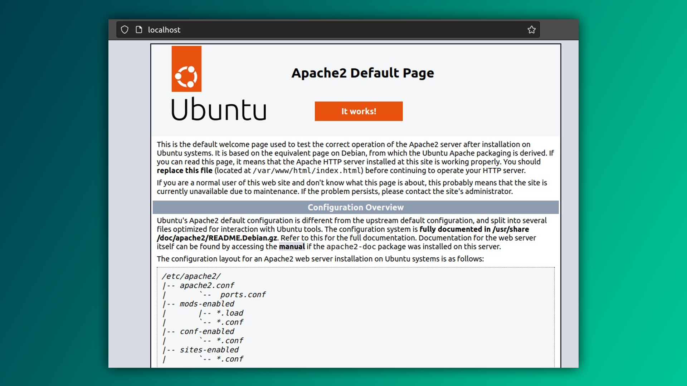

Xizmatlarni boshqarishda `service` va `systemctl` buyruqlari ishlatiladi. `service` eski usul bo'lib, tizim xizmatlarini boshqarish uchun ishlatiladi, `systemctl` esa yangilangan va keng qamrovli imkoniyatlarga ega.

- **systemctl** = yangi usul
- **service** = eski usul

Misol uchun, Apache2 veb-server xizmatini boshqarish uchun:

```bash
$ systemctl start apache2
$ systemctl status apache2
$ systemctl stop apache2
```

Yoki eski usulda:

```bash
$ service apache2 start
$ service apache2 status
$ service apache2 stop
```

## Veb-server yaratish

Veb-server yaratish uchun `apache2` dasturini o'rnatish va ishga tushirish kerak:

```bash
$ sudo apt install apache2
$ service apache2 start
```

Veb-server muvaffaqiyatli ishga tushganini tekshirish uchun quyidagi buyruqni kiritishingiz mumkin:

```bash
$ service apache2 status
```

Brauzeringizda "[localhost](http://localhost)" yoki [127.0.0.1](http://127.0.0.1) manzilini ochib, veb-sahifangizni ko'ring. Sahifani o'zgartirish uchun `/var/www/html/` papkasiga o'zgartirishlar kiriting.



## SSH serverni ishga tushirish

SSH (Secure Shell) orqali kompyuteringizga masofadan ulanish uchun `openssh-server` dasturini o'rnatish zarur:

```bash
$ sudo apt install openssh-server
$ service ssh start
```

SSH xizmatining holatini tekshirish uchun:

```bash
$ service ssh status
```

Endi SSH orqali kompyuteringizga bog'lanishingiz mumkin. Buning uchun:

```bash
$ ssh root@192.168.43.5
password: ****
successfully logged in as user "root"
root~#
```

SSH haqida qo'shimcha ma'lumot uchun quyidagi resurslarga murojaat qiling:

- **[SSH nima?](https://www.websiterating.com/uz/web-hosting/glossary/what-is-ssh/)**
- **[Ubuntu'da SSH server o'rnatish](https://uz.termotools.com/8299-installing-ssh-server-in-ubuntu.html)**

## Xizmatlar boshqaruvi - `systemctl`

Xizmatlarni boshqarish uchun `systemctl` buyrug'idan foydalaning. `systemctl` sizga xizmatlarni yoqish, o'chirish va qayta ishga tushirish imkonini beradi.

### Xizmatni yoqish

```bash
$ systemctl start ssh
```

### Xizmatni o'chirish

```bash
$ systemctl stop ssh
```

### Xizmatni qayta ishga tushirish

```bash
$ systemctl restart ssh
```

### Xizmatlar haqida umumiy ma'lumot

Xizmatlar tizimning asosiy funksiyalarini amalga oshiradi. Masalan, Apache2 veb-server xizmatini ishga tushirganingizda, siz web sahifalaringizni onlayn qilib ko'rsatish imkoniyatiga ega bo'lasiz. Shuningdek, SSH server yordamida masofadan kompyuteringizga bog'lanishingiz mumkin. Har bir xizmat o'zining `.conf` keygaytmasiga ega `/etc/xizmat/` papkasida joylashgan konfiguratsiya fayli orqali boshqariladi.

## Samaradorlikni oshiring

- **CTRL + C** - ko'pincha skript yoki dasturdan chiqish uchun ishlatiladi.
- **CTRL + D** - terminal yoki dasturdan chiqish uchun ishlatiladi.
- **CTRL + SHIFT + C** - terminalda belgilangan matnni nusxalaydi | brovzerda dasturchi panelini ochadi.
- **CTRL + SHIFT + V** - nusxalangan matnni belgilangan joyga qo'yadi.

---

## Topshiriq

### Tarmoqni tahlil qilish

1. `nmap` yordamida o'z kompyuteringizdagi barcha ochiq portlarni aniqlang va ularga qanday xizmatlar bog'langanligini tahlil qiling.
2. `/etc/hosts` fayli haqida batafsil o'rganing.

### Veb-serverni sozlash

1. Apache2 veb-serverini o'rnating va ishga tushiring. O'z veb sahifalaringizni `/var/www/html/` papkasiga qo'ying.

### SSH serverni boshqarish

1. SSH orqali boshqa bir serverga ulanib, birorta fayl yuklab oling.
2. SSH xizmatining xavfsizligini oshirish uchun konfiguratsiyani sozlang. Misol uchun, `root` hisobini qulflang.

**Keyingi dars:** [[08-dars]]