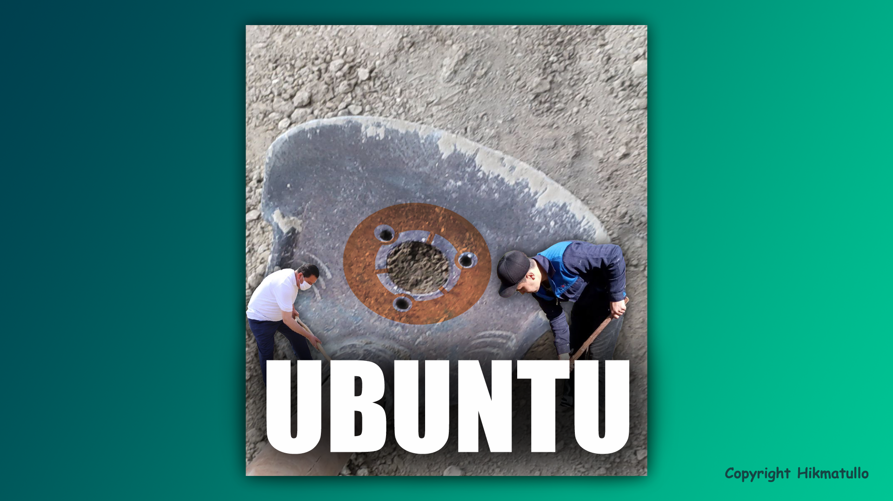

Agar Ubuntu Linux distributividan foydalanadigan bo'lsangiz, samaradorlikni oshirish va kichik qulayliklarga ega bo'lish uchun quyidagi bir nechta buyruqlarni terminalda yozib ko'ring:

```bash
$ gsettings set org.gnome.mutter center-new-windows true
```

**Maqsadi:** yangi ochilgan oynalarni doim monitor markazidan yaratadi. Kattaroq ekranlarda ishlasangiz ayni muddao.

```bash
$ gsettings set org.gnome.desktop.wm.preferences focus-new-windows 'smart'
```

**Maqsadi:** agar siz biron dasturda ishlab turib, chap dock paneldan bironta dasturni ochsangiz, uni ochish o'rniga *Window is ready!* degan eslatmadan sizni xalos qiladi.

```bash
$ sudo apt install ubuntu-restricted-extras
```

 **Maqsadi:** Ubuntu bazaviy holatiga kiritilmagan va ba'zi `doc`, `xls` formatidagi fayllarni va Windows'da yaratilgan fayllarni ochishda duch keladigan shriftlar va qo'shimcha kodi ochiq bo'lmagan lekin, kerakli codec va dasturlarni o'rnatib oladi.

Agar siz dasturchi bo'lsangiz va kompilyator va dasturlashga oid dasturlarni ishga tushirishda sizda har bir kerakli paketlarni birma-bir o'rnatib chiqishni xoxlamasangiz:

```bash
$ sudo apt install build-essential
```

Aytgancha agar siz Ubuntu'da bo'lsangiz va `AppImage` turidagi dasturlarni internetdan yuklab olib ishga tushirmoqchi bo'lsangiz shunchaki xatolik haqida xabar ham chiqmaydi va dastur ishga ham tushmaydi, buni faqat terminalda ko'rib to'g'rilab olish mumkin. Mening holatimda Jetbrains Toolbox ilovasi bilan shunday holat yuz beradi doim. Sizni ortiqcha Googlelash va asablarni yo'qotishdan xalos etish uchun bir qator kod aytaman:

```bash
$ sudo apt install libfuse2
```

Va oxirgi va eng asosiy qadamlardan biri, keyinchalik ko'p asablaringizni tejaydigan ishni qiling, doim oldinda va daryo bilan teng oqish uchun, yangilanishlar serveringizni O'zbekiston uchun ajratilganidan (`uz.archive.ubuntu.com`) dan Asosiy serverga (`archive.ubuntu.com`) o'tkazib oling. Buni Software & Update dasturi orqali osongina amalga oshirish mumkin. Agar sizda Ubuntu server bo'lsa, quyidagi amallarni bajarishingiz kerak.

Avval `sources.list` faylingizni zaxiralang. Har qanday o'zgartirish kiritishdan oldin `sources.list` faylining zaxira nusxasini yaratish ayni muddaodir. Terminalni oching va quyidagi buyruqni bajaring:

```bash
$ sudo cp /etc/apt/sources.list /etc/apt/sources.list.backup
```

Endi qo'rqmay `sources.list` faylini tahrirlashingiz mumkin. Biz buni `nano` matn muharriri orqali amalga oshiramiz:

```bash
$ sudo nano /etc/apt/sources.list
```

>Grafikda ishlayotgan bo'lsangiz, `gedit` dasturini ishlatishingiz mumkin.

`deb` yoki `deb-src` bilan boshlanadigan qatorlarni va URL manzillarni qidiring (bizning vaziyatda `uz.archive.ubuntu.com`). URL manzillarni standart URL (`archive.ubuntu.com`) bilan almashtiring.

Eski:

```bash
deb http://uz.archive.ubuntu.com/ubuntu/ focal main restricted
```

Yangi:

```bash
deb http://archive.ubuntu.com/ubuntu/ focal main restricted
```

Bu jarayonni barcha satrlar uchun bajaring. So'ng, o'zgarishlarni `Ctrl + S` tugmalarini bosib saqlang va `Ctrl + X` tugmalarini bosib Nano-dan chiqing.

Tayyor! Endi bu oxirgi paket ma'lumotlarini olishi kerak.

```bash
$ sudo apt update
```

## Samaradorlikni oshiring

- **Ctrl + Super + D** - Ish stolini ko'rsatish/yashirish.
- **Super + W** - barcha ochiq oynalarni yoyilgan ko'rinishda ko'rsatish.
- **Super + strelka_tugmalari** - oynalarni kattalashtirish yoki plitka qo'yish.
- **Alt + F4** - hozirda fokuslangan oynani yopish.

**P.S.** *Asl maqola [Vodiylik Aka](https://t.me/vodiylik) tomonidan yozilgan.

**Keyingi dars:** [[11-dars]]