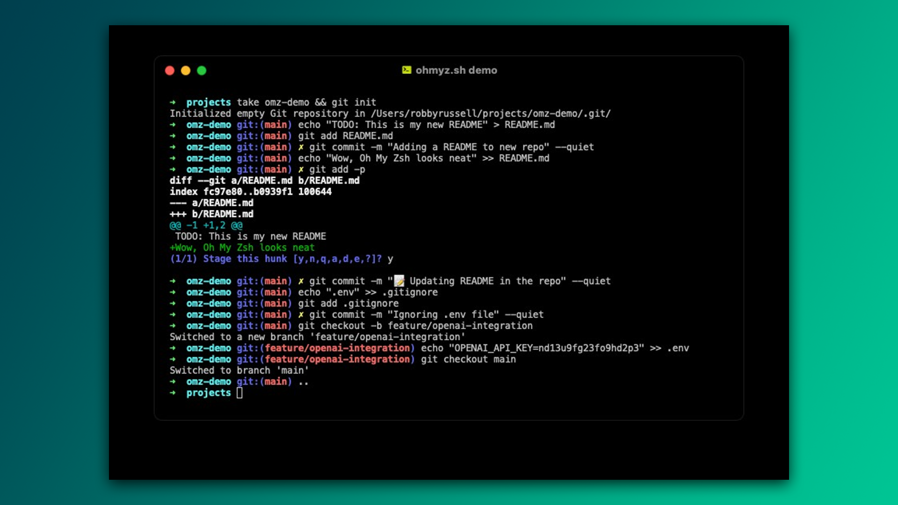
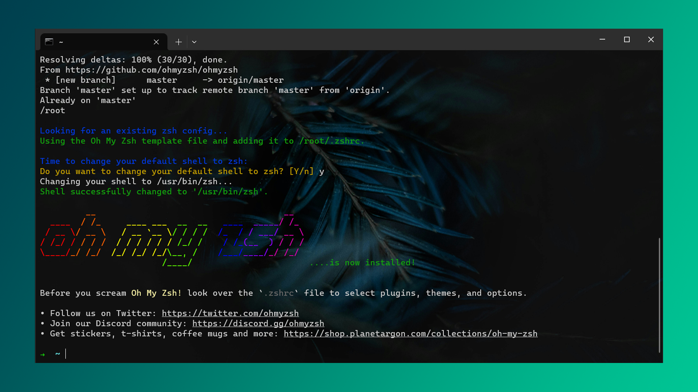
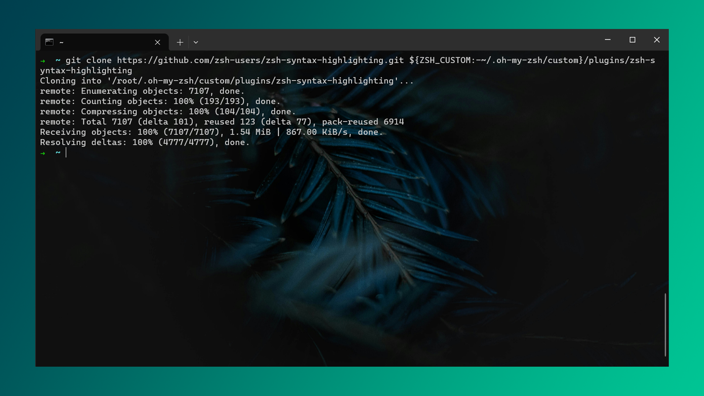
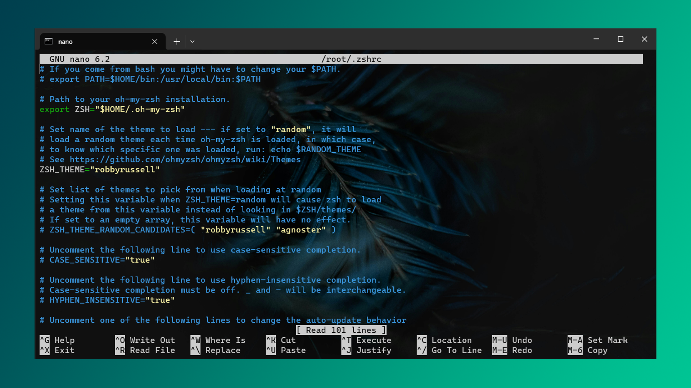
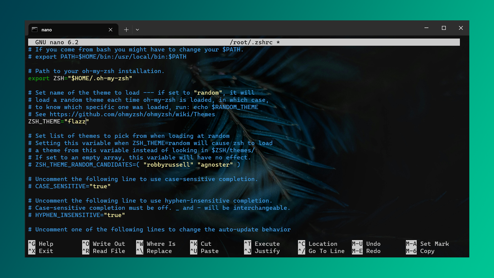
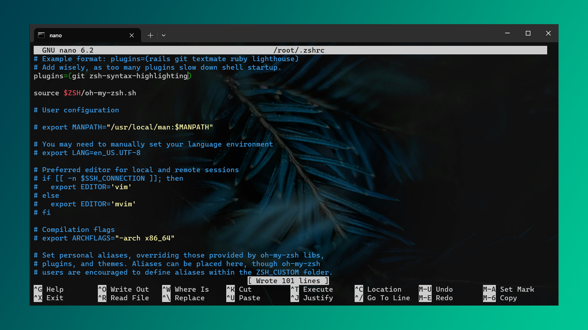
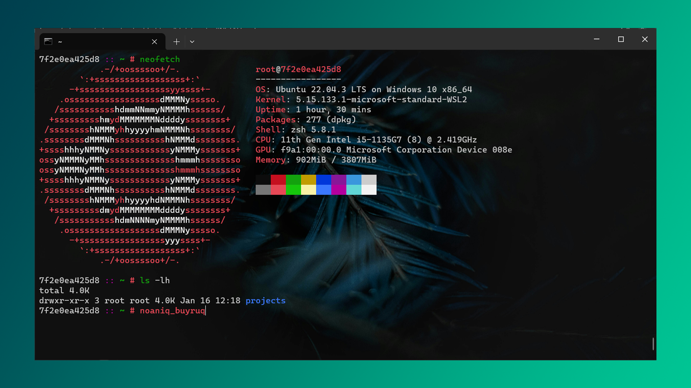

Linux foydalanuvchilari ko‘p vaqtlarini terminalda o‘tkazadilar. Shu sababli, terminal oynasini personallashtirish, yoqimli temalar o'rnatish nafaqat insonni ilhomlantiradi, balki ishga bo‘lgan ishtiyoqni ham oshiradi.



Endi, dastlabki terminal oynasiga o'tib standart bash shell'dan zsh shell'ga o'tamiz - bu huddi CMD'dan Powershell'ga o'tganday gap.

> Agar ba'zi buyruqlar sizga tushunarsiz bo'lsa, hammasi joyida! Bu buyruqlar rasmiy veb-saytlarda shunchaki nusxalab & tashlash niyatida berilgan. Shunchaki jarayonni o'rganing va iloji bo'lsa buyruqlarni qo'lda yozib chiqing. Bu mushak xotirasini yaxshilaydi.

```bash
$ sudo apt install zsh curl git -y
```

- `curl` orqali `ohmyzsh` dasturini tortib olamiz chunki u ilova menejerida mavjud emas.
- `git` orqali ayrim plaginlarni GitHub'dan tortib olamiz.

`ohmyzsh` o'rnatish:

```bash
$ sh -c "$(curl -fsSL https://raw.githubusercontent.com/ohmyzsh/ohmyzsh/master/tools/install.sh)"
```

Sizdan _standart shell'ni zsh'ga o'zgartirish vaqti keldimi?_ deb so'raydi. Siz esa `y` va Enter-ni bosing.



Yaxshi, lekin biz terminalni maksimal darajada o'zgartirishni hoxlaymiz va `highlighter` plaginini o'rnatamiz. Bu plagin yozgan buyruqlarimizni chiroyli qilib bo'yab beradi. Buyruq nomini xato yozadigan bo'lsak, oldindan ogohlantirib turadi - juda kerakli vosita!

Avval plaginni GitHub'dan klonlaymiz (avtomatik plaginni kerakli joyga klonlaydi):

```bash
$ git clone https://github.com/zsh-users/zsh-syntax-highlighting.git ${ZSH_CUSTOM:-~/.oh-my-zsh/custom}/plugins/zsh-syntax-highlighting
```

Menda yuqoridagi buyruq muvaffaqiyatli yakunlanganini ko'rishingiz mumkin:



Plagin tayyor. Hammasi joyida. Endi faqat uni faollashtirish qoldi holos. Buni amalga oshirish uchun `~/.zshrc` faylida `plugins` nomli massivga `zsh-syntax-highlighting` satrini qo'shsak bo'ldi.

```
$ nano ~/.zshrc
```

Keling yo'l-yo'lakay temani o'zgartirib ketamiz - `ZSH_THEME`. Standart ravishda `robbyrussell` temasi tanlangan. Siz o'zingizga kerakli temani [bu yerdan](https://github.com/ohmyzsh/ohmyzsh/wiki/Themes) topishingiz mumkin. Darvoqe, bu ortiqcha plagin talab qilmaydi - hammasi allaqachon kompyuteringizga o'rnatilgan!



Shaxsan menga `flazz` temasi yoqadi chunki u minimalist va ortiqcha detallarsiz. Shunday qilib men `flazz` ga o'zgartiraman.



Mana endi plaginni qo'shsak ham bo'ladi.



`CTRL + S` tugmalarini bosib faylni saqlang va `CTRL + x` tugmalarini bosib fayldan chiqib keting. Natija ish berishi uchun terminaldan chiqib qayta kirishingiz yoki quyidagi buyruqni yozib terminalga "restart" berishingiz mumkin:

```bash
$ source ~/.zshrc
```

Manabuni terminal desa bo'ladi! 🔥



**Keyingi dars:** [[12-dars]]
