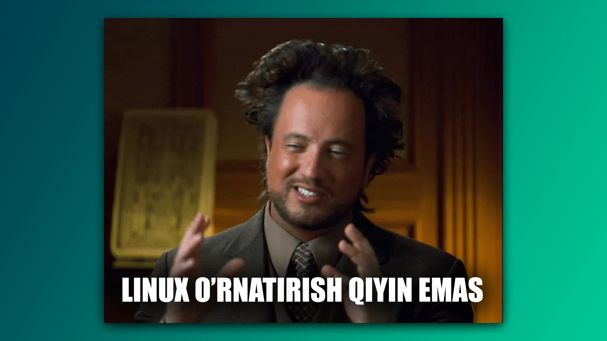
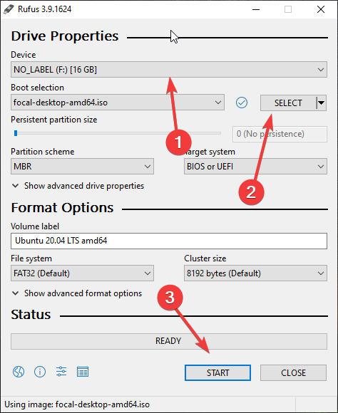
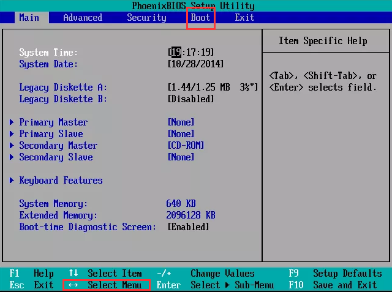
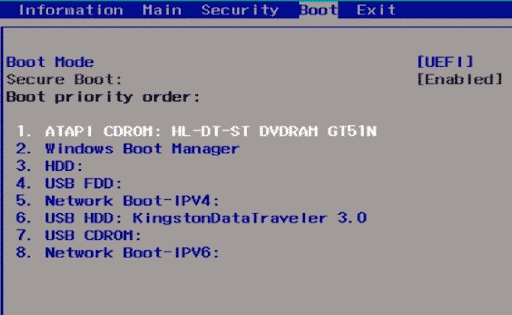
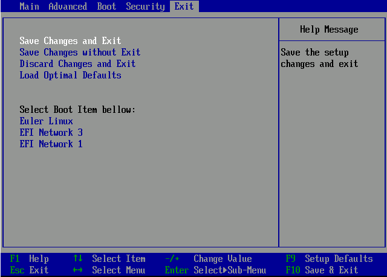
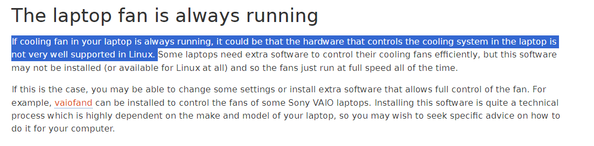

---
tags:
  - linux-ornatish
  - bios
  - tlp
description: Agar virtual/live Linux bilan bir qancha vaqt shug'ullanib, uning interfeysi, sozlamalari va asosiy ma'lumotlar haqida yetarli bilimga ega bo'lsangiz, ehtimol, Linux'dan maksimal darajada rohatlanish uchun uni asosiy kompyuteringizga o'rnatish vaqti keldi. Bu juda ham oddiy jarayon bo'lib, kamida 20 daqiqa vaqtingizni oladi.
title: 13 - Linux O'rnatish
sort: 13
---


Agar virtual/live Linux bilan bir qancha vaqt shug'ullanib, uning interfeysi, sozlamalari va asosiy ma'lumotlar haqida yetarli bilimga ega bo'lsangiz, ehtimol, Linux-dan maksimal darajada rohatlanish uchun uni asosiy kompyuteringizga o'rnatish vaqti keldi. Bu juda ham oddiy jarayon bo'lib, kamida 20 daqiqa vaqtingizni oladi.

>Keyingi darslarda Linux-ni Windows yoniga, tashqi SSD va fleshkaga o'rnatishni ko'rib chiqamiz inshoolloh. 

## Reja

Linux o'rnatish uchun oddiy fleshka zarur chunki siz oxir oqibat joriy tizimni butunlay o'chirib, yangi tizim, Linux, o'rnatyapsiz. Kompyuter o'z-o'zini o'chirib, boshqa bir tizim yoza olmaydi - bu huddi ishlayotgan dasturni o'chirishdek gap. Fleshkaga yengil tizim o'rnatilgan bo'lib, u yerdan kompyuterga Linux o'rnatishimiz mumkin.

Quyidagi distributivlardan birini tanlab, rasmiy sayti orqali `.iso` kengaytmali faylni yuklab oling:

| Distributiv | Havola |
| :--- | :--- |
| Fedora | [www.fedoraproject.org](https://www.fedoraproject.org/) |
| Red Hat Enterprise Linux (RHEL) | [www.redhat.com](https://www.redhat.com/) |
| CentOS | [www.centos.org](https://www.centos.org) |
| Debian | [www.debian.org](https://www.debian.org)  |
| Ubuntu | [www.ubuntu.com](https://www.ubuntu.com)  |
| Linux Mint | [www.linuxmint.com](https://www.linuxmint.com)  |
| SUSE | [www.suse.com](https://www.suse.com) |
| OpenSUSE | [www.opensuse.org](https://www.opensuse.org) |

### Rufus

Windows foydalanayotganingizni taxmin qilgan holda [Rufus](https://rufus.ie/en/) dasturini yuklab olishingizni maslahat beraman. U orqali fleshkaga ISO fayllarni yozish mumkin.



1. Bu yerda kompyuterga ulangan fleshkalarni ko'rish/tanlash mumkin.
2. Avval tortib olingan ISO faylni belgilash.
3. START - o'z nomi bilan ISO faylni tanlangan fleshkaga yozishni boshlaydi.

Jarayon 10-15 daqiqa vaqt oladi, albatta bu fleshka va tizim spetsifikatsiyasiga bog'liq. Agarda sizda USB3 turidagi fleshka bo'lsa, juda tez yakunlanadi.

>Linux yoki Mac foydalanuvchilari uchun - [BalenaEtcher](https://etcher.balena.io/)

### BIOS

**BIOS** (asosiy kirish/chiqish tizimi) kompyuterning operatsion tizimi, qattiq disk, video adapter, klaviatura, sichqoncha va printer kabi biriktirilgan qurilmalar o'rtasidagi ma'lumotlar oqimini boshqaradi.

BIOS'ga o'tish kaliti hamma kompyuterlarda har xil. Buni Google orqali kompyuter modelingizni yozib aniqlaysiz, lekin ko'p hollarda `F2` yoki `ESC` tugmalari qo'l keladi. Kompyuter yonayotganda o'sha kalitlarni BIOS oynasiga o'tguncha to'xtovsiz bosib turish zarur.

Kompyuter BIOS'ga o'tgach, Linux yozilgan fleshkamizni asosiy tizim deb belgilashimiz zarur - kompyuter yonayotganda fleshka borligini tekshiradi va undagi tizimni RAM'ga yuklaydi. BIOS ekranida Boot yoki shunga o'xshash nomlangan bo'limni ko'rishingiz mumkin:



U yerga strelka tugmalari orqali o'tib, fleshkani 1-o'ringa olib o'tish kerak. Ko'pincha bu `F5` va `F6` tugmalari orqali amalga oshiriladi, lekin bu haqida o'ng tomondagi panelda yozib qo'yilgan.



So'ngra "Exit" bo'limiga o'tib "Save Changes and Exit" tugmasi bosiladi:



Shunday qilib kompyuter fleshkadagi tizim bilan yonadi, muhimi fleshka yaxshi o'rnatilganligiga ishonch hosil qiling.

### Vizual

Yuqoridagi qadamlarni bajarib bo‘lgach, distributivga mos keladigan videoni tanlang va unga amal qilgan holda o‘rnatishni davom ettiring:

| Distributiv | Havola |
| :--- | :--- |
| Fedora 38 | [YouTube - Fedora](https://youtu.be/W79NdszUhiI?si=jKcPRiKPxnorO2IU) |
| CentOS 8.2 | [YouTube - CentOS](https://youtu.be/Qqx-KtpAlrg?si=cXT5QbuKafda_HHk) |
| Debian 12 | [YouTube - Debian](https://youtu.be/0uBJHxYSiYU?si=FpQJsKSL3dZBMVvW) |
| Ubuntu 22.04 LTS | [YouTube - Ubuntu](https://youtu.be/rkpyQ9dSkDU?si=mHnKavL11pxQDwQ9) |
| Linux Mint 20.01 | [YouTube - Linux Mint](https://youtu.be/Z0NGXPOOmRQ?si=JbTQmHVicynGEZ0m) |
| OpenSUSE | [YouTube - OpenSUSE](https://www.youtube.com/watch?v=ZZ_zDUFn8Q0) |

>LTS (long-time-support) uzoq muddatli qo'llab quvvatlashni anglatadi, ya'ni bu yerda tizimning butun umri davomida yangilash, tuzatish va texnik xizmat ko'rsatish majburiyatlarini kompaniya o'z bo'yniga oladi. **Ubuntu 22.04 LTS** 2027-yil Aprel oyigacha qo'llab quvvatlanadi.

## Xulosa

Siz tanlagan distributiv sizga ko'p xizmat qilishini ta'minlash uchun `tlp` (*noutbukning batareya quvvatini tejaydi)* kabi dasturlarni o'rnating. Bu dastur asosan Ubuntu foydalanuvchilariga tegishli chunki men ko'p noutbuklarda fanning to'xtovsiz shovqinli ishlab turishini guvohi bo'ldim. Agar sizda bu xol kuzatilsa:
  
```bash
$ sudo apt install tlp
$ sudo tlp-start
```

Shunday qilib, `tlp` xizmati har kompyuter yonishida ishga tushadi. Agar bu yordam bermasa qo'rqamanki sizning kompyuteringiz Linux-ni to'liq qo'llab quvvatlamaydi. Mana rasmiy javob:

 

**Savollar tug'ilsa** - [community-chat](https://t.me/linux_uzbekistan)

**Keyingi dars:** [[14-dars]]