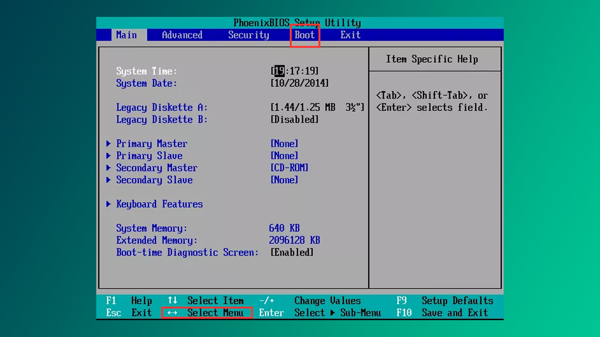
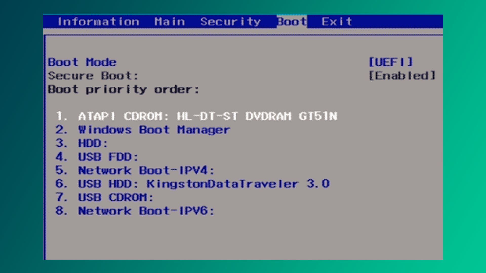
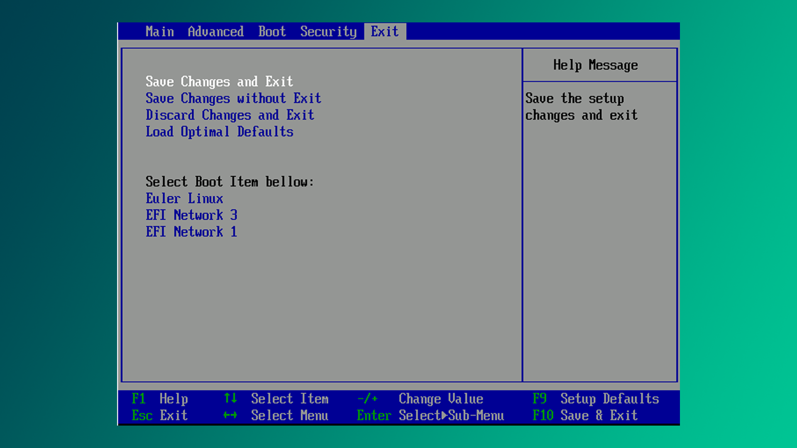
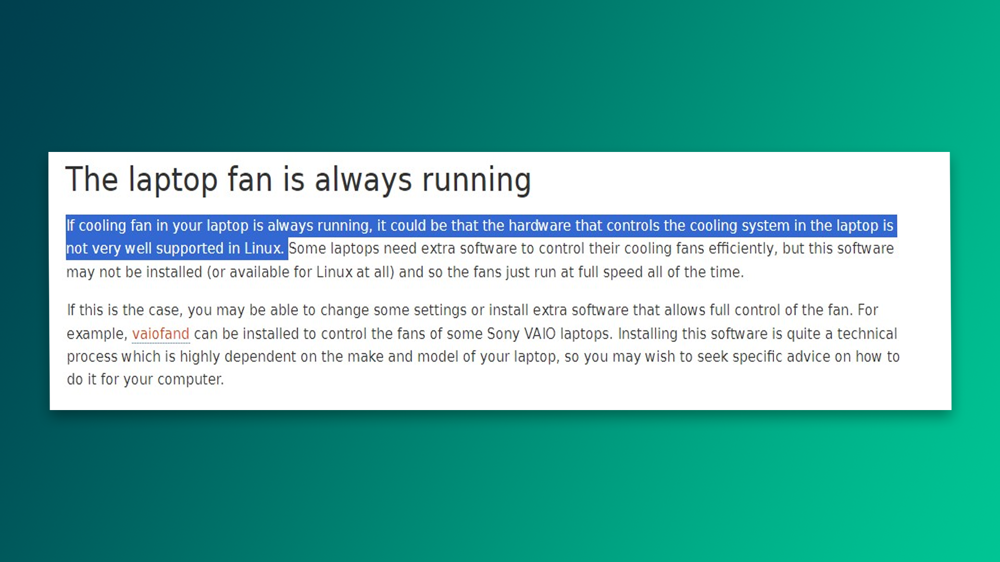

Agar virtual/live Linux bilan bir qancha vaqt shug'ullanib, uning interfeysi, sozlamalari va asosiy ma'lumotlar haqida yetarli bilimga ega bo'lsangiz, ehtimol, Linux-dan maksimal darajada rohatlanish uchun uni asosiy tizim sifatida o'rnatish vaqti keldi. Bu juda ham oddiy jarayon bo'lib, kamida 20 daqiqa vaqtingizni oladi.

>[!tip] Linux-ni Windows yoniga, H/SDD yoki fleshkaga o'rnatish mumkin.

## Yuklash

Linux o‘rnatish uchun sizga fleshka kerak, chunki oxir-oqibat hozirgi tizimingizni Linux bilan almashtirasiz. Kompyuter ishlayotgan paytda o‘z-o'zini qayta yoza olmaydi - buni ochiq turgan dasturni yopishga o‘xshatish mumkin. Fleshkada alohida yengil tizim bo‘ladi, o'sha yerdan Linux yoziladi.

Quyidagi distributivlardan birini tanlab, rasmiy saytidagi `.iso` kengaytmali faylni yuklab oling:

| Distributiv | Havola |
| :--- | :--- |
| Fedora | [www.fedoraproject.org](https://www.fedoraproject.org/) |
| Red Hat Enterprise Linux (RHEL) | [www.redhat.com](https://www.redhat.com/) |
| CentOS | [www.centos.org](https://www.centos.org) |
| Debian | [www.debian.org](https://www.debian.org)  |
| Ubuntu | [www.ubuntu.com](https://www.ubuntu.com)  |
| Linux Mint | [www.linuxmint.com](https://www.linuxmint.com)  |
| SUSE | [www.suse.com](https://www.suse.com) |
| OpenSUSE | [www.opensuse.org](https://www.opensuse.org) |

## Rufus

Windows foydalanayotganingizni taxmin qilgan holda [Rufus](https://rufus.ie/en/) dasturini yuklab olishingizni maslahat beraman. U orqali fleshkaga ISO fayllarni yozamiz.


1. Bu yerda kompyuterga ulangan fleshkalarni ko'rish/tanlash mumkin.
2. Tortib olingan ISO faylni belgilash.
3. START - ISO faylni tanlangan fleshkaga yozadi.

Jarayon 10-15 daqiqa vaqt oladi, albatta bu fleshka va tizim spetsifikatsiyasiga bog'liq. Agar sizda USB3 turidagi fleshka bo'lsa, juda tez yakunlanadi.

>[!info] Linux yoki Mac uchun [BalenaEtcher](https://etcher.balena.io/)

## BIOS

BIOS (Basic Input/Output System) kompyuteringizning operatsion tizimi, qattiq disk, video adapter, klaviatura, sichqoncha, printer va h.k o‘rtasidagi ma’lumotlar oqimini boshqaradi.

BIOS-ga o'tish kaliti turli modellarda farq qiladi. Siz buni internetdan qidirib topishingiz kerak, ammo ko‘pincha F2 yoki ESC tugmalari ish beradi. Kompyuteringiz yonayotganda o'sha tugmani qayta-qayta bosib turing.

BIOS-ga kirgandan so‘ng, fleshkani asosiy yuklash qurilmasi sifatida belgilang. BIOS kompyuter ishga tushganda fleshkani tekshiradi va undagi tizimni operativ xotiraga yuklaydi:



U yerga strelka tugmalari orqali o'tib, fleshkani 1-o'ringa olib o'tish kerak. Ko'pincha bu `F5` va `F6` tugmalari orqali amalga oshiriladi, lekin bu haqida o'ng tomondagi panelda yozib qo'yilgan.



So'ngra "Exit" bo'limiga o'tib "Save Changes and Exit" tugmasi bosing:



Shunday qilib kompyuter fleshkadagi tizim bilan yonadi, muhimi fleshka yaxshi o'rnatilganligiga ishonch hosil qiling.

## Vizual

Yuqoridagi qadamlarni bajarib bo‘lgach, distributivga mos keladigan videoni tanlang va uni kuzatgan holda o‘rnatishni davom ettiring:

| Distributiv      | Havola                                                                   |
| :--------------- | :----------------------------------------------------------------------- |
| Fedora 38        | [YouTube - Fedora](https://youtu.be/W79NdszUhiI?si=jKcPRiKPxnorO2IU)     |
| CentOS 8.2       | [YouTube - CentOS](https://youtu.be/Qqx-KtpAlrg?si=cXT5QbuKafda_HHk)     |
| Debian 12        | [YouTube - Debian](https://youtu.be/0uBJHxYSiYU?si=FpQJsKSL3dZBMVvW)     |
| Ubuntu 22.04 LTS | [YouTube - Ubuntu](https://youtu.be/rkpyQ9dSkDU?si=mHnKavL11pxQDwQ9)     |
| Linux Mint 20.01 | [YouTube - Linux Mint](https://youtu.be/Z0NGXPOOmRQ?si=JbTQmHVicynGEZ0m) |
| OpenSUSE         | [YouTube - OpenSUSE](https://www.youtube.com/watch?v=ZZ_zDUFn8Q0)        |

>[!info] Ubuntu LTS 
>LTS (long-time-support) uzoq muddatli qo'llab quvvatlashni anglatadi, ya'ni bu yerda tizimning butun umri davomida yangilash, tuzatish va texnik xizmat ko'rsatish majburiyatlarini kompaniya o'z bo'yniga oladi. **Ubuntu 22.04 LTS** 2027-yil Aprel oyigacha qo'llab quvvatlanadi.

## Xulosa

Siz tanlagan distro sizga ko'p xizmat qilishini ta'minlash uchun `tlp` (noutbukning batareya quvvatini tejaydi) kabi dasturlarni o'rnating. Bu dastur asosan Ubuntu foydalanuvchilariga tegishli. Men ko'p Ubuntu noutbuklarda fanning to'xtovsiz shovqinli ishlab turishini guvohi bo'ldim. Agar sizda bu xol kuzatilsa:
  
```bash
$ sudo apt install tlp
$ sudo tlp-start
```

Bu yordam bermasa, qo'rqamanki kompyuteringiz Linux-ni to'liq qo'llab quvvatlamaydi. Mana rasmiy javob:

 

**Keyingi dars:** [[14-dars]]
