Ushbu yo‘riqnomani o‘qib chiqgach, tizimdagi vaqt, til, mavzu va boshqa ko‘plab sozlamalarni qanday o‘zgartirish mumkinligini bilib olasiz. Keltirilgan ma’lumotlar deyarli barcha distributivlarga taalluqli.

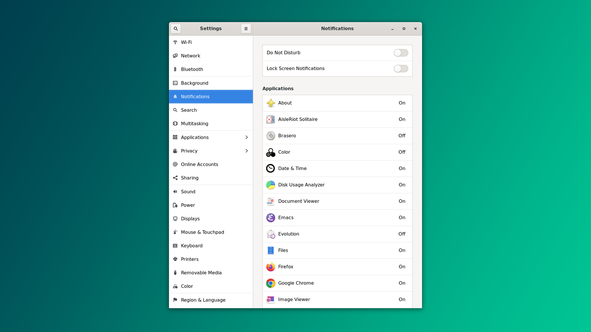

## Standart dasturlar

PDF, HTML yoki matnli fayllar siz hoxlagan dastur tomonidan ochilishi uchun ularni "**Applications**" bo'limidan konfiguratsiya qilish lozim. *Default Handlers* ya'ni standart boshqaruvchilar maydoni bunga javob beradi. 

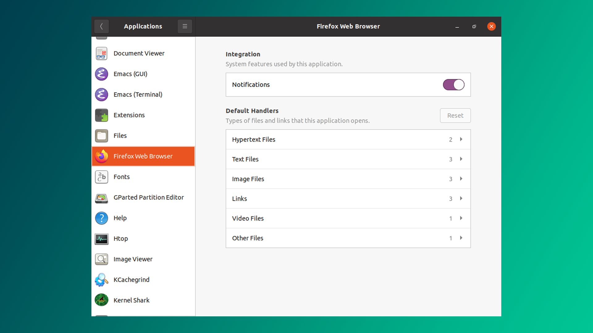

## Foydalanuvchi ma'lumotlarini yangilash

Parol, ism va qulf ekranida ko'rinadigan login rasmi kabi ma'lumotlarni "Users" bo'limiga o'tib yangilash mumkin.

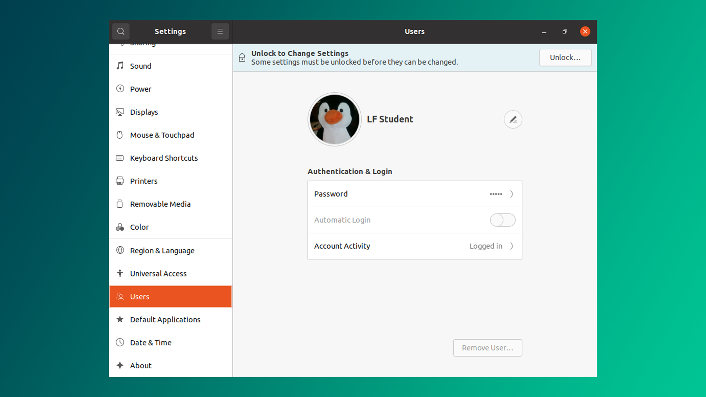

## Vaqt & kunni sozlash

**Settings > Date & Time** bo'limidan vaqt va kunga oid sozlamalarni o'zgartirishingiz mumkin.

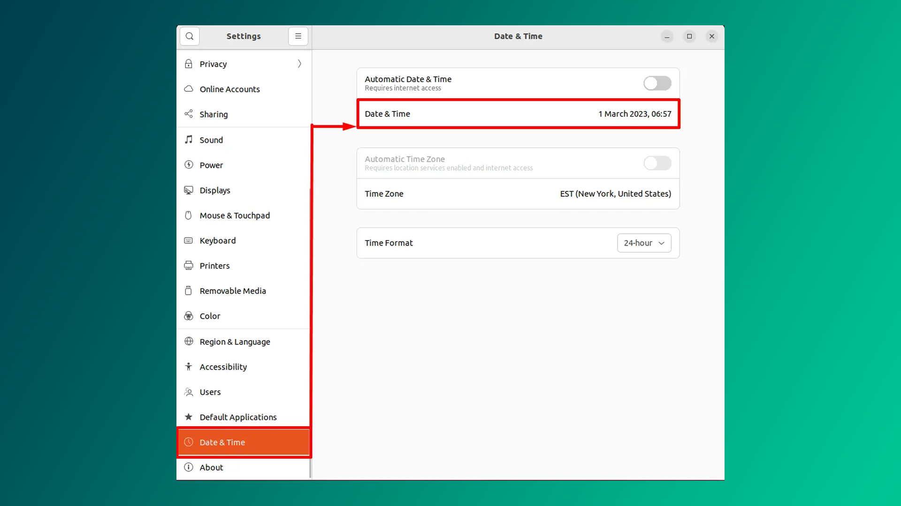

Avtomatik date & time opsiyasi yoniq turgani ma'qulroq. Vaqtni terminalda quyidagicha o'zgartirish mumkin (*hech narsa chiqmasa buyruq muvaffaqiyatli yakunlanganini bilish mumkin*):

```bash
$ sudo timedatectl set-time “2023-03-01 07:15:24”
```

## Tilni o'zgartirish 

Linux o'rnatgach, interfeys Ingliz tilidaligini ko'rishingiz mumkin. Buni, misol uchun, Rus tiliga o'zgartirish uchun -> **Settings/Region & Language** bo'limiga o'tib **Language** maydonidan Russian/Rus tilini belgilaysiz va kompyuterni **o'chirib yoqasiz**. 

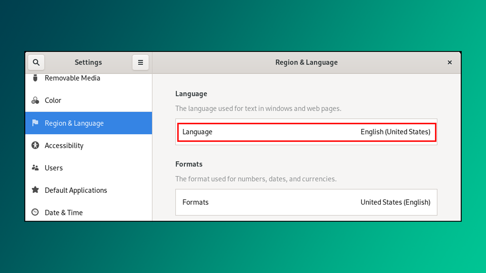

>Ba'zan sizga kerakli til o'rnatilmagan bo'ladi va bunday hollarda "**Language Support**" bo'limiga kirib kerakli tilni import qilish lozim.

## Displey sozlamalari

Tizim odatda ekraningiz uchun eng maqbul o‘lchamni avtomatik ravishda aniqlasa-da, ba’zi hollarda, masalan virtual mashina ichida ishlatilganda, bu noto‘g‘ri sozlanishi mumkin. Yoki bir nechta displey ulaganda ularning joylashuvini o‘zgartirishni istaysiz. Bunday vaziyatlarda displey sozlamalari sizga barcha zarur parametrlarni taqdim etadi.

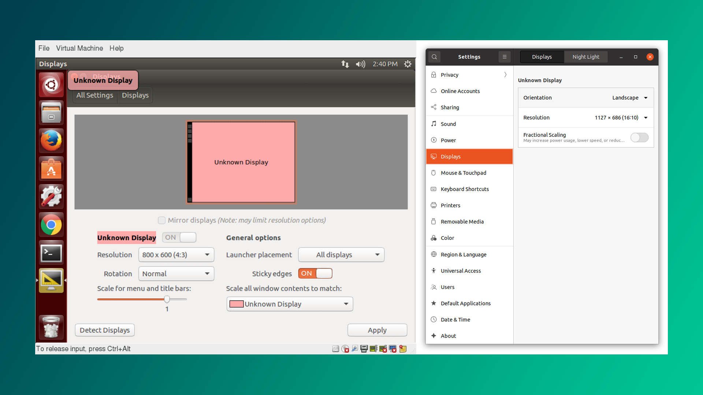

## Printerni sozlash

Yangi printer qo'shish yoki mavjud printerlarni konfiguratsiya qilish juda oddiy. Buning uchun **Settings > Printers** bo'limiga o'tib, "Unlock" tugmasini bosasiz.

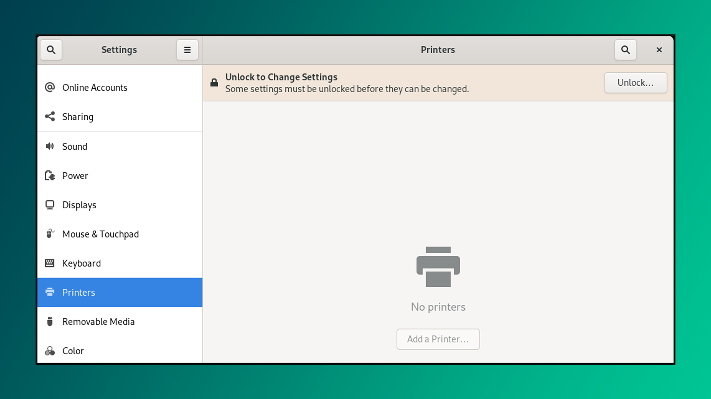

Sizdan "root" ya'ni admininstrator hisob parolini so'raydi. Uni kiriting.


Keyin, printer IP manzili yoki nomini yozib "Add" tugmasini bosasiz.

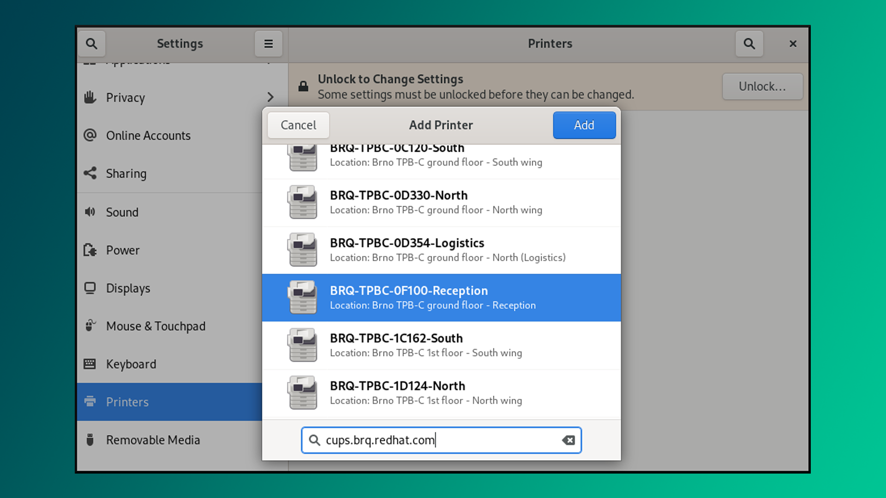

### Test sahifasi

Mana endi printer qo'shildi. **Printing Options → Test Page** tugmasini bosish orqali printerda test sahifasini chop etishingiz mumkin.

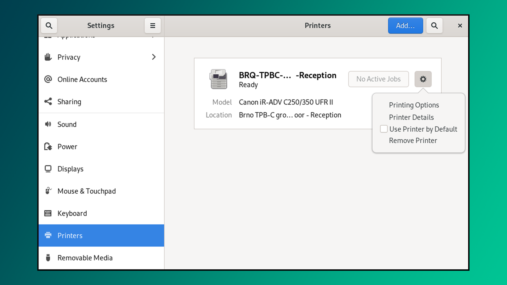

## Noutbukni yopganda tizim qanday chora ko'rishini belgilash 

Noutbuk qopqog‘ini yopganingizda, u batareya quvvatini tejash maqsadida ekranni o‘chiradi. Bu xatti-harakatni o‘z xohishingizga ko‘ra sozlashingiz mumkin.

>[!warning] Ehtiyot bo'ling
>Noutbuk yopiq holda uzoq ishlasa qizib ketadi.

1. Terminal oynasini oching (Ubuntu: **CTRL + ALT + T**)
2. `sudo nano /etc/systemd/logind.conf` - faylni matn muharriri orqali oching.
3. `HandleLidSwitch=suspend` - o'xshash qatorni qidiring
4. Agar qator kommentga olingan bo'lsa ya'ni `#` belgisi bilan boshlansa, uni o'chiring.
5. `suspend` - satrini quyidagilardan biriga o'zgartirishingiz mumkin:
	- `poweroff` - kompyuterni o'chiradi
	- `lock` - kompyuterni qulflaydi
	- `ignore` - hech narsa qilmaydi
6. Faylni saqlang va muharrirdan chiqib keting

## Quvvat tugmasini bosganda tizim qanday chora ko'rishini belgilash

Kompyuterdagi quvvat tugmasini bosganingizda, u tizimni o‘chiradi. Siz bu xatti-harakatni o‘z xohishingizga muvofiq sozlashingiz mumkin.

1. Terminal oynasini oching (Ubuntu: **CTRL + ALT + T**)
2. `sudo nano /etc/systemd/logind.conf` - faylni matn muharriri orqali oching.
3. `HandlePowerKey=poweroff` - o'xshash qatorni qidiring
4. Agar qator kommentga olingan bo'lsa ya'ni `#` belgisi bilan boshlansa, uni o'chiring.
5. `poweroff` - satrini quyidagilardan biriga o'zgartirishingiz mumkin:
	- `reboot` - kompyuterni o'chirib yoqadi
	- `halt` - tizimni to'xtatadi
	- `hibernate` - tizimni kutish rejimiga o'tkazadi
	- `ignore` - hech narsa qilmaydi
1. Faylni saqlang va muharrirdan chiqib keting

## gnome-tweaks 

Ko'pgina personallashtirish konfiguratsiyalari sozlamalar menyusida ko'rinmaydi. Qo'shimcha qulaylik/funksiyalarga ega bo'lish uchun `gnome-tweaks` (eski distributivlarda `gnome-tweak-tool`) deb nomlangan vositani o'rnatish kerak. Har doim Alt-F2 tugmalarini bosib, `gnome-tweaks` kiritish orqali dasturni ishga tushirish mumkin. Agar dastur kompyuteringizda topilmasa, quyidagi buyruqlarni ketma-ket yozib o'rnating:

```bash
$ sudo apt update
$ sudo apt install gnome-tweaks -y
```

Bu vosita bilan qilishingiz mumkin bo'lgan ayrim narsalar: tema tanlash, Internetdan yuklab olingan kengaytmalarni sozlash, yangi shriftlar o'rnatish, klaviatura tartibini o'zgartirish va tizim yonganda ishga tushadigan dasturlarni sozlash.

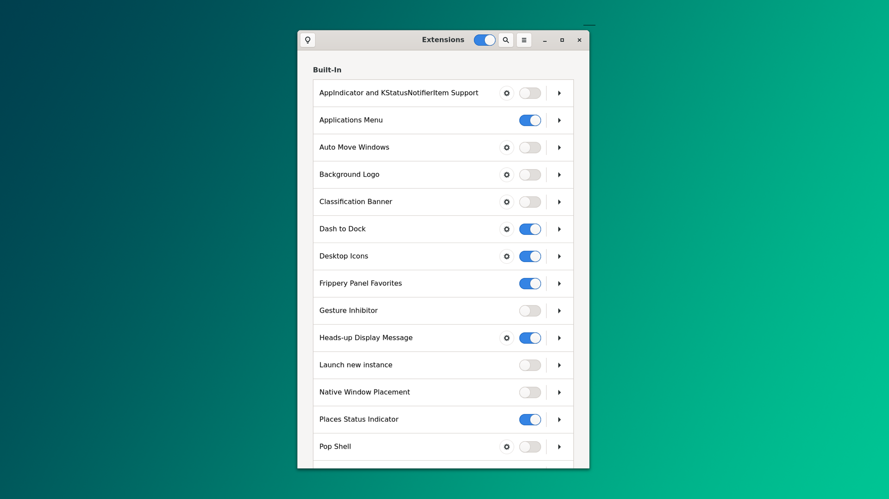

## Gnome kengaytmalari

`gnome-extension-manager` dasturi orqali  [extensions.gnome.org](https://extensions.gnome.org/) saytidan yoki ilova ichidan turli-xil kengaytmalarni kompyuterga bepul o'rnatish mumkin. Agar saytdan foydalanayotgan bo'lsangiz brovzeringizda [Gnome Shell Integration](https://chromewebstore.google.com/detail/gnome-shell-integration/gphhapmejobijbbhgpjhcjognlahblep) nomli kengaytma o'rnatilgan bo'lishi zarur:


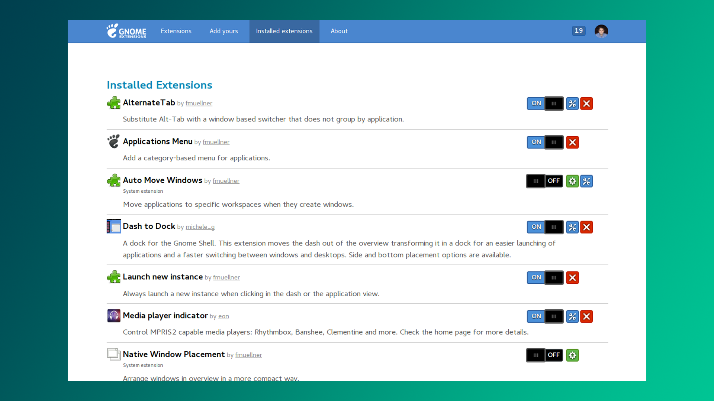

>Agar kerakli kengaytma ilova ichidan topilmasa saytdan qidirishni tavsiya qilaman. 

Darvoqe, `gnome-extension-manager` ilovasini app-store-dan o'rnatish mumkin. Shunday qilib, eng foydali va dolzarb bo'lgan ba'zi kengaytmalar quyidagilardir:

- Blur My Shell
- Dash to Panel
- Desktop Icons NG
- WinTile
- Net Speed Simplified
- Gesture Improvements
- Impatience

### Blur My Shell

[Blur My Shell](https://extensions.gnome.org/extension/3193/blur-my-shell/) kengaytmasi sizga o'zi aytgan narsani beradi: xiralik effekti.  Kengaytma yordamida dok va qidiruv paneli orqa foniga xiralik effektini berish mumkin. 

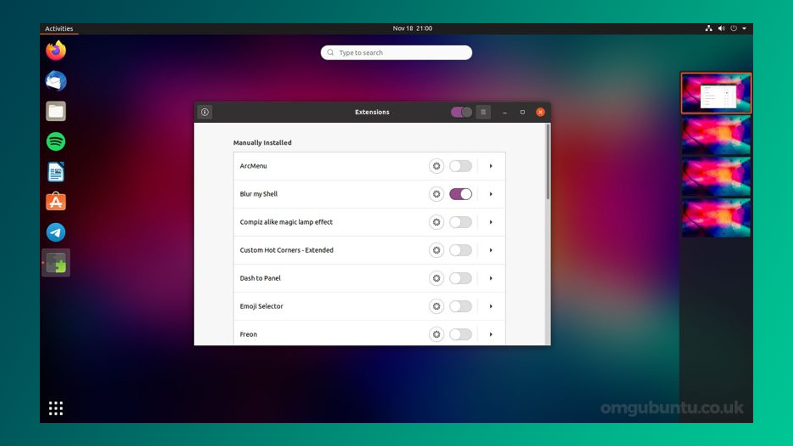

### Dash to panel

Windows yoki Mint-dagiga o'xshash taskbar sizga ko'proq yoqsa, [Dash to Panel](https://extensions.gnome.org/extension/1160/dash-to-panel/) kengaytmasi aynan siz uchun.  

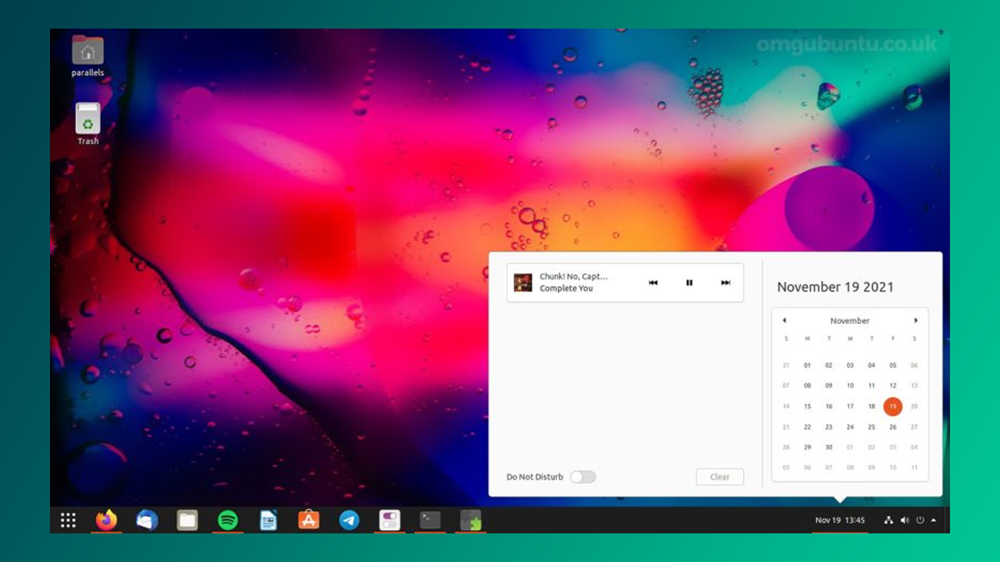

### Desktop icons NG

[Desktop icons NG](https://extensions.gnome.org/extension/2087/desktop-icons-ng-ding/) kengaytmasi ko'proq Ubuntu 20.04 LTS va Debian foydalanuvchilari uchun mo'ljallangan - va siz buni aniq xohlaysiz, chunki u ilova va fayllarni ish stoliga sudrab olib o'tish imkonini beradi. 

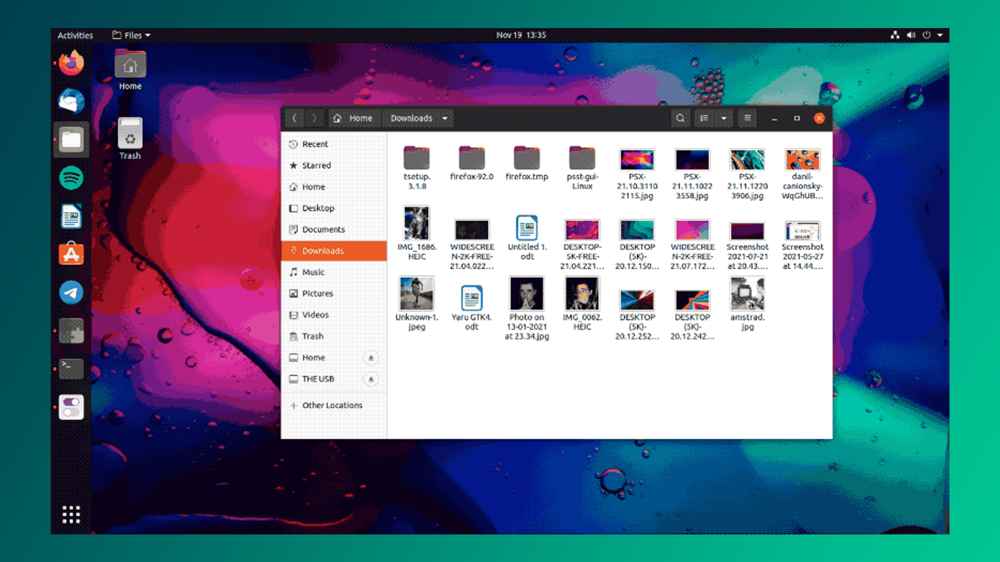

### WinTile

Windows va Mac-dagi kabi oynalarni chorak burchaklarga mahkamlash Linux-da standart qo'llab quvvatlanmaydi. Shu sababli sizga [WinTile](https://extensions.gnome.org/extension/1723/wintile-windows-10-window-tiling-for-gnome/) kengaytmasi zarur.

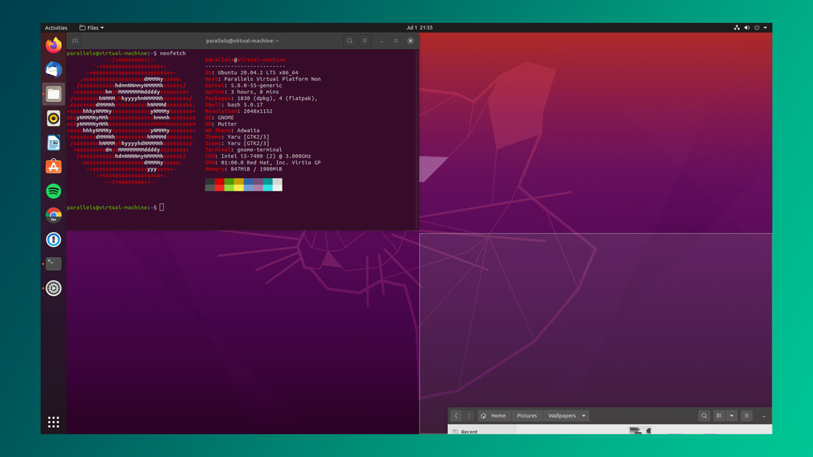

### Net speed simplified

Real vaqtda internet tezligini kuzatib borish uchun ajoyib kengaytma - [NetSpeedSimplified](https://extensions.gnome.org/extension/1723/wintile-windows-10-window-tiling-for-gnome/)

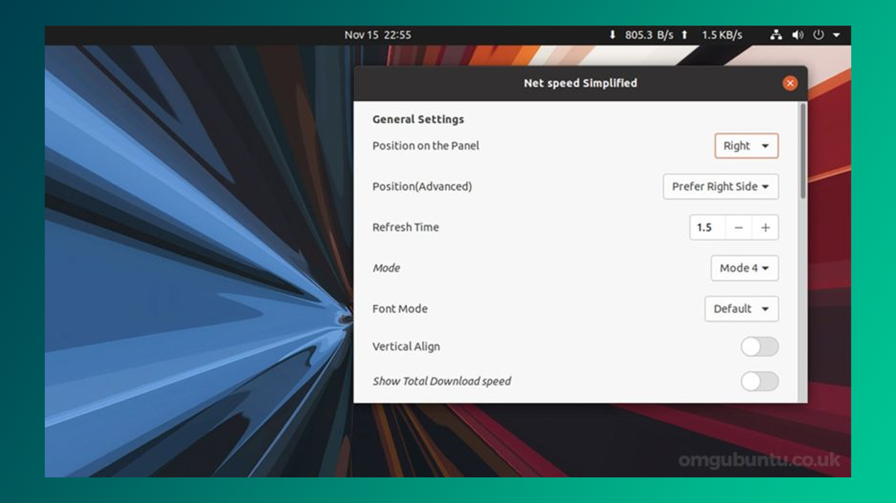

### Gesture Improvements

Windows va OSX-da oynalarni barmoqlar orqali surib almashtirish Ubuntu-da "[Gesture Improvements](https://extensions.gnome.org/extension/4245/gesture-improvements/)" nomli plagin o'rnatilishini talab qiladi. 

### Impatience

Sabrsiz odamlarga tegishli bu kengaytma - [Impatience](https://extensions.gnome.org/extension/277/impatience/) - navigatsiya, dastur ishga tushishi va boshqa animatsiyalarni 2 baravar tezlashtiradi. 

### OpenWeather

[OpenWeather](https://extensions.gnome.org/extension/750/openweather/) kengaytmasi yordamida yerning istalgan yuzasidagi ob-havo ma'lumotlarini olish mumkin. 

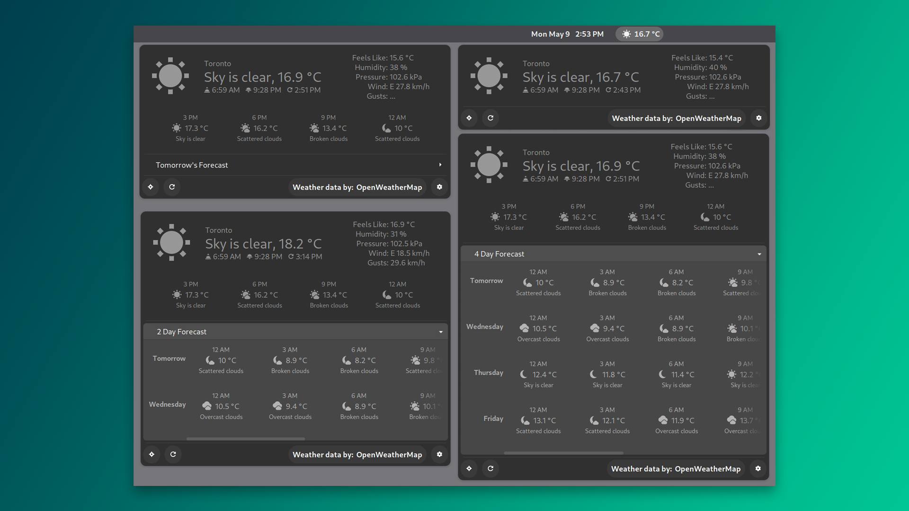

## Foydali manbalar

- [Ubuntu sozlamalari](https://youtu.be/o1wWIoB1jVk?si=Hiw7YITgr5Cd-gzD) - "Salom Dunyo" YouTube kanalidan
- [Linux operatsion tizimi](https://youtu.be/GGupJiaOx8w?si=uPzeRVar1xGROwxD) - "Milliy ta'lim resurslari" YouTube kanalidan

**Keyingi dars:** [[15-dars]]