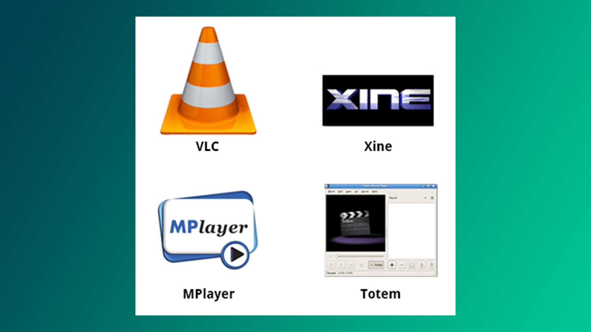
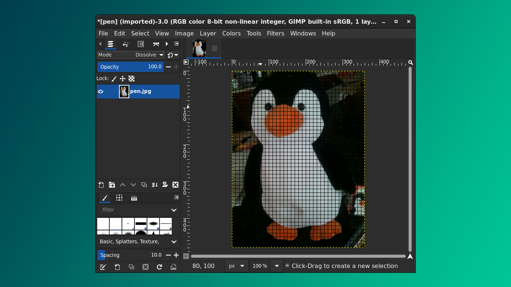

Windows yoki OSX bilan uzoq vaqt ishlaganingizdan so‘ng Linux-ga ilk qadam qo‘yganingizda, siz har kuni foydalanadigan MS Office, Adobe va AutoCAD kabi dasturlar Linux uchun maxsus ishlab chiqilmaganini payqaysiz. Biroq, albatta, bularga muqobil variantlar mavjudligini ham unutmang.

## Veb-brovzerlar

Linux grafikli va terminalga asoslangan turli xil veb-brauzerlarni taklif etadi, jumladan:

- [Firefox](https://www.mozilla.org/en-US/firefox/new/) 
- [Google Chrome](https://www.google.com/chrome/)
- [Chromium](https://www.chromium.org/getting-involved/download-chromium/)
- [Konqueror](https://apps.kde.org/konqueror/)
- linx, lynx, w3m (terminalda)
- Opera 

## E-mail ilovalar

Ko'pchilik elektron pochtalarini brovzerdan nazorat qilishni ma'qul ko'rishadi, lekin bu yerda ko'plab maxsus ilovalar ham mavjud:

- Thunderbird, Evolution va Claws Mail grafikli elektron pochta ilovalari.
- Terminalda: Mutt va mail.
- Gmail, Yahoo Mail va Office 365 kabi veb platformalar.

## Video playerlar

Linux bir qator video pleyerlarini taklif qiladi. Ulardan eng yaxshilari:

- [VLC](https://www.videolan.org/)
- [MPlayer](http://www.mplayerhq.hu/)
- [Xine](http://xinehq.de/)
- Totem (standart Gnome ilovasi)

## Video muharrirlar

| **Ilova** | **Maqsadi** |
| :--- | :--- |
| [**Blender**](https://www.blender.org/download/) | 3D animatsiya va dizayn yaratishga mo'ljallangan bepul va ochiq-kodli professional vositadir. |
| [**Cinelerra**](https://www.cinelerra-gg.org/) | Audio/video yozib olish/tahrirlash. |
| [**FFmpeg**](https://www.ffmpeg.org/download.html) | Audio/video yozib olish, tahrirlash va striming. Ilova terminaldagi interfeysga ega bo'lib konvert qilish, kadrlarni chiqarib olish kabi hizmatlarni taqdim qiladi.  |

## Rasm muharrirlar
 
 *Gimp Editor* Photoshop-ga alternativ bo'la oladi:

GIMP-dan tashqari ilovalar:

- **eog**
- **Inkscape**
- **convert**
- **Scribus**

## Ofis ilovalar

- [LibreOffice](https://www.libreoffice.org/download/download-libreoffice/) - bu bepul va ochiq kodli ofis dasturlari to'plami
- [Caligra](https://calligra.org/download/)
- [Google Docs](https://docs.google.com/)

## PDF o'qish uchun ilovalar

PDF o'qish va annotatsiya funksiyalariga ega minimal ilova qidirayotgan bo'lsangiz, **Okular**, **Evince** va [SmallPdf.com](https://smallpdf.com) saytini maslahat beraman.

## Virtual mashina yaratish

Men sinovdan o‘tkazgan dasturlar qatoriga VirtualBox, VMWare, Qemu, VirtManager va GNOME Boxes kiradi. Tavsiyam: GNOME Boxes yoki VirtManager, chunki ulardagi virtual mashinalar yadro bilan bevosita aloqada bo‘lgani tufayli sezilarli darajada tezroq ishlaydi; bundan tashqari, ular faqat Linux tizimi uchun ishlab chiqilgan. Terminalda virtual mashina yaratishni hoxlasangiz: 

- Ubuntu-da: Multipass
- QEMU
- Vagrant
- Docker

## Bonus ilovalar

1. [czkawka](https://github.com/qarmin/czkawka) - Duplikat fayllarni, bo'sh fayllarni topish va o'chirish uchun yordamchi dastur - diskdagi keraksiz narsalarni tozalashga yordam beradi.
2. [CopyQ](https://hluk.github.io/CopyQ/) - clipboard menejeri.
3. [Stacer](https://oguzhaninan.github.io/Stacer-Web/) - tizim optimallashtiruvchisi va dastur monitori bo'lib, chiroyli interfeysga ega ilova

**Keyingi dars:** [[16-dars]]