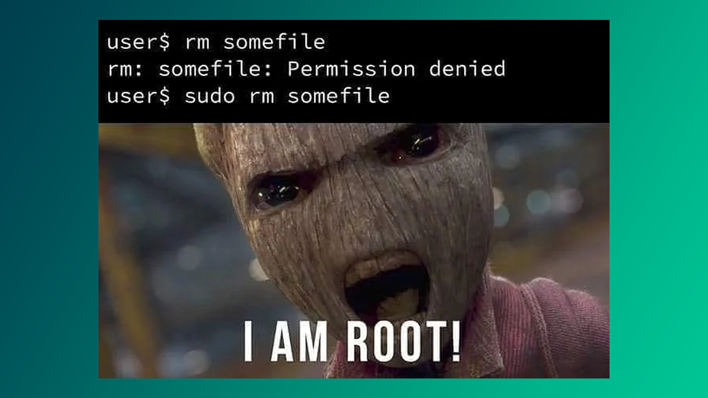
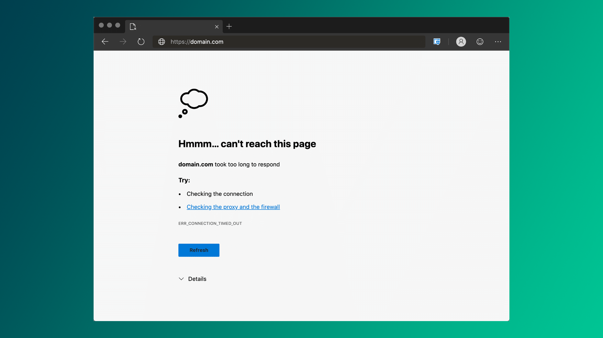
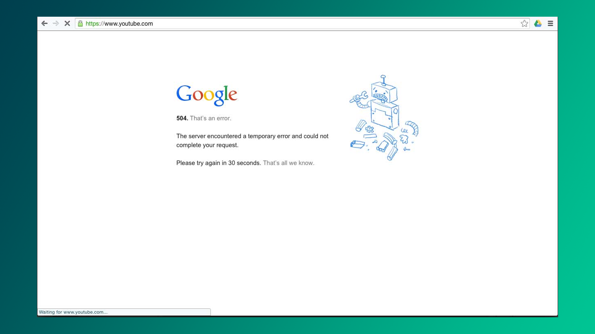
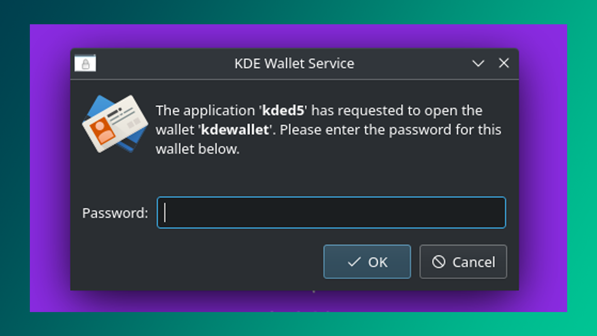
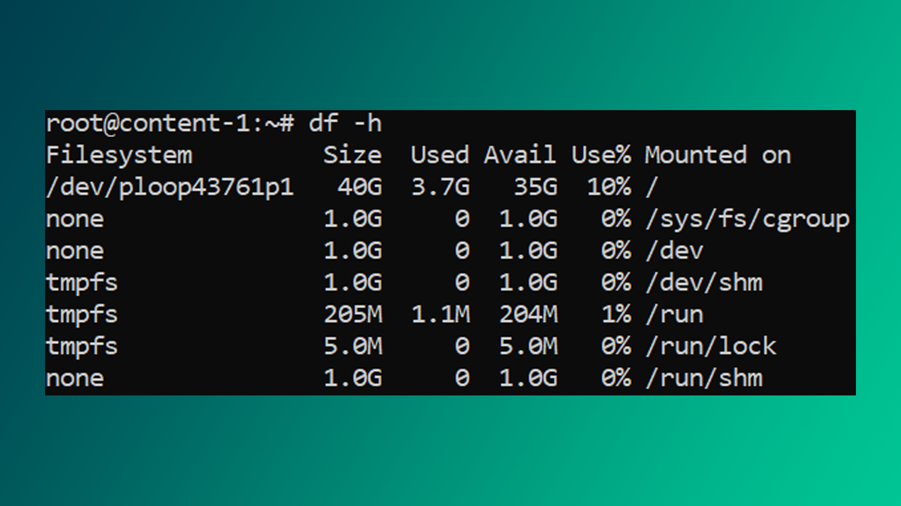

Yangi foydalanuvchi sifatida xato va kamchiliklarga uchrash sizni g'azablantirishi yoki ko'p vaqtingizni olishi tayin. Shu sababli, men bu darsni ayrim ko'p uchraydigan muommolarga mutlaq yechim taqdim qilish maqsadida yozdim.

## `khumoyun is not in the sudoers file`

Debian distributivida odatda oddiy foydalanuvchi xavfsizlik sabablariga ko'ra "root" amallarini bajara olmaydi, misol uchun **terminalda** dastur o'rnatish, tizim konfiguratsiyalarini o'zgartirish va h.k. Bu kabi amallarni bajarish uchun foydalanuvchi "sudo" guruhiga mansub bo'lishi shart. Quyida buni qanday bajarish haqida bilib olasiz (terilgan parol ekranda ko'rinmaydi):

```bash
$ su
Password: parolni_yozib_enter
```

Ekranda `root@debian:~#` o'xshash matn paydo bo'ladi. So'ng, quyidagi buyruqni kiriting, albatta `khumoyun` o'rniga o'z ismingizni yozasiz (aniqroq aytganda "sudo" guruxiga qo'shilishi kerak bo'lgan foydalanuvchi nomi):

```bash
$ /sbin/usermod -aG sudo khumoyun
```

Tamom. Kompyuter o'zgarishlarni payqashi uchun uni **o'chirib yoqing**.

>Kelajakda foydalanuvchining gurux atributlarini o'zgartirish va unga har xil huquqlar berish haqida batafsil gaplashamiz. Bu biroz murakkab mavzu bo'lgani tufayli, chuqurroq tushuntirishga to'xtalib o'tmayman.

## `Permission denied`



`Access is denied` yoki `You must have administrative privileges to perform this operation.` yoki `operation not permitted` kabi muommolar admin huquqi kerakligini bildiradi. Masalan `apt` admin huquqisiz hech qanday amalni bajarmaydi:

```bash
$ apt update
Reading package lists... Done
E: Could not open lock file /var/lib/apt/lists/lock - open (13: Permission denied)
E: Unable to lock directory /var/lib/apt/lists/
```

Muommoni hal qilish uchun `root` hisobiga o'tish yoki `sudo` buyrug'idan foydalanish kerak.

>Ba'zan `sudo` buyrug'ining o'zi o'rnatilmagan bo'ladi. Bunday hollarda `su root` orqali `root` hisobiga kiring. So'ng, `apt install sudo -y` buyrug'ini yozing.

## `The system cannot find the file specified`

Internetdagi 404 xatoliklari singari `File Not Found` yoki `[Errno 2] No such file or directory` kabi xabarlar shunchaki fayl yoki papka **mavjud emasligini** bildiradi. 

```bash
$ cd papka12345
bash: cd: papka12345: No such file or directory
```

## `Module Not Found`

Python dasturlarini ochayotganda ro'y beradigan dolzarb muommolardan biri bu `Module Not Found` yoki `No module named 'modul_nomi'`. Ular dasturga qaram paketlar o'rnatilmaganligini bildiradi. Sodda yechim:

```bash
$ pip install modul_nomi
```

yoki ish papkasida `requirements.txt` faylini ko'rsangiz, bilingki, uning ichida dasturga kerakli barcha kutubxona nomlari yozilgan. Ularni barchasini tortib olish uchun quyidagi buyruqni tering:

```bash
$ pip install -r requirements.txt
```

## `TimeoutError`



`Connection timed out` yoki `Connection refused` kabi muommolar xost ya'ni server o'chiqligini yoki internetga ulanish bilan bog'liq muommo borligini bildiradi.

```bash
$ ssh root@lalaland.com
Connection timed out
```

## `SyntaxError`

`Invalid Syntax` yoki `Unexpected token` kabi xatoliklar dastur kodida kompilyatorga tushunarsiz bo'lgan belgi yoki grammatika yozilganligini bildiradi. Bunday xatoliklar, misol uchun, Pythondagi yangi skriptlarni eski Python versiyasida ochganingizda yoki bironta buyrug'ni noto'g'ri yozganingizda ro'y beradi.

## `Unable to allocate X bytes of memory`

Bu muommo shunchaki xotira yetishmovchiligini bildiradi.

## `Session Timed Out`

Ko'pincha brovzerlarga va boshqa dasturlarga ham tegishli: sahifa ancha vaqt jim turgani sababli **seans o'chirildi**. Seans doimiy turishi uchun foydalanuvchidan aktivlik talab qilinadi.

## `504 Gateway Timeout`



Server belgilangan vaqtda javob qaytarmasa, shu xatolik ekranga chiqariladi. Bu ko'pincha DDOS hujumlar tufayli yoki serverga haddan tashqari ko'p so'rov yuborilganda vujudga keladi.

## Band ilova-menejeri

Agar sizda quyidagidek muommo tug'ilsa, shunchaki kompyuterni o'chirib yoqing! (bu ilova-menejeri boshqa terminal seansda faoliyat yuritayotganini bildiradi, va buyruq ishlashi uchun jarayon to'liq yakunlanishini kutish lozim):

```bash
$ sudo apt upgrade
E: Could not get lock /var/lib/dpkg/lock-frontend - open (11: Resource temporarily unavailable)  
E: Unable to acquire the dpkg frontend lock (/var/lib/dpkg/lock-frontend),   
 is another process using it?
```

## Tezroq internet

Internetingiz yanada tezroq ishlashi uchun dns serverni Google-nikiga o'tkazishni maslahat beraman:

```bash
$ sudo echo nameserver 8.8.8.8 > /etc/resolv.conf
```

## Grub menyuda qotib qoldi

Linux o'rnatganingizdan so'ng, grub menyusi chiqib qolyaptimi (qora ekran)? Unda rufus orqali fleshkaga "Write in DD Image mode" opsiyasini belgilab yozish kerak. Buni o'zida ham aytib turibti, boot bilan bog'liq muommoga duch kelsang boshqa rejimda yoz deb:


## Terminal ochilmayaptimi?

Locale (region) o'zgartiring. Tilni xam. US region va Ingliz tilini belgilang. Keyin bir o'chirib yoqing.

## KDEWallet 



Debian-da KDEWallet qayta-qayta parol so'rayaptimi? U holda ilovani o'chirib yuborishni maslahat beraman.

```bash
$ sudo apt remove kwalletmanager
```

## Disk xotirasini ko'rish

`df` buyrug'i kompyuterdagi mavjud xotira hajmini ko'rsatadi. U fayl tizimi, hajmi, mavjud xotira (foizda) va qayerda o'rnatilganini ko'rsatadi. `-h` (human) optsiyasi hajmlarni o'qish uchun qulay tarzda ko'rsatadi.



Bizda mavjud yana bir buyruqlardan biri `du` (disk-usage) ya'ni ma'lum bir papka yoki faylni hajmini ko'rsatib berish uchun ishlatiladi.

```bash
$ du -h /home
```

## Keshlarni qanday tozalayman?

Quyidagi bir qator buyruq Debian distributividagi barcha keraksiz fayllarni o'chiradi, ya'ni eski konfiguratsiya fayllarini, to'liq yuklanmagan paketlarni, eski jurnal fayllarini va vaqtincha fayllarni o'chiradi:

```bash
$sudo apt-get clean && sudo apt-get autoclean && sudo apt-get autoremove && sudo apt-get purge $(dpkg -l | grep '^rc' | awk '{print $2}') && sudo find /var/cache/apt/archives/ -type f -name '*.deb' -exec rm -f {} \; && sudo find /var/cache/apt/archives/partial/ -type f -exec rm -f {} \; && sudo find /var/cache/debconf/ -type f -name '*-old' -exec rm -f {} \; && sudo find /var/log/ -type f -name '*.gz' -exec rm -f {} \; && sudo find /var/log/ -type f -name '*.1' -exec rm -f {} \; && sudo journalctl --vacuum-time=7d && sudo journalctl --rotate && sudo find /var/tmp/ -type f -exec rm -f {} \; && sudo find /tmp/ -type f -exec rm -f {} \;
```

## Yangilanishlar avtomatik emas

Yangilanishlar muhim chunki u ayrim xato va buglarni tuzatishni va takomillashtirilgan xususiyatlarni taqdim etadi. Shuningdek, yangilanishlar tizim xavfsizligi uchun ham muhimdir. Qanday yangilayman deysizmi? Bu juda oddiy:

```bash
$ sudo apt update && sudo apt upgrade 
```

## Samaradorlikni oshiring

- **CTRL + H** - fayl-menejerida yashirin fayllarni ko'rsatadi
- **CTRL + F** - fayl-menejerida qidiruv oynasini ochadi
- **CTRL + L** - fayl-menejerida muayyan papkaga kirishning tezkor yo'li
- **SHIFT + DELETE** - fayl-menejerida belgilangan fayllarni butunlay o'chirib tashlaydi

 Yaxshiroq eslab qolish uchun: 

1. **H** - *hidden* = *yashirin*. 
2. **F** - *find* = *qidirish*. 
3. **L** - *location* = *manzil*.

**Keyingi dars:** [[18-dars]]