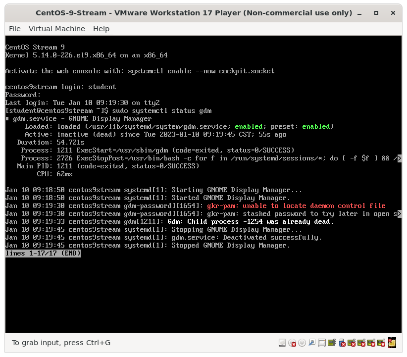

Linux-ni faqat terminal interfeysida ishlatish orqali tizim resurslarini optimallashtirish, xavfsizlik va buglarsiz server muhitini o'rganish imkoniyatini qo'lga kiritasiz. Ba'zilar GUI-ni o'z ichiga olmaydigan minimalistik tizimni afzal ko'rishadi. Ushbu maqolada bu jarayonni qanday amalga oshirish to'g'risida gaplashamiz.

Agar siz Ubuntu, Fedora yoki CentOS kabi distributiv ishlatsangiz, displey menejeri xizmatini to'xtatishingiz mumkin. Masalan, `systemctl` bilan:

```bash
$ sudo systemctl stop gdm # GNOME Displey menejeri
$ sudo systemctl stop lightdm # LightDM (Ubuntu va boshqalar)
```

## GUI avtomatik ishga tushirishni oldini olish

Displey menejerini yuklashda avtomatik ravishda ishga tushirishni o'chirib qo'yishingiz mumkin:

```bash
$ sudo systemctl disable gdm # GNOME Display Manager 
$ sudo systemctl disable lightdm # LightDM
```

Displey menejerini to'xtatgandan so'ng, GUI-ni to'liq o'chirish uchun tizimni o'chirib yoqish lozim.



**Video ro'likni** afzal ko'ruvchilar uchun [xavola](https://youtu.be/mSYpy8QTxQI?si=cq0ueMUYmzXs6oTw).

**Keyingi dars:** [19-dars](19-dars)