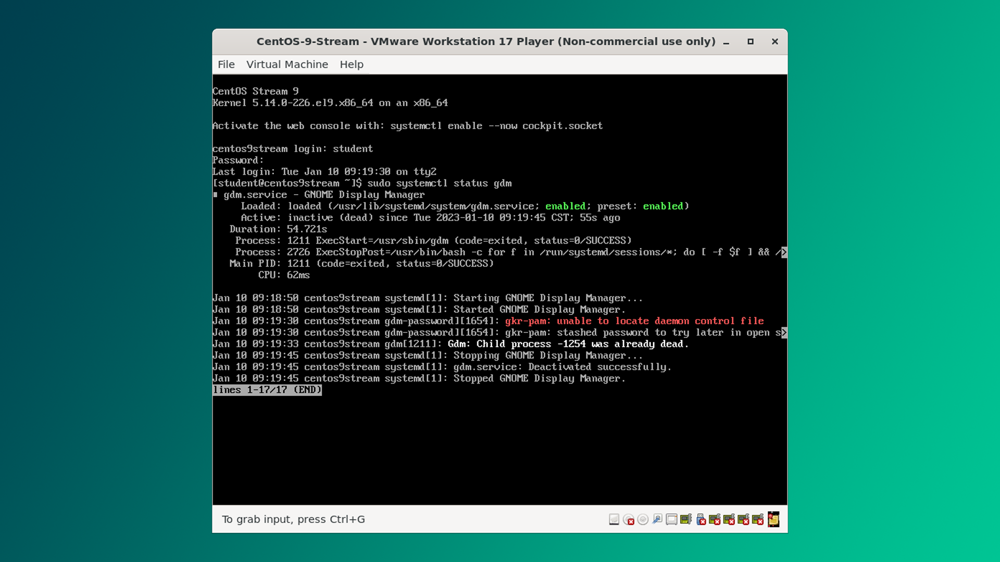

Grafik interfeys (GUI) kompyuterni boshqarishni osonlashtiradi, lekin ba'zan undan voz kechish foydali bo'ladi. Nega?

- Tizim resurslarini tejaydi
- Xavfsizlikni oshiradi
- Serverlarni boshqarishni o'rganish imkonini beradi
- Tizimni chuqurroq tushunishga yordam beradi

Agar siz Ubuntu, Fedora yoki CentOS kabi distributiv ishlatsangiz, displey menejeri xizmatini to'xtatishingiz mumkin. Masalan, `systemctl` bilan:

```bash
$ sudo systemctl stop gdm # GNOME Displey menejeri
$ sudo systemctl stop lightdm # LightDM (Ubuntu va boshqalar)
```

## GUI yuklashini bloklash

Displey menejerini yuklashda avtomatik ravishda ishga tushirishni o'chirib qo'yishingiz mumkin:

```bash
$ sudo systemctl disable gdm # GNOME Display Manager 
$ sudo systemctl disable lightdm # LightDM
```

Displey menejerini to'xtagandan so'ng, GUI-ni to'liq o'chirish uchun tizimni o'chirib yoqish lozim.



Terminal muhitida ishlash avvaliga g'alati tuyuladi. Biroq vaqt o'tishi bilan uning afzalliklarini his qila boshlaysiz. Video rolikni afzal ko'ruvchilar uchun [xavola](https://youtu.be/mSYpy8QTxQI?si=cq0ueMUYmzXs6oTw).

**Keyingi dars:** [[19-dars]]