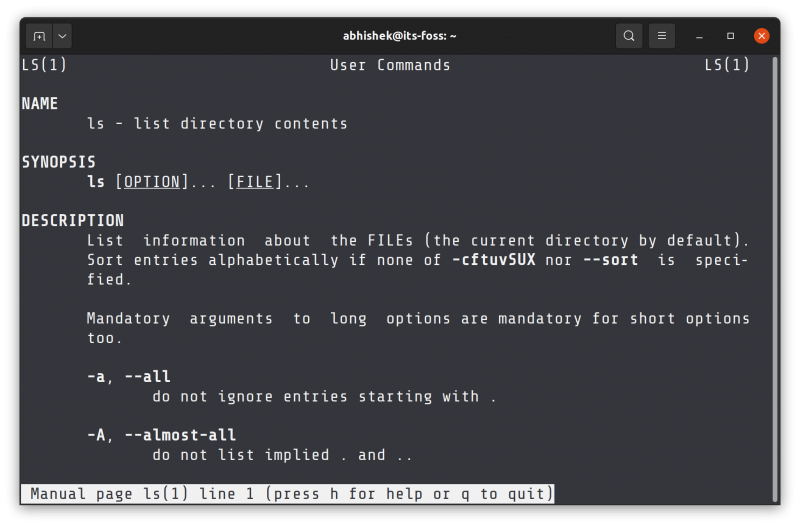
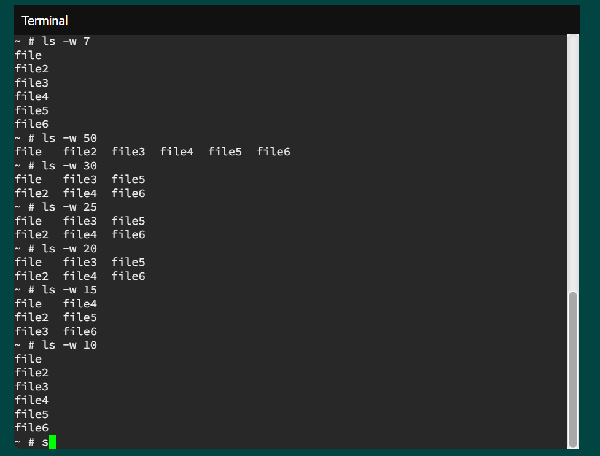
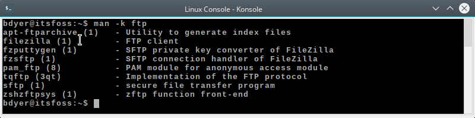

Biror narsani tushunmoqchi bo'lganingizda yoki hamjamiyatga savol bersangiz, manabunga o'xshash javoblar sizni asabingizga tegishi aniq:

- **"Shunchaki `man` sahifasini o'qi!"**
- "**Google sening do'sting :)** "
- "`rm -rf /* --preserve-root` :) "

Bular aslida juda yaxshi maslahatlar (oxirgisini aytmaganda albatta - u butun sistemani o'chirib yuboradi), lekin `man` kabi hujjatlarni o'qish murakkab va ko'nikish uchun biroz vaqt kerak bo'ladi. Odatda `man` sahifalari deyarli barcha ma'lumotlarni ichiga oladi va yaxshi struktura asosida yozilgan. Misol uchun, `man bash` 80 dan ortiq sahifaga ega va ma'lumotlar juda zich yozilganidan bitta sahifasining o'zi bir necha kun amaliyotni talab qiliadi. Siz sevgan yutuber va yozuvchilar ma'lumotlarni asosan `man` sahifalaridan oladilar, va ko'pincha mayda detallarni e'tibordan chetlatadilar. `man` sahifasiga avval tashrif buyurgan bo'lsangiz, sizda quyidagi savollar tug'ilgan bo'lishi mumkin:

* Nega ba'zi narsalar qavs `[]` ichida, qolgani esa yo'q?
* Nega ba'zi narsalardan keyin nuqtachalar `...` bor?
* Nega ba'zi opsiyalarda bitta chiziq, boshqalarida ikkita chiziq bor?

Bu va yana boshqa savollarga maqolada javob olasiz degan umiddaman. 

## Foydalanish

Sahifadagi tushunarsiz belgilar va struktura haqida tanishishdan avval sahifa ichida qo'llaniladigan ayrim buyruqlar haqida to'xtalib o'tmoqchiman, lekin xabaringiz bo'lsa, o'tkazib yuborishingiz mumkin. `man`-dan foydalanish uchun buyruq satriga `man` yoziladi, keyin bo'sh joy va qidirilayotgan buyruq nomi (masalan, `ls`, `cp`, `man` va h.k.). Misol uchun:

```bash
$ man ls
```



Klaviaturadagi strelka tugmalari (yoki `jk`) bilan yuqori va pastga harakat qilish mumkin va `q` (quit) yoki `:q` tugmasi sahifani butunlay yopishga ma'sul. Sahifa ichidan ma'lum bir terminni qidirish kerak bo'lsa termin `/` (slesh) dan so'ng yoziladi. Misol: `/Display`. Keyingi topilma yoki avvalgisiga sakrash uchun `n` va `N` tugmalari ishlatiladi. Sahifani bir oyna tushirish yoki ko'tarish uchun `z` va `w` tugmalari bosiladi; bu esa sizga kamroq tugamalar ishlatgan holda sahifani siljilitish imkonini beradi.

>**[Vim](https://youtu.be/-txKSRn0qeA?si=5im4F9plqHuwFwx-)** matn muharriri bilan ishlagan bo'lsangiz, undagi buyruqlar va harakat ishoralari `man` sahifalariga ham tegishligini tushunasiz. 

## Konventsiyalar

- **Qalin matn** - ko'rsatilgandek yozing.
- *Kursiv matn* - tegishli argument bilan almashtiring.
- \[-**abc**\] - qavs ichidagi opsiyalar ixtiyoriy
- **-a** | -**b** - **|** bilan chegaralangan opsiyalarni birgalikda ishlatish mumkin emas
- `argument ...` - argument takrorlanishi mumkin
- `[expression] ...` - `[]` ichidagi butun ifoda takrorlanishi mumkin

Yuqoridagi `ls` sahifasidagi **SYNOPSIS** bo'limi ostida yozilgan qatorga e'tibor bering; bu bildiradiki buyruqni hech qanday opsiyalarsiz yozish va bir nechta fayl nomlarini kiritish imkoniyati borligini:

```bash
ls [OPTION] ... [FILE] ...
ls -l -a -h .
ls -lah .
ls -lah
```

Quyida `--color` opsiyasini argumentlarsiz yozish orqali natijani rangli formatda chiqarish mumkinligi aytilmoqda, lekin `=WHEN` matni ixtiyoriy va standart ravishda `always` qiymatiga ega; undan tashqari qiymatlar esa `auto` va `never`:

```bash
--color[=WHEN]
    colorize  the output; WHEN can be 'always' (default if omitted), 'auto', or 'never'; more info below
```

`-h` yoki `--human-readable` opsiyasi fayl o'lchamlarini odam tushunadigan "**K/M/G/T**" formatda ifodalaydi - agar `-l` opsiyasi bilan birgalikda qo'llanilsa aks holda u butunlay keraksiz:

```bash
 --h, --human-readable
	 with -l, print sizes in human readable format (e.g., 1K 234M 2G)
```

Bu yerda agar `COLS` qiymati berilsa fayllarni shunga mos ravishda ekranga chiqaradi. Opsiya qiymat talab qiladi va manabular bunga misoldir: `ls -w 50`, `ls --width=50`: 

```bash
-w, width=COLS
	assume screen width instead of current value
```



## Sarlavha va bo'limlar

Sahifalar bir nechta sarlavhalarga bo'lingan. Umumiy taqsimot quyidagicha:

1. **NAME** - *buyruq nomi va qisqacha tavsifi keltirilgan*.
2. **SYNOPSIS** - *buyruq sintaksini ya'ni qanday ishlatilishini ko'rsatadi. Kvadrat qavs ichidagi argumentlar `[]` ixtiyoriy; qavs ichida bo'lmagan narsalarni yozish shart.*
3. **DESCRIPTION** - *buyruq  nima qilishi va undan qanday foydalanish mumkinligini batafsil tavsiflaydi. Shuningdek, ixtiyoriy atributlarni o'tkazib yuborsangiz nima bo'lishini aytib beradi.*
4. **EXAMPLES** - *buyruqdan foydalanish to'g'risida misollari keltiriladi. Ko'pincha misollar buyruqning potensialini yanada ko'rsatish maqsadida murakkab tarzda yoziladi.*
5. **DIAGNOSTICS** - *bu bo'limda buyruq tomonidan qaytarilgan xato xabarlari ro'yxati keltirilgan bo'ladi.*
6. **LIMITS** - *bu bo'lim buyruqning har qanday cheklovlarini tavsiflaydi.*
7. **SEE ALSO** - *tegishli ma'lumotlarni ichiga oladi, jumladan xavolalar.*
8. **HISTORY** - *buyruqning qisqacha tarixini beradi, masalan, qachon paydo bo'lgan.*
9. **WARNING** - *agar bu bo'lim mavjud bo'lsa, unda foydalanuvchilar uchun muhim maslahatlar mavjud.*
10. **NOTES** - *yordamchi ma'lumotlar: buyruqni to'liq tushunish va foydalanishda yordam beradi.*

Barcha `man` sahifalar an'anaviy tarzda raqamlangan bo'limlarga saralangan. Sahifalarni bunday guruhlarga ajratish yanada samarali qidiruvlarni amalga oshirish imkonini beradi. Men misol uchun dasturlash bilan shug'ullanaman, shu sababli 3-bo'limga ko'proq e'tibor qarataman. 

- **1-bo'lim**: *Shell buyruqlari va ilovalar*
- **2-bo'lim:** *Asosiy yadro xizmatlari, xato kodlar*
- **3-bo'lim:** *Dasturchilar uchun kutubxona ma'lumotlar*
- **4-bo'lim:** *Tarmoq xizmatlari - agar TCP/IP yoki NFS o'rnatilgan bo'lsa Qurilma drayverlari va tarmoq protokollar*
- **5-bo'lim**: *Standart fayl formatlari - masalan: `tar` arxivi qanday ko'rinishini ko'rsatadi*
- **6-bo'lim:** *O'yinlar*
- **7-bo'lim:** *Turli fayllar va hujjatlar*
- **8-bo'lim:** *Tizimni boshqarish va texnik xizmat ko'rsatish buyruqlar*
- **9-bo'lim:** *Yadro bilan bog'liq ma'lumotlar va interfeyslar*

Buyruq yonidagi raqam orqali qaysi sahifa qaysi guruhga tegishligini bilsa bo'ladi. Masalan, agar siz `ls` sahifasiga qarasangiz, sahifaning eng yuqori qismida yozilgan: `LS(1)`. Qavs ichida 1-bo'lim ya'ni *shell buyruqlari va ilovalari* guruhiga mansubligi aytilmoqda. Sizga biror buyruqning 8-bo'limga oid sahifasi kerak bo'lsa, misol uchun, quyidagi buyruqni yozishingiz mumkin:

```bash
$ man 8 buyruq
```

## Terminlar orqali qidirish

Agar siz, aytaylik, `ftp` bilan bog'liq sahifalarni ko'rishni istasangiz, ushbu buyruqni yozishingiz mumkin (`-k` = keyword):

```bash
$ man -k ftp	
```



>`whatis` buyrug'i ham guruhlarni aniqlash borasida juda foydali usul

## Hulosa

- `man` Linuxda standart o'rnatilgan yordam tizimidir.
- `man` manual so'zining qisqartmasi.
- `man` to'g'risida ko'proq ma'lumot olish uchun: `man man`
- `man` sahifalari **jk** (past/yuqori) yordamida boshqariladi, chunki sahifalar `vim`-dan foydalanadi va u `vi` dan foydalanadi va uning yaratuvchisining klaviaturasida strelka tugmachalari bo'lmagan. 
- `man` sahifalari Linuxni o'zlashtirishingizda katta rol o'ynaydi.

## Foydalanilgan manbalar

1. [Itsfoss.com - linux man page guide](https://itsfoss.com/linux-man-page-guide/)
2. [YouTube: Linux Training Academy - mastering linux man pages](https://youtu.be/RzAkjX_9B7E?si=YdkC7R64CWvTBQzR)

**Keyingi dars:** [21-dars](21-dars)