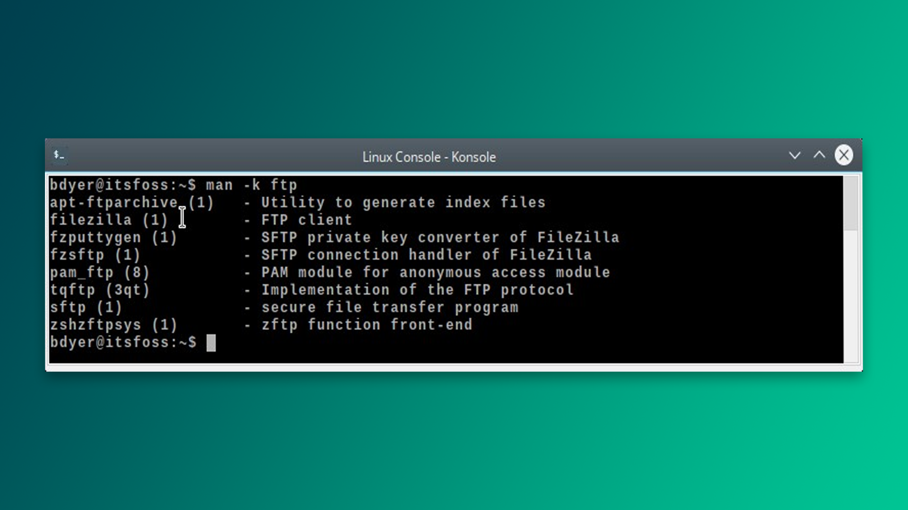

Biror narsani tushunmoqchi bo'lganingizda yoki hamjamiyatga savol bersangiz, manabunga o'xshash javoblar sizni asabingizga tegishi aniq:

- **Shunchaki `man` sahifasini o'qi!**
- **Google sening do'sting 🙂**
- `rm -rf / --preserve-root` 🙂

Bular aslida juda yaxshi maslahatlar (oxirgisini aytmaganda albatta, u butun tizimni o‘chirib yuboradi), lekin `man` kabi qo‘llanmalarni o‘qish murakkab va ularga ko‘nikish uchun vaqt kerak. Odatda `man` sahifalari deyarli barcha ma’lumotlarni o‘z ichiga oladi va yaxshi tuzilma asosida yozilgan. Misol uchun, `man bash` 80 dan ortiq sahifadan iborat bo‘lib, ma’lumotlar juda zich yozilgani sababli uning bitta sahifasini o‘zlashtirish bir necha kun talab qiladi. 

Siz sevgan YouTuberlar va yozuvchilar ma'lumotlarni asosan `man` sahifalaridan oladi. Agar siz `man` sahifasiga birinchi marta kirgan bo‘lsangiz, quyidagi savollar tug‘ilishi mumkin:

* Nega ba'zi narsalar qavs `[]` ichida?
* Bu nuqtalar `...` nimani anglatadi?
* Nega ba'zi opsiyalarda bitta chiziq, boshqalarida ikkita chiziq bor?

## Foydalanish

Sahifadagi tushunarsiz belgilar va struktura haqida tanishishdan oldin, sahifa ichida qo‘llaniladigan ayrim buyruqlar haqida to‘xtalib o‘tmoqchiman. Agar bu haqda ma’lumotga ega bo‘lsangiz, bu qismni o‘tkazib yuborishingiz mumkin. `man` buyrug‘idan foydalanish uchun buyruq satriga `man` yoziladi, undan keyin bo‘sh joy va qidirilayotgan buyruq nomi (masalan, `ls`, `cp`, `man` va hokazo). Misol uchun:

```bash
$ man ls
```


Klaviaturadagi strelkalar (yoki `jk` tugmalari) yordamida yuqoriga va pastga harakatlanish mumkin. `q` (chiqish) yoki `:q` tugmasi esa sahifani butunlay yopish uchun ishlatiladi. Sahifa ichidan ma’lum bir atamani qidirish kerak bo‘lsa, ’/’ (slesh) belgisidan so‘ng atama yoziladi. Masalan: `/Display`. Keyingi yoki avvalgi topilgan natijaga o‘tish uchun `n` va `N` tugmalari qo‘llaniladi. Sahifani bir oyna pastga tushirish yoki yuqoriga ko‘tarish uchun esa ’z’ va ’w’ tugmalari bosiladi.

>**[Vim](https://youtu.be/-txKSRn0qeA?si=5im4F9plqHuwFwx-)** matn muharriri bilan ishlagan bo'lsangiz, undagi buyruqlar va harakat ishoralari `man` sahifalariga ham tegishligini tushunasiz. 

## Konventsiyalar

- **Qalin matn** - ko'rsatilgandek yozing.
- *Kursiv matn* - tegishli argument bilan almashtiring.
- \[-**abc**\] - qavs ichidagi opsiyalar ixtiyoriy
- **-a** | -**b** - **|** bilan chegaralangan opsiyalarni birgalikda ishlatish mumkin emas
- `argument ...` - argument takrorlanishi mumkin
- `[expression] ...` - `[]` ichidagi butun ifoda takrorlanishi mumkin

Yuqoridagi `ls` sahifasidagi **SYNOPSIS** bo'limi ostida yozilgan qatorga e'tibor bering; bu bildiradiki buyruqni hech qanday opsiyalarsiz yozish va bir nechta fayl nomlarini kiritish imkoniyati borligini:

```bash
ls [OPTION] ... [FILE] ...
ls -l -a -h .
ls -lah .
ls -lah
```

Quyida `--color` opsiyasini argumentlarsiz yozish orqali natijani rangli formatda chiqarish mumkinligi aytilmoqda, lekin `=WHEN` matni ixtiyoriy va standart ravishda `always` qiymatiga ega; undan tashqari qiymatlar esa `auto` va `never`:

```bash
--color[=WHEN]
    colorize  the output; WHEN can be 'always' (default if omitted), 'auto', or 'never'; more info below
```

`-h` yoki `--human-readable` opsiyasi fayl o'lchamlarini odam tushunadigan "**K/M/G/T**" formatda ifodalaydi - agar `-l` opsiyasi bilan birgalikda qo'llanilsa aks holda u butunlay keraksiz:

```bash
 --h, --human-readable
	 with -l, print sizes in human readable format (e.g., 1K 234M 2G)
```

Bu yerda agar `COLS` qiymati berilsa fayllarni shunga mos ravishda ekranga chiqaradi. Opsiya qiymat talab qiladi va manabular bunga misoldir: `ls -w 50`, `ls --width=50`: 

```bash
-w, width=COLS
	assume screen width instead of current value
```


## Sarlavha va guruxlar

Sahifalar bir nechta sarlavhalarga bo'lingan. Umumiy taqsimot quyidagicha:

| **Sarlavha**    | **Tavsif**                                                                                                                                                               |
| --------------- | ------------------------------------------------------------------------------------------------------------------------------------------------------------------------ |
| **NAME**        | Buyruq nomi va qisqacha tavsifi keltirilgan.                                                                                                                             |
| **SYNOPSIS**    | Buyruq sintaksini ya'ni qanday ishlatilishini ko'rsatadi. Kvadrat qavs ichidagi argumentlar `[]` ixtiyoriy; qavs ichida bo'lmagan narsalarni yozish shart.               |
| **DESCRIPTION** | Buyruq nima qilishi va undan qanday foydalanish mumkinligini batafsil tavsiflaydi. Shuningdek, ixtiyoriy atributlarni o'tkazib yuborsangiz nima bo'lishini aytib beradi. |
| **EXAMPLES**    | Buyruqdan foydalanish to'g'risida misollar keltiriladi. Ko'pincha misollar buyruqning potensialini yanada ko'rsatish maqsadida murakkab tarzda yoziladi.                 |
| **DIAGNOSTICS** | Bu bo'limda buyruq tomonidan qaytarilgan xato xabarlari ro'yxati keltirilgan bo'ladi.                                                                                    |
| **LIMITS**      | Bu bo'lim buyruqning har qanday cheklovlarini tavsiflaydi.                                                                                                               |
| **SEE ALSO**    | Tegishli ma'lumotlarni ichiga oladi, jumladan xavolalar.                                                                                                                 |
| **HISTORY**     | Buyruqning qisqacha tarixini beradi, masalan, qachon paydo bo'lgan, kim yaratgan.                                                                                        |
| **WARNING**     | Agar bu bo'lim mavjud bo'lsa, unda foydalanuvchilar uchun muhim maslahatlar mavjud.                                                                                      |
| **NOTES**       | Yordamchi ma'lumotlar.                                                                                                                                                   |

Barcha `man` sahifalari raqamlangan guruxlarga ajratilgan. Sahifalarni bunday guruhlarga ajratish yanada samarali qidiruvlarni amalga oshirish imkonini beradi. Men misol uchun dasturlash bilan shug'ullanaman, shu sababli 3-bo'limga ko'proq e'tibor qarataman. 

| **Bo'lim** | **Tavsif** |
|------------|------------|
| **1** | Shell buyruqlari va ilovalar |
| **2** | Asosiy yadro xizmatlari, xato kodlar |
| **3** | Dasturchilar uchun kutubxona ma'lumotlar |
| **4** | Tarmoq xizmatlari - agar TCP/IP yoki NFS o'rnatilgan bo'lsa Qurilma drayverlari va tarmoq protokollar |
| **5** | Standart fayl formatlari - masalan: `tar` arxivi qanday ko'rinishini ko'rsatadi |
| **6** | O'yinlar |
| **7** | Turli fayllar va hujjatlar |
| **8** | Tizimni boshqarish va texnik xizmat ko'rsatish buyruqlar |
| **9** | Yadro bilan bog'liq ma'lumotlar va interfeyslar |

Buyruq yonidagi raqam orqali qaysi sahifa qaysi guruhga tegishligini bilsa bo'ladi. Masalan, agar siz `ls` sahifasiga qarasangiz, sahifaning eng yuqori qismida yozilgan: `LS(1)`. Qavs ichida 1-bo'lim ya'ni *shell buyruqlari va ilovalari* guruhiga mansubligi aytilmoqda. Sizga biror buyruqning 8-bo'limga oid sahifasi kerak bo'lsa, misol uchun, quyidagi buyruqni yozishingiz mumkin:

```bash
$ man 8 buyruq
```

## Terminlar orqali qidirish

Agar siz, aytaylik, `ftp` bilan bog'liq sahifalarni ko'rishni istasangiz, ushbu buyruqni yozishingiz mumkin (`-k` = keyword):

```bash
$ man -k ftp	
```



>[!tip] `whatis` buyrug'i ham guruhlarni aniqlaydi

## Xulosa

- `man` Linux-da standart o'rnatilgan yordam tizimidir.
- `man` manual so'zining qisqartmasi.
- `man` to'g'risida ko'proq ma'lumot olish uchun: `man man`
- `man` sahifalar `jk` (pastga/yuqoriga) tugmalari yordamida boshqariladi, chunki ular `vim` dasturidan foydalanadi. `Vim` esa o‘z navbatida `vi` dasturiga asoslangan bo‘lib, uning yaratuvchisining klaviaturasida strelka tugmalari bo‘lmagan.
- `man` sahifalari Linux-ni o'zlashtirishingizda katta rol o'ynaydi.

## Topshiriq

1. `which`, `whatis`, `appropos`, `type` buyruqlarini sinab ko'ring.
2. `man` orqali `wc` buyrug'i bilan tanishing. Faylda faqatgina nechta qator borligini ko'rish uchun qaysi opsiyadan foydalanamiz?

## Foydalanilgan manbalar

1. [Itsfoss.com - linux man page guide](https://itsfoss.com/linux-man-page-guide/)
2. [YouTube: Linux Training Academy - mastering linux man pages](https://youtu.be/RzAkjX_9B7E?si=YdkC7R64CWvTBQzR)

**Keyingi dars:** [[21-dars]]