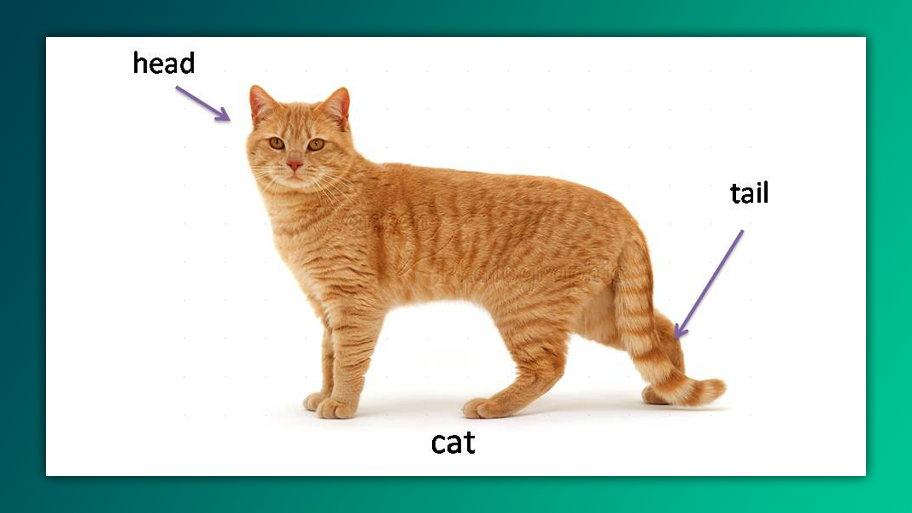

Fayllarni ko‘rish uchun turli xil buyruqlar bor. Biroq, ularning hammasi ham har qanday sharoitda qo'llashga mos kelavermaydi. Hajmi kattaroq fayllarni ko'rishda `cat`, `tac` (`cat`-ning teskarisi, ya'ni fayl tarkibini teskari tartibda ko'rsatadi) kabi buyruqlar samarali emas. Chunki u butun faylni bir vaqtning o‘zida ekranga chiqaradi, natijada terminal "muzlab qolishi" yoki ishdan chiqishi ham ehtimoldan xoli emas. 

Shu bois, katta hajmli fayllar uchun `less`, `more`, `awk`, yoxud `head` va `tail` singari buyruqlardan foydalanish ancha samaraliroq. Hozircha faqat `head` va `tail` haqida gaplashamiz.

## Umumiy o'xshashliklar

`head` va `tail` buyruqlari barcha distributivlarda o'rnatilgan va ishlash tartibi deyarli bir xil. Ular faylning qaysi qismini ko‘rsatmoqchi ekanligingizga qarab, uning turli joylarini chop etadi: `head` faylning boshidagi qatorlarni chiqarsa, `tail` esa faylning oxirgi qatorlarini ko‘rsatadi. Har ikki buyruqning sintaksisi ham o‘xshash:

```bash
head [PARAMETRLAR] fayl
tail [PARAMETRLAR] fayl
```

## `head` buyruq

`head` buyrug'i faylning dastlabki 10 qatorini chiqaradi. Agar ko'rsatilgan qatorlar sonini o'zgartirishni xohlasangiz, `-n` parametridan foydalanishingiz mumkin:

```bash
$ head -n 15 fayl.txt
```

Bu misol `fayl.txt` ning birinchi 15 qatorini ekranga chiqaradi.

Agar siz qatorlarni orqadan hisoblashni xohlasangiz, masalan, oxirgi 88 qatordan avvalgi qatorlarni chiqarish kerak bo'lsa, `-n` parametriga manfiy qiymat beriladi:

```bash
$ head -n -88 fayl.txt
```

Bu misolda fayl oxiridan yuqoriga 88 qatorni chiqarib tashlaydi, ya'ni qolgan qatorlarni ko'rsatadi.

`head` bir vaqtning o'zida bir nechta fayl tarkiblarini ham ko'rsata oladi:

```bash
$ head fayl1.txt fayl2.txt
```

Bu buyruq har ikki faylning birinchi 10 qatorini chiqaradi.

>`-c` yoki `--bytes`: dastlabki "n" baytni ko'rsatadi. Misol uchun: `head -c 20 file.txt`

## `tail` buyruq

`tail` buyruqi faylning oxirgi 10 qatorini chiqaradi. Lekin, bunda ham `-n` parametri yordamida qatorlar sonini o'zgartirish mumkin:

```bash
$ tail -n 20 fayl.txt
```

Bu `fayl.txt` ning oxirgi 20 qatorini ekranga chiqaradi.

`tail`-ning qiziqarli xususiyatlaridan biri - real vaqt rejimida fayldagi o'zgarishlarni kuzatish imkoniyati. Buning uchun `-f` parametri ishlatiladi:

```bash
$ tail -f fayl.txt
```

Bu buyruq fayldagi o‘zgarishlarni uzluksiz ravishda ko‘rsatib turadi. Masalan, `log` fayllarini kuzatishda juda qo‘l keladi. 

Serverga kimlar kirib-chiqayotganini real vaqtda kuzatish quyidagicha amalga oshiriladi:

```bash
$ sudo tail -f /var/log/auth.log
```

## Savollar

1. Siz `/var/log/messages` va `/var/log/auth` nomli fayllarni oxirgi 20 qatorini real vaqtda kuzatmoqchisiz. Buni qanday amalga oshirasiz?
2. Aytaylik, siz `/var/log/messages` faylidan 5-dan 10-gacha bo'lgan qatorlarini chiqarishingiz kerak. Buni `head` va  `tail` yordamida qanday amalga oshirasiz? (ishora: "pipe" operatori ishlatiladi)
3. `head` yordamida `/var/log/messages` faylidan oxirgi 10 ta qatorni chiqarib tashlab, qoldiq qatorlarni ko'rsatmoqchisiz. Buni qanday amalga oshirish mumkin? (ishora: `-n` parametriga manfiy raqam beriladi)

>[!question]- Javobimni qanday tekshiraman?
>ChatGPT-dan so'rang. 🙂

## Fikr bildirish

Kelasi darslarning sifatini yaxshilash uchun fikr mulohazalaringizni ulashing. Qayerida kamchilik bor? Nimaga ko'proq e'tibor qaratish kerak? Yoki siz o'rganishni reja qilib yurgan mavzular yoki buyruqlarni ham yozishingiz mumkin. Github-dagi "Issues" yoki "discussions" orqali fikr berishni tavsiya etmayman. Iltimos, @comoyun bilan Telegramda yoki Redditda (u/comoyun) bog'laning. 

**Keyingi dars:** [[22-dars]]