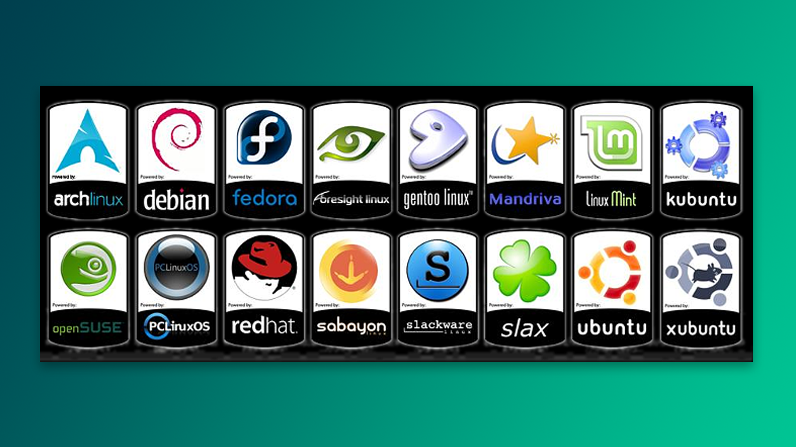

**Linux** - bu zamonaviy ochiq kodli operatsion tizim. U dunyodagi eng kuchli superkompyuterlarni va Internetni quvvatlovchi serverlarning aksariyatini boshqaradi. Shu bilan birga, u milliardlab smartfonlar, aqlli soatlar, televizorlar va IoT qurilmalarining asosi bo'lib xizmat qilmoqda.

## Distributiv tanlash

Distributiv o‘z ichiga Linux yadrosi, bir qator dasturlar va grafik interfeysni qamrab oladi. Bularning barchasi birgalikda to‘liq operatsion tizimni tashkil etadi. Turli distributivlar haqida ma’lumot olish uchun yordam bo‘limidagi [[yordam/distributiv-tanlash|distributiv tanlash]] sahifasiga qarang.

>[!tip] Distributivni qisqacha "distro" deyishingiz mumkin.

O‘rganish davomida ko‘plab distro-larga duch kelasiz. U shoxdan bu shoxga sakrab vaqtingizni bekor sarflash o'rniga, bir savolni o‘zingizga bering: _"Nega Linux-ni tanladim o'zi?"_ Maqsad aniq bo‘lsa, mos distro tanlash oson bo‘ladi:

- *"Customization" xohlaysizmi?*  - Arch yoki Garuda.
- *Eski kompyuterlarni qayta jonlantirish?*  - Mint yoki Debian.
- *Dasturlash va dizayn uchun?*  - Debian yoki Fedora.
- *Minimalist yondashuv yoqadimi?* - Void Linux
- *Serverlar uchun kuchli tanlov* - Ubuntu Server yoki CentOS
- *Maxfiylik yoki Darknet?* - Tails OS

## Dastlabki qadamlar

Linux-ni tanladingiz, ammo u sizni tanlamasachi? Bu holat ko‘pincha texnik bilim yetishmaganda yuz beradi. Yoki undan ham yomoni, qurilma mos kelmaganda. Imkoniyatingiz bo‘lsa, Linux bilan *aka-ukadek* chiqishadigan kompyuter sotib oling, deylik, Thinkpad-ni. 

>Aslida, hech qaysi tizim 100% ideal ishlamaydi. Nosozliklar bo'lishi tabiiy. Majbur, ko'nikasiz 🙂

Eng keng tarqalgan distro-larni pastda keltirdim. Ulardan birini tanlab, virtual mashinada sinab ko‘ring. "*Nega virtual mashina?*" chunki bu asosiy tizimga zarar yetkazmasdan o'rganish va distributivlarni farqlash imkonini beradi. 

| Distributiv                     | Rasmiy Havola                                           |
| :------------------------------ | :------------------------------------------------------ |
| Fedora                          | [www.fedoraproject.org](https://www.fedoraproject.org/) |
| Red Hat Enterprise Linux (RHEL) | [www.redhat.com](https://www.redhat.com/)               |
| CentOS                          | [www.centos.org](https://www.centos.org)                |
| Debian                          | [www.debian.org](https://www.debian.org)                |
| Ubuntu                          | [www.ubuntu.com](https://www.ubuntu.com)                |
| Linux Mint                      | [www.linuxmint.com](https://www.linuxmint.com)          |
| SUSE                            | [www.suse.com](https://www.suse.com)                    |
| OpenSUSE                        | [www.opensuse.org](https://www.opensuse.org)            |

## Qo'llanma

Bu yerda Linux va unga oid turli xil dasturlar, buyruqlar haqida ma’lumot olasiz. Qo‘llanma nafaqat yangi foydalanuvchilar uchun, balki tajribali tizim administratorlari uchun ham foydali bo‘ladi. Maqsad sizni tajribali Linux foydalanuvchisiga aylantirish va keyinchalik mustaqil ravishda o‘rgana oladigan darajaga yetkazish.

> [!tip] Yaxshiroq o‘qish uchun qorong‘i rejimini yoqing.

### Qisqa reja

- [ ] Darslarni **tartib** bilan o'qing.
- [ ] Virtual mashina orqali buyruqlarni mashq qiling va distro-larni sinang.
- [ ] Darslarni tugatganingizdan so‘ng, yo‘lingizda erkinsiz. Endi o‘zingizga ma’qul distro-ni tanlab, unga sodiq qoling.

## FAQ

### Linux men uchunmi?

O'zingizni "power-user" deb bilsangiz, ha, Linux siz uchun. Geymerlarga esa yo'q, chunki ko‘pchilik o‘yinlar Windows uchun ishlab chiqilgan (to'g'ri, emulyatorlar yordamida o'ynash mumkin, ammo bu o'yin samaradorligini pasaytiradi).

### O'rganishdan nima foyda?

Texnologiyaning yuragiga kirish, serverlarni boshqarish. Linux dasturchi uchun kuchli asbob, xaker uchun qurol, oddiy foydalanuvchi uchun esa tajriba quyonchasi desa ham bo'ladi 🙂

### Linux qiyinmi?

Ha, va yo'q. Dastlab qiyin bo'ladi, ammo Linux aslida juda sodda tizim. Har qanday yangi narsani o'rganishda amal qilish kerak bo‘lgan oddiy qoida bor - u bilan qancha ko‘p shug‘ullansangiz, shuncha osonlashadi. Asosiy kalit izchillikda. 

Esimda, bir paytlar Linux tasavvurimda yo‘q edi, hatto uning buyruqlarini cmd-ga yozib, nega xatolik berayotganini tushunmasdim. 🙂

### Linux-ni smartfon orqali o'rgansam bo'ladimi?

Sizda kompyuter bo'lmasa, xavotir olmang, chunki Android orqali ham o'rganish mumkin. Bilmagan bo'lsangiz: Android-ning asosi Linux hisoblanadi.

 1. [Termux](https://f-droid.org/en/packages/com.termux/) dasturini **FDroid** saytidan yuklang. 
 2. Ilova menejeri bilan tanishing. Biz bu yerda `apt` bilan ishlaymiz, lekin Termux-da `pkg` deb nomlangan. Misol uchun, `nginx` o'rnatish uchun: `pkg install nginx`
 3. Agar telefoningizda [root](https://youtu.be/_uxvvtl7bNc?si=nda_n-0Ak98EB-AM) o'rnatilgan bo'lsa, ayni muddao.

### Mendan nima talab qilinadi?

Operatsion tizimlar, dasturlash tillari, GUI/CLI, fayllar va terminal haqida bilsangiz kifoya. Agar "terminal" deyilganda do'kondagi plastik karta tiqadiganni o'ylamasangiz, demak tayyorsiz. 🙂

### Do you speak English?

Unda sizga [edx.org](https://edx.org) platformasidagi "Linux Foundation" bepul kursini tavsiya qilaman. [LinuxJourney.com](https://linuxjourney.com/) saytida ham foydali resurslar bor. Shuningdek, quyidagi YouTube kanallarga obuna bo'lishni unutmang:

- Learn Linux TV
- Veronica Explains
- Network Chuck
- John Hammond
- FreeCodeCamp

## Qo'shimcha savollar

Muommo yoki boshqa savollar tug'ilsa, hamjamiyatimizdan so'rashingiz mumkin - [Linux Uzbek Community](https://t.me/linux_uzbek)

O'z fikr/mulohazalaringiz bilan o'rtoqlashmoqchi bo'lsangiz, mendan [t.me/comoyun](https://t.me/comoyun) orqali so'rashdan tortinmang. 

**Keyingi sahifa:** [[01-dars]]
