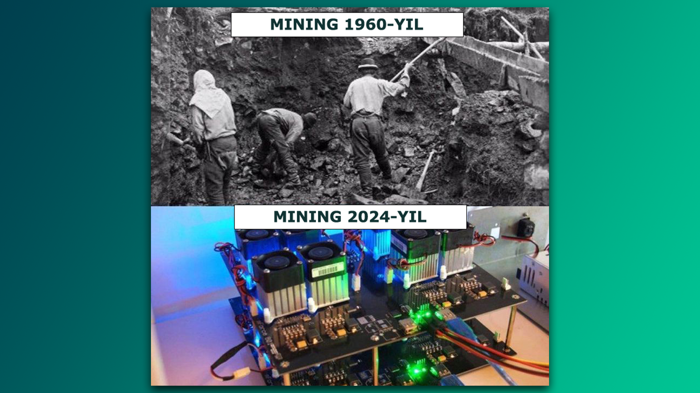

**Miner** - hozirda ko'pchilikning serverlarida duch kelyapti. Bu asosan turli paketlar orqali kelayotgan **zararli dastur** hisoblanadi. Uning asosiy vazifasi server resurslaridan foydalangan holda *kriptovalyuta* ishlab chiqish.  
  
**Aniqlash**: odatiy `top` yoki `htop` orqali tasklarni ko'rganingizda `kswapd0`-ning CPU resurslaridan foydalanayotganini ko'rishingiz mumkin. Uni haqqiy swap-dan ajratish yo'li oson. Agarda sizda RAM va swap-da yetarlicha joy bo'lsa demak bu virus.  
  
### Yechim 
  
`kswapd0` fayli diskdan qidiraladi:

```bash
$ sudo find / -f kswapd0
```

Qidiruv taxminan quyidagicha natija berishi kerak:  

```
/var/www/html/.configrc5/a/kswapd0
```

Demak bu yerda aniq **miner** bor. Keyingi jarayonda `kswapd0` qaysi user-dan ishga tushayotganini aniqlab shu user-dagi tasklarni o'chirish kerak:

```bash
$ sudo killall -u user
```
  
Keyin virusning o'zini:  

```bash
$ sudo rm -rf /var/www/html/.configrc5
```

Virus qaytalanmasligi uchun `ssh` kalitlarni yoki parollarni yangilang. O'rnatilgan paketlarni tozalang. Bu asosan `ngrok` yoki `ssh` orqali ulanishi mumkin bo'lgan turli linux paketlardan keladi.

**Manba:** [UzInfocom Open Source](https://t.me/uzinfocom_oss) Telegram kanalidan olindi.
