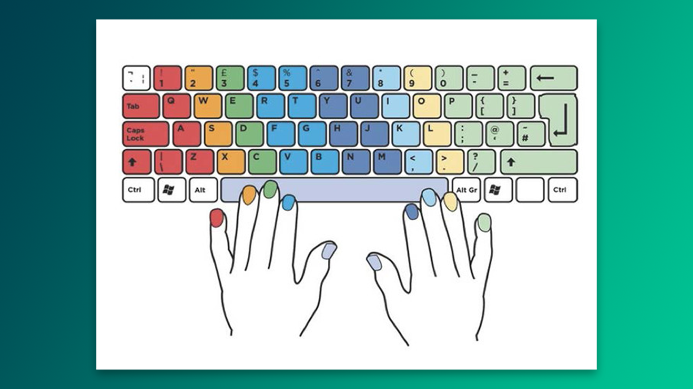
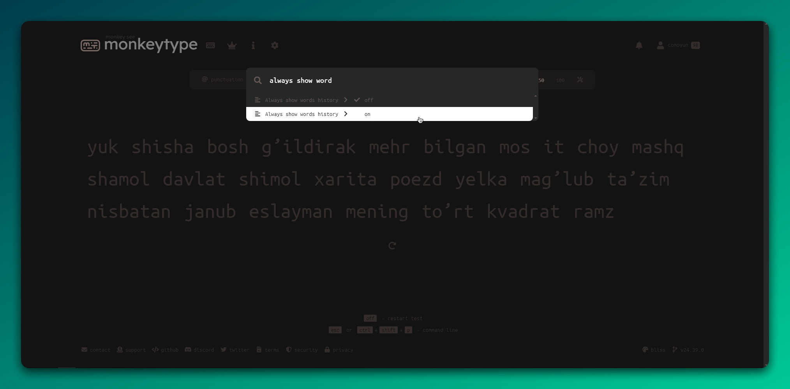
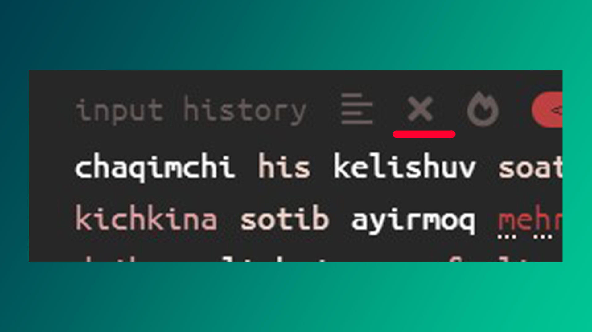
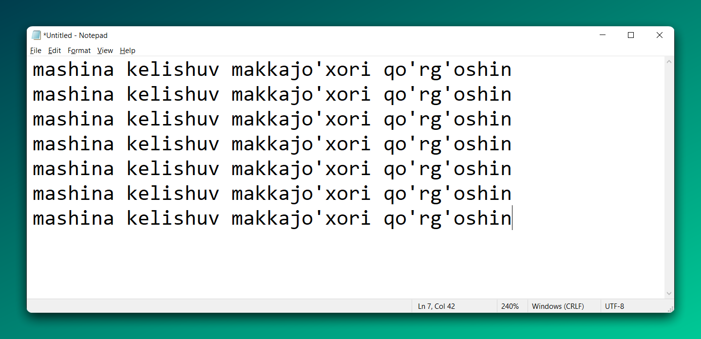
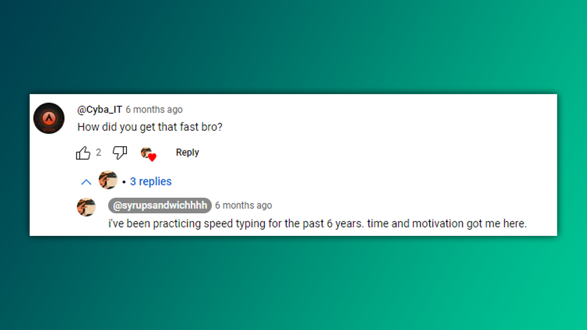
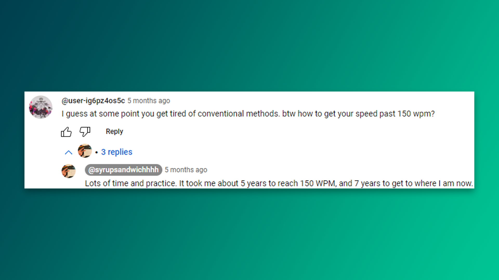
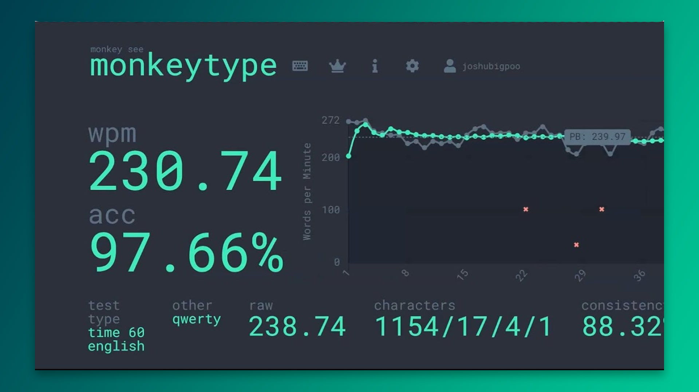

Mavzu Linux bilan bevosita bog‘liq bo‘lmasada, bu barcha "aytishniklar" bilishi shart bo‘lgan ko‘nikmalardan biri deb hisoblayman. Xuddi kod muharririni "extensions" (kengaytmalar) bilan yaxshilaganingiz kabi, to‘g‘ri yozish texnikasini ham o‘zingiz uchun bir kengaytma sifatida qabul qilishingiz mumkin. 

## Mativeyshinal spich

Yaqinda ukam bilan kasalxonada o‘tirganimda, shifokor kompyuterda nimanidir yozishi kerak bo'ldi. Uning ikki barmog‘i bilan klaviaturaga qarab-qarab, sekin-sekin terayotganini kuzatish azob edi; u aslida mening bir necha yil avvalgi aksim bo‘lganiga ishonish qiyin. Muammo uning tezligida emas, balki bu ishni bajarish uchun qancha kuch va e’tibor talab qilinayotganida. Bu menga ilgari nega yozishni yoqtirmasligimni eslatdi, ammo hozir yozish bilan bog‘liq har qanday ishni bajarishga tayyorman.

Lekin shuni tushundimki, hammamiz qayerdandir boshlaymiz. Qanchalik tez boshlaganingiz emas, qanchalik uzoqqa bora olishingiz muhim. Oxir-oqibat qachonlardir imkonsiz bo‘lib tuyulgan narsalar tabiiy holga aylanganini ko'rasiz.

"Tez yozish siri" sarlavhasi uchun uzr, chunki bu e’tiboringizni tortish uchun tanlangan nom edi, aslida bu yerda hech qanday maxfiy yoki sehrli sir yo‘q. 


Maqolaga sho'ng'ishdan avval [Gary_Internet](https://www.reddit.com/user/Gary_Internet/)-ga alohida minnatdorchilik bildirmoqchiman, chunki u ushbu maqolaning deyarli barcha qismini yozib chiqqan, men esa tarjima qildim xolos. Maqola haqiqatan ham foydali. U tufayli hozir ravon yoza olaman.

---

**Nega 2024-yilda va undan keyin to'g'ri uslubda yozishni o'rganishingiz kerak?**

"Touch typing" usulini (barcha barmoqlarni ishlatib yozish) o‘zlashtirgach, Internetda odamlar bilan yozishning jismoniy tomonlari haqida qayg'urmay bemalol suhbatlasha olasiz.

"O‘zi shundog'am daqiqasiga 100 ta so‘z yozamanu?", deb o‘ylaysiz, lekin yozish davomida klaviaturaga qaraysiz, xato qilasiz va go‘yo bor kuchingizni sarflayotgandek yozasiz. Lekin aynan shu kuch touch-typing bilan birgalikda sizni yanada yuqoriroq bosqichlarga olib chiqadi. Bundan tashqari, klaviaturaga qaramay tekis va aniq yozishni o'rganasiz.

Klaviaturadagi har bir harfning joylashuvini pastga qarab topish, mushak xotirasi orqali harflarning qayerdaligini instinktiv ravishda bilishga nisbatan ancha sekinroq.

Har bir necha soniyada to‘xtab, xato qilganingizni tekshirish uchun ekranga qarash, doimo ekranga uzluksiz qarab turishdan ko‘ra ancha sekinroq. 

>[!warning] Xatolarni tuzatish
>Xatolarni faqatgina `backspace` yordamida tuzatmang. `Ctrl + Backspace` tugmalarini bosing va keyin darhol xato so'zni **boshidan** yozing. Bu mushak xotirasini to'g'ri shakllantirishga hissa qo'shadi.

## Yozishni o'rganish

Ushbu [video](https://www.youtube.com/watch?v=X_my-XhPyJ0&ab_channel=TheresaCarpenter) va rasmdagi maʼlumotlarni qo'llang va [keybr.com](https://keybr.com/) saytidan foydalaning.



Agar bular yordam bermasa, [Typing Club](https://typingclub.com)-dan foydalaning, lekin esda tutingki, siz faqat YouTube videodagi aytilgan narsalarni o'rganasiz, boshqa hech narsa emas.

**Yozishni o‘rganishning ilk bosqichlarida amal qilishingiz lozim bo‘lgan oddiy, biroq muhim qoida - hech qachon klaviaturaga qaramaslik. Bu nihoyatda muhim.**

Jarayon og‘riqli bo‘ladi. Boshida ko‘p xatolarga yo‘l qo‘yasiz. Barmoqlaringiz chalkashib ketadi, pastga qaragingiz keladi, lekin bunga aslo YO'L QO'YMANG!

Klaviaturaga qarash o‘rganish jarayonini butunlay izdan chiqaradi. Har safar klaviaturaga yashirincha nazar tashlab, miyangizga yordam berayotgandek his qilasiz. Aslida esa, o‘z rivojlanishingizga to'sqinlik qilyapsiz.

**Yoza olishingizni qanday bilasiz?** Juda oddiy. Klaviaturaga qaramasdan, alifboning barcha 26 ta harfining joylashuvini avtomatik topa olganingizda.

**Buni qachon qila olishingizni qanday bilasiz?** Klaviaturaga qaramasdan "*The quick brown fox jumps over the lazy dog*" deb yoza olganingizda. Bu jumla pangram hisoblanadi, ya’ni unda alifboning barcha 26 ta harfi mavjud. 

Shu bilan yozishni o‘rganishning birinchi bosqichi yakunlanadi. Buyog'iga, garchi juda sekin bo‘lsa-da, ekranda ko‘rgan har qanday so‘zni tera olish imkoniyatiga ega bo‘lasiz.

Ikkinchi bosqich shunchaki tezroq terishni xohlagan ma’lum so‘zlarni iloji boricha kamroq xato bilan **qayta-qayta** yozishdan iborat xolos. Bor-yo‘g‘i shu. Ikkinchi bosqich umringizning oxirigacha davom etadi.

Turli xil mashq qilish saytlarining keng ro‘yxatini ko‘rish uchun [bu yerga](https://docs.google.com/spreadsheets/d/1aN-Vo-fsvLD8AJFuTAxN77d0BJLQ8_-7bvg-K_-OpgA/edit?gid=0#gid=0) bosing. Esda tutingki, bu saytlarning barchasi mohiyatan bir xil. Siz shunchaki ekranda ko‘rsatilgan so‘zlarni ko‘chirib yozasiz, xolos. Matn terish mashqi aslida shundan iborat.

## Aniqlik

Siz doimo xato qilayotgan va juda qiynalayotgan so‘zni qanday mashq qilishingiz kerak? Uni bo'g'imlarga ajratib, so‘zning turli bo‘laklarini alohida-alohida mashq qilib, keyin asta-sekin so‘zni qaytadan yig‘ish orqali. Masalan, "*mustaqillik*" so‘zini yozishda qiynalayotgan bo‘lsangiz:

```
mus mus mus mus mus mus mus mus mus mus mus mus

ta ta ta ta ta ta ta ta ta ta ta ta ta ta ta ta 

qil qil qil qil qil qil qil qil qil qil qil qil 

lik lik lik lik lik lik lik lik lik lik lik lik

musta musta musta musta musta musta musta musta

qillik qillik qillik qillik qillik qillik qillik

musta qillik musta qillik musta qillik musta qillik

mustaqillik mustaqillik mustaqillik mustaqillik
```

Buni sekin va aniq yozish kerak. Bunday mashqni istalgan matn muharririda bajarish mumkin. Men oddiygina Notepad dasturini ishlataman. Bir hafta davomida har kuni ikki marta "*mustaqillik*" so‘zi ustida ishladim va deyarli xato qilmaydigan bo‘ldim.

[MonkeyType](https://monkeytype.com)-dan foydalanganda, aniqlik mashqlarini quyidagicha bajaraman (buni eng yaxshi usul deb hisoblamayman, lekin o‘zim uchun samarali deb topdim):

`Esc` tugmasini bosib, "*Always show words history*" deb yozing. 



Bu test yakunida matn va yana 3 ta tugmani paydo qiladi. Siz o‘rtadagi **X** belgili tugmani bosishingiz kerak.



"X" tugmasi xato yozilgan so'zlarni nusxalaydi. Keyin men bu so‘zlarni matn muharririga uloqtirib, quyidagi rasmda ko‘rsatilganidek qayta-qayta yozib mashq qilaman. 



Endi, shoshilmasdan har bir so‘zni to‘g‘ri terishga e’tibor qaratsam bo'ladi. Bu yerda tez yozishga emas, balki miyamni qayta dasturlashga urinayapman. Maqsadim - barmoqlarimning **to‘g‘ri** harakat tartibini shakllantirish.

Monkeytype-da xato qilingan so'zlarni qaytadan yozish mashqi bor, lekin uni ma’qul ko‘rmayman, chunki u so'zlarni ko'p marta yozish va qiyin so'zlarni bo'laklarga bo'lib yozish imkonini bermaydi.

Oxir-oqibat, o‘zingizga qulay usulni tanlang, chunki eng muhimi, siz muntazam ravishda xato qiladigan so‘zlarni, to ularni to‘g‘ri yoza olguningizcha, mashq qilishingizdir. Buni qanday amalga oshirishingiz muhim emas, asosiysi, siz bu ishni bajarsangiz bo'ldi.

## Tezlik

Muayyan so‘zni har safar uchratganingizda uni imkon qadar tezroq yozishga urinish bilan, shu so‘zni yozish tezligingizni oshira olmaysiz. Yozish tezligi barmoqlaringizni shunchaki tezroq harakatlantirishga intilish orqali rivojlanmaydi.

Yozish tezligi shunchaki so‘zning harflari orasidagi ikkilanishning yo‘qligi bo‘lib, bu esa so‘zni yozish uchun kerak bo‘lgan harakatlarni ketma-ket bajarish natijasida yuzaga keladi.

Ikkilanishning yo‘qligi shunchaki siz bu so‘zni o‘tgan haftalar, oylar va yillar mobaynida ko‘p marta terganingiz tufayli. Yozish mashqlaringiz davomida muayyan so‘zni qanchalik ko‘p **aniq** takrorlasangiz, klaviatura tugmalarini bosish orasidagi ikkilanish shunchalik kamayadi.

**Tezlikni oshirishning yana bir usuli** 

So‘zlar orasidagi to‘xtab qolishlarni kamaytirish. Buning uchun siz ma’lum bir so‘z guruhi yoki birorta iqtibosdagi barcha so‘zlar bilan yuqori darajada tanish bo‘lishingiz lozim.

Yuqorida aytib o‘tilganidek, bunday ko‘nikma faqat uzoq vaqt davomida ushbu so‘zlarni **ko‘p martalab aniq takrorlash** orqali hosil qilinadi. Barmoqlaringiz har bir so‘zni yozish uchun kerak bo‘ladigan harakatlar ketma-ketligiga shunchalik o‘rganib qolishi kerakki, siz ekranga qaramasdan ham yozayotgan so‘zingizni oxirigacha yozib tugatishingiz mumkin bo‘lsin. Bu sizning ko‘zlaringizga oldinga qarash, keyingi so‘zni tanib olish va hozirgi so‘zni tugatishingiz bilanoq yangi so‘zni yozishga ruhan tayyorlanish erkinligini beradi. Shu bilan birga so‘zlar orasidagi juda qisqa pauzalarni deyarli yo‘q darajaga keltiradi.

Tasavvur qiling, agar siz 100 ta so‘z yozsangiz va so'zlar orasida 0,3 soniyalik pauza bo'lsa, bu sinov davomida *99 ta oraliq x 0,3 soniya = **29,7*** soniya bekor ketgan vaqtni tashkil etadi. Pauza 0,1 soniyagacha qisqartirilsa ham, natija 9,9 soniyani tashkil etadi.

Oldinda kelayotgan so'zni o‘qish aynan manashu pauzalarni yo'qotadi. Asosiy tezlikni aynan shu yerda qo‘lga kiritasiz, alohida so‘zlarni tezroq terishdan emas. Shunchaki yumshoq va bir maromda yozing.

Lekin faqat o‘zingizga yaxshi tanish bo‘lgan so‘zlarga duch kelguncha "oldindan o‘qish" usulini qo‘llay olasiz. Notanish so‘zga duch kelishingiz bilanoq, ehtimol sekinlashishingiz, o‘qish maromingiz buzilishi va so‘zni harfma-harf terib chiqishga majbur bo‘lishingiz mumkin. 

Muqobil variant - notanish so‘zni tanish so‘zlar bilan bir xil tezlikda terishga urinib, tavakkal qilishdir. Ammo testlarda va haqiqiy hayotda xato qilsangiz, `Ctrl + Backspace` tugmalarini bosib, so‘zni qaytadan yozing. 

>Tezlik - ikkilanmaslikdir. Ikkilanmaslik tanishlikdan kelib chiqadi. Tanishlik esa takrorlash natijasida paydo bo‘ladi. Ko‘p marta takrorlash uchun vaqt talab etiladi. Bu oylar va yillar davom etadi.

Mushak xotirasiga kelsak, ma’lum bir so‘zni aniq terishda yaxshilanayotgan narsa barmoqlarning harakat tezligi emas, balki barmoqlarning muayyan ketma-ketlikdagi harakatlarini eslab qolish va bajarish qobiliyatidir. Nega tez yozadiganlarning aksariyati yosh bolalarni tashkil qiladi? Chunki mushak xotiralari erta yoshda tezroq rivojlanadi. Aynan o'sha bolalar katta bo'lib YouTube-da "Qanday qilib 160+ wpm ga erishish mumkin" kabi videolar chiqarib layk yig'ishadi.

## X dan Y wpm ga qanday erishaman?

yoki "*men X tezlikda qotib qolgandayman. Nima qilishim kerak?*" 

Mana, hech kim o‘qishni istamaydigan javoblar.

Qayta-qayta mashq qilish orqali. "Monkeytype", "Typeracer" yoki "10fastfingers"dan foydalanayotganingiz ahamiyatsiz. Siz ekraningizda ko‘rayotgan so‘zlardan nusxa ko‘chiryapsiz. O‘ylab ko‘ring: har bir matn terish veb-saytida siz faqat shu ishni qilasiz. Hammasi bir xil. Agar biror so‘zni bir veb-saytda mukammal yoza olsangiz, uni boshqa veb-saytda ham xuddi shunday mukammal yoza olasiz. Miyangiz uchun bularning barchasi bir xil. Siz shunchaki matnni ko‘chirib yozyapsiz xolos.

Vaqt o'tib mushak xotirangiz rivojlanadi, tezlik bilan birga albatta. Bu oylar yoki, ehtimol, yillar davom etadigan ishdir.

Ko‘pchilik uchun bu Monkeytype-dagi standart "*inglizcha*" til sozlamasida 200 ta so‘zni o‘zlariga ma’qul kelgan test davomiyligi bilan, to bezib ketguncha qayta-qayta terishni anglatadi. 

 Tezlik uzoq vaqt mobaynida so'zlarni qayta qayta (yuzlab yoki minglab) takrorlashga borib taqaladi. Yoki yana ham afzalroq "aniq takrorlash", chunki miyangiz xatolarni butunlay boshqa so‘zning to‘g‘ri takrorlanishi sifatida qabul qiladi (masalan, "the" o‘rniga "teh"). Miyangiz bunda farq ajratmaydi. 

## Ho'p, 240 wpm-ga erishmoqchi bo'lsamchi?

Uzr, javob o‘sha-o‘sha. Bunday tezlikka erishishning faqat shunday tez yozadiganlar biladigan maxsus siri yo‘q. Hech narsa o‘zgarmagan. Siz shunchaki yozishda davom etasiz, tezroq yozishni istagan so‘zlaringizni aniqroq qayta-qayta takrorlaysiz. Balki **sizdan ancha ko‘p vaqt** talab qilar. Hatto sharoitingizni, yoshingizni hisobga olgan holda, bunga erishish **imkonsiz** bo‘lishi ham mumkin.

Mana, men malakali typist-dan o‘qigan eng yaxshi va lo'nda javoblardan biri. U shunchalik oddiyki, uni e’tiborsiz qoldirish oson. Bu fikr [ushbu videoning](https://www.youtube.com/watch?v=8RgSrK1kmfY&ab_channel=Syrupsandwich) izohlar bo‘limida joylashgan:



Tarjima:

```
Cyba_IT: Qanday qilib bunaqa tezlikka erishding uka?

Syrupsandwich: Man 6 yildan beri mashq qilyapman. Vaqt va motivatsiya tufayli.
```

Tugadi. **Vaqt va motivatsiya.** 

Syrupsandwich - Monkeytype-ning standart ingliz tilidagi 200 ta so‘zlik testida bir daqiqa davomida 100% aniqlik bilan **202** ta so'z yoza oladigan va Typeracer-da o‘rtacha **160** wpm-dan ortiq tezligiga ega bo‘lgan, umuman olganda 98,82% aniqlik ko‘rsatkichiga erishgan mahoratli typist-dir.

Siz bunday odamdan ko‘zingizni ochib qo‘yadigan o‘ta maxfiy sehrli maslahat kutgan bo‘lishingiz mumkin. Ammo yo‘q. Aslida, tez yozuvchi biladigan, sekin yozuvchi bilmaydigan uncha ko‘p narsa yo‘q. Hayratlanarli darajada oz, aslini olganda.



Tarjima:

```
User-ig6: Menimcha, ma’lum bir paytdan keyin an’anaviy usullardan charchaysiz (Qwerty-ni nazarda tutyapti). Ammo daqiqasiga 150 so‘zdan yuqori tezlikka qanday erishsa bo‘ladi?

Syrupsandwich: Juda ko'p vaqt va praktika. 150 tezlikka erishishim uchun 5 yil ketdi, hozirgi tezligimga esa 7 yil.
```

Bu bola taxminan 10-11 yoshida Typing Club va shunga o‘xshash boshqa veb-saytlarda yozishni o‘rgangan va keyin muntazam ravishda mashq qilishni davom ettirgan. Ko‘pchilik uni narsalarni juda tez o‘zlashtiradigan va "tabiiy iste’dod"ga ega bo‘lgan yoshlardan biri deb o‘ylaydi. U ajoyib iste’dod egasi bo‘lsa kerak, to'g'rimi? Yo‘q, unday emas.

"Bir daqiqada 150 ta so‘z yozish tezligiga erishish uchun 5 yil  muntazam mashq qilishga to‘g‘ri keldi," dedi. Bu ham ko‘pchilikka nisbatan ancha erta yosh davrida boshlashning afzalliklari bilan birga. Agar siz 10 yoshdan katta bo‘lsangiz, shunchaki ko‘proq sabrli bo‘lishingizga to‘g‘ri keladi. Bu shunchalik oddiy. Men 38 yoshimda boshlaganman, shuning uchun juda sabrli va qat’iyatli bo‘lishimga to‘g‘ri keldi.

## Vaqt va motivatsiya

Asoslarni o‘zlashtirib olgandan so‘ng, sizga faqat shular kerak xolos. Agar kimdir sizga boshqacha aytsa yoki siz bilishingiz kerak bo‘lgan maxfiy usul borligini aytib, uni sizga sotmoqchi bo‘lsa, u aldayapti. Ha, hozir ham kompyuterda yozish kurslarini sotadigan odamlar bor. Bu shunchaki odamlarning **pulini aldab olishdir**.

Tez va sekin yozuvchilarni bir-biridan ajratib turadigan narsa shunchaki vaqt va motivatsiya. Buni boshqacha qilib aytganda, sabr-toqat va qat’iyat deyish mumkin. Rivojlanish jarayoni - bu vaqti-vaqti bilan yengib o‘tiladigan, juda zerikarli va uzoq davom etadigan to‘xtab qolish davrlaridan iborat. Agar siz bu to‘xtab qolish davrlariga chidashga qodir bo‘lsangiz, oxir-oqibat maqsadingizga erishasiz.

Ba’zi odamlar hayotlarida hech qachon mashq qilmasdan ham daqiqasiga 120 ta so‘zdan ko‘proq terishni uddalaydilar. Ular yoshligidanoq yozishni o‘rganishgan va hozir 30 yoki 40 yoshga kirib, o‘n yildan ortiq vaqt davomida yozib kelishmoqda. Bu odamlarni tez yozuvchilar deb atasa bo‘ladimi? Balki. Ammo siz ulardan tez yozish bo‘yicha mutaxassis ekanliklarini so‘rasangiz, ular "Bilmayman. Ehtimol shundaydir. Men bu haqda hech o‘ylab ko‘rmaganman," deb javob berishadi. Bunday vaziyatda ko‘plab odamlar bor. Ular shunchaki yozib, o‘z ishlarini qilib kelishgan va "elita" yoki "ilg‘or" toifasining quyi chegarasida ekanliklari ular uchun ahamiyatsiz.

Esda tuting, har qanday yozish mashqdir. Hatto siz o‘qiyotgan ushbu hujjatni tahrirlashim ham mashq hisoblanadi.

## Yanglishyapsiz. Tez yoza oladigan, ammo aniqlik darajasi past bo‘lgan ko‘plab odamlar bor.

Albatta. Siz gapirayotgan odamlarning aksariyati Monkeytype-ning 200 ta so‘zdan iborat ro'yxatda yuqori tezlikka erishgan odamlar bo‘ladi. So‘zlarning barchasi juda keng tarqalgan, juda qisqa va hech kim o‘z xatolarini tuzatishi shart emas.

Bundan tashqari, ushbu 200 ta so‘zning 93 tasi ingliz tilidagi eng ko‘p ishlatiladigan 100 ta so‘z qatoriga kiradi. Bu so‘zlar yozma ingliz tilining qariyb yarmini tashkil etishi aytilgan va ular Typeracer-dagi barcha iqtiboslarda ham so‘zlarning taxminan yarmini tashkil qiladi.

Bu shuni anglatadiki, o‘sha 200 ta so‘zning deyarli yarmi odamlar Monkeytype yoki boshqa har qanday matn terish veb-saytini topishdan oldin yozishga juda yaxshi ko‘nikkan so‘zlardir.

Shaxsiy misol keltiradigan bo‘lsam, Monkeytype-da 100 so‘zlik test o‘tkazdim va 95,03% aniqlikka erishdim. 14 ta so‘zda 31 ta noto‘g‘ri harf bosildi. Bu esa 86 ta so‘zni mutlaq aniqlik bilan yozganimni anglatadi. Lekin xato qilmang, 95% aniqlik yaxshi natija emas. Har doim 98% yoki undan yuqori aniqlikni maqsad qiling.

Typeracer kabi veb-saytlarda, matnning keyingi so‘ziga o‘tishdan oldin barcha xatolaringizni tuzatishga majbursiz. Chunki aniqlikni oshirish tezlikni oshirishning yagona yo‘lidir. 

"[Problem words](https://problemwords.com)" saytini ko‘rib chiqing. Sayt sizga keng ko‘lamli so‘zlarda aniqlikni oshirishga yordam beradi va shu orqali yozish lug‘atingizni kengaytiradi. Shuni ta’kidlash joizki, har bir testda juda keng tarqalgan so‘zlar bilan birga noyob va kam uchraydigan so‘zlar ham aralash holda keladi, shu bois siz juda yaxshi muvozanatga ega bo‘lasiz.

"[pairtype.com](https://pairtype.com)" ham yana bir ajoyib sayt. U sizga murakkab bigrammalar ustida ishlashga yordam beradi, shu bilan birga yozish lug‘atingizni ham sezilarli darajada kengaytiradi.

## Qanday qilib ba’zilar *o'ta* tez yozadi?



Imkoningiz bo'lsa, quyidagi 3 ta savolni o'sha tez yozuvchilarga berib ko'ring. Chunki aynan shu savollar ularning tezligi ortidagi haqiqatni ochib beradi va chindan ham ahamiyatli bo‘lgan jihatlarni yoritib beradi.

1. Hozir necha yoshsiz?

2. Kompyuterdan muntazam foydalanishni boshlaganingizda necha yosh edingiz?

3. [Typing.com](https://typing.com/) yoki shunga o‘xshash saytda "to‘g‘ri" uslubda yozishni o‘rganganingizda necha yosh edingiz?

*Ho'p, maqsad nima?*  Ba'zan tezlikka erishish uchun faqat praktikaning o'zi yetmasligini ko‘rsatib berish. Har kim ham juda tez yoza olmaydi. Inson qarigani sayin o'rganish instinktlari susayib boradi. Mana nega Yevropada ota-onalar bolalarini juda erta yoshidan boshlab skripka yoki pianina cholish kurslariga berishadi.

Ularning hozirgi yoshini oling va undan kompyuterdan muntazam foydalanishni boshlagan yoshini yoki to'g'ri yozishni o'rgangan yoshini ayirib tashlang va birdaniga hamma narsa ayon bo'ladi. Ular 5 yildan 20 yilgacha mashq qilishgan. Bu juda ko'p amaliyot.

Bu uzoq vaqt mobaynida bir xil so‘zlarni minglab marta takrorlash natijasida to‘plangan tajribadir. Ular shu qadar tez yoza olishlarining sababi, har bir so‘zni yozish uchun kerak bo‘lgan barmoq harakatlarining ketma-ketligini juda yaxshi o‘zlashtirib olganliklarida.

Yozish jarayonidagi avtomatlashtirish darajasini ta’riflash qiyin, ammo shuni aytishim mumkin. Ular barmoqlari va qo‘llari nima qilayotgani haqida deyarli o‘ylamaydilar, balki butunlay yozayotgan narsalariga e’tibor qaratadilar. Biroq, hatto bu ham ularning aqliy quvvatining ko‘p qismini band qilmaydi. 

**Uzoq muddat davomida ko‘p mashq qilish natijasida, yozish jarayonining texnik tomoni deyarli o‘ylamasdan amalga oshiriladigan faoliyatga aylanadi.**

Quyida men olib borgan tadqiqot natijasini ko'ring va xulosa qiling:

| Hozirgi yoshi | Kompyuterdan muntazam foydalanishni boshlagan yoshi | To'g'ri yozishni o'rganish yoshi | monkeytype - 1 daqiqalik standart testdagi eng yaxshi natija |
| ------------- | --------------------------------------------------- | -------------------------------- | ------------------------------------------------------------ |
| 41 (men)      | 16                                                  | 38                               | 81 wpm                                                       |
| 18            | Noma'lum                                            | 11                               | 178 wpm                                                      |
| 23            | 5                                                   | 15                               | 187 wpm                                                      |
| 16            | 4                                                   | 11                               | 207 wpm                                                      |
| 19            | 5                                                   | 7                                | 165 wpm                                                      |
| 15            | Noma'lum                                            | 12                               | 243 wpm                                                      |
| 21            | 4                                                   | Noma'lum                         | 227 wpm                                                      |
| 19            | 6                                                   | Hech qachon                      | 220 wpm                                                      |
| 34            | Noma'lum                                            | 16 (Dvorak)                      | 169 wpm                                                      |
| 16            | 7                                                   | 16 (Dvorak)                      | 158 wpm                                                      |
| 16            | 6                                                   | Hech qachon                      | 192 wpm                                                      |
| 15            | 5                                                   | Hech qachon                      | 240+ wpm                                                     |
| 11            | Noma'lum                                            | 7 (typingclub.com)               | 100 wpm (kam amaliyot)                                       |
| 25            | 5                                                   | 7                                | Noma'lum (15 soniyalik testda 217 wpm)                       |
| 17            | 12                                                  | 2021 yil dekabr                  | 167 wpm                                                      |
| 17            | Noma'lum                                            | 10-11 yosh                       | 202 wpm                                                      |

## Monkeytype uchun tavsiya etilgan sozalamar

`Esc` tugmasini bosing, so‘ng "*language*" so‘zini yozing va paydo bo‘lgan ro‘yxatdan "*English 1k*" yoki "*Uzbek 1k*" ni tanlang.

`Esc` tugmasini bosing va "*difficulty*" so‘zini yozing, keyin paydo bo‘lgan variantlardan "*Expert*"-ni tanlang.

>"*English 1k*" yoki "*Uzbek 1k*" sizni yanada mukammalroq typist-ga aylantiradi, chunki siz ishonch bilan yoza oladigan so‘zlar va n-grammalar doirasini kengaytirasiz.

`Esc` tugmasini bosing, va quyidagilarni kiriting:

"**decimal**" va "*always show decimal places*" funksiyasini yoqing... Bu sizga aniqlik foizining yanada aniqroq ko‘rsatadi.

"**history**" va "*always show word history*" funksiyasini yoqing... Bu sizga doimo xato yozilgan so‘zlarni vaqtinchalik xotiraga nusxalash tugmasini ko‘rish va ularni matn muharririda mashq qilish imkonini beradi.

 "**live**" va "*live progress style off*", chunki bu sizga kerak bo‘lmagan ekrandagi chalg‘ituvchi vosita.

"**freedom**" rejimini yoqing. Keyingi so‘zni kiritganingizdan so‘ng `Backspace` yoki  `Ctrl + Backspace` tugmalarini bosishni xohlasangiz, bu imkoniyat qo‘l keladi va testning boshigacha ortga qaytishingiz mumkin. Nega bu o‘zgartirilishi mumkin bo‘lgan sozlama ekanligini tushunmayman. Bu standart holda yoqilgan bo‘lishi kerak edi.

>Test davomida xato qilgan so'zlaringizni 10 martadan takrorlang. 30 sekund yoki 1 minut o'rniga 2 minutli testlarni bajaring, shu orqali chidamlilikni oshirasiz. 

## Fikr bildirish

Tarjima sifatini yaxshilash uchun fikr mulohazalaringizni ulashing. Qayerida kamchilik bor? Qayeri tushunmovchilik tug'diryapti? Telegram ([@comoyun](https://t.me/comoyun)) yoki Reddit (u/comoyun) orqali bog'laning. 

---

**Aniqlik x Takrorlash = Tezlik**

