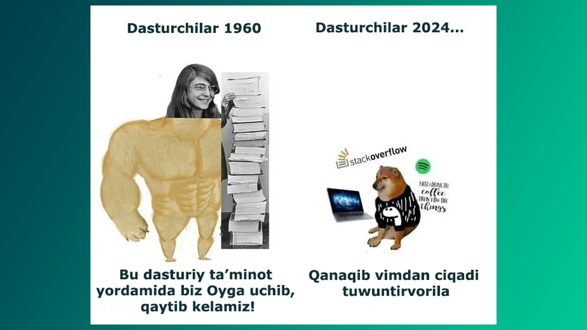
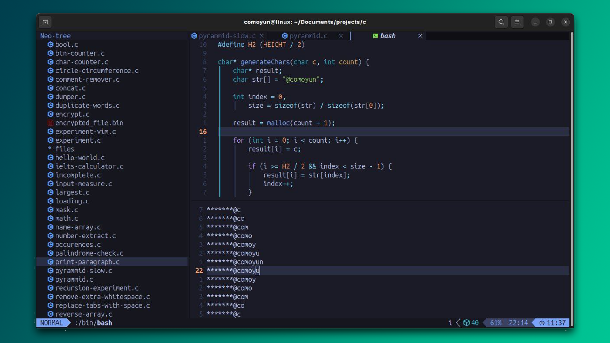
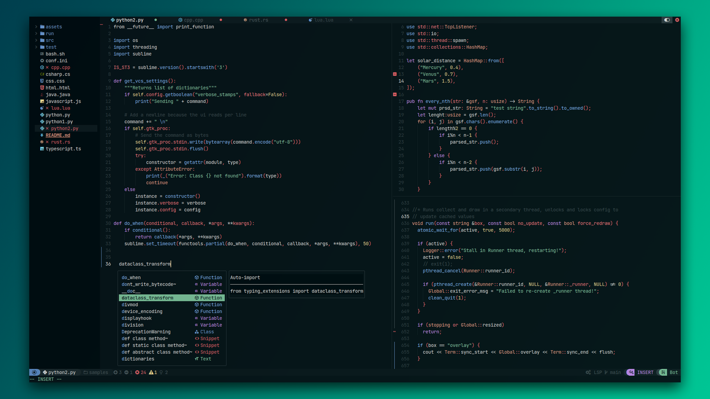

1991-yildan beri Vim dasturchilarning ishonchli hamrohi bo'lib kelmoqda. Oddiy ko'rinishga ega bu muharrir ortida ajoyib kuch yashiringan. Vim sizga ko‘p narsani o‘rgatadi. Masalan, barcha barmoqlardan foydalanib yozishni, sichqonchaga kamroq tayanishni, tez va samarali yozishni. 

To‘g‘ri, boshida biroz aqliy zo‘riqish bo‘lishi mumkin, lekin 16 yoshgacha bo'lgan davrda miyamiz va mushak xotiramiz yangi ko'nikmalarga chanqoq bo'ladi; Vim buyruqlari barmoqlaringizga "o'rnashib" qoladi. Kattalar ham bemalol o'rgana oladi, shunchaki ko'proq sabr talab qiladi.

Vim bel va bo‘yinni asraydi, chunki u to‘g‘ri holatda o‘tirib yozishni rag‘batlantiradi. Bu, ayniqsa, kuniga bir necha soat kompyuter oldida o'tiradigan dasturchilar uchun muhim. Vim-da kod yozish maroqli, chunki qayta-qayta yozish yoki o‘zgartirish mumkin bo‘lgan matnlarni strategiyalar tuzib, Vim "tili" yordamida avtomatlashtirsa bo'ladi. Dasturchi bo‘lmasangiz ham, undan foyda olishingiz mumkin. O‘rganing, afsuslanmaysiz 🙂

Vim-ni tavsiya qilishimning yana bir sababi shuki, u barcha Linux tizimlarida standart holatda o‘rnatilgan bo‘ladi. Biror serverga SSH orqali ulanganingizda, qo‘shimcha dasturlar o‘rnatmasdan darhol ishga kirishishingiz mumkin.

Vim bilan matnni fikr tezligida tahrirlash mumkin, deyishadi, ammo buning uchun siz "touch typing" qobiliyatiga ega bo‘lishingiz va ancha tajriba orttirgan bo‘lishingiz kerak. Masalan, bu [dasturchi](https://youtu.be/7Hlb8YX2-W8?si=l8XfvYN99T-aZXRx)ni ko‘rib, "*Sun’iy intellekt mening ishimni olib qo‘yishi mumkin, lekin bu odamning ishini hech qachon egallay olmaydi*", deb o‘ylashingiz tabiiy.

>[!success] Vim-ning kuchi sizning tasavvuringiz bilan cheklangan.

## O'rnatish

Vim deyarli barcha platformalarda mavjud. Avval aytilganidek, Linux-da standart o'rnatilgan bo'ladi, ammo u yo‘q bo‘lsa, `sudo apt install vim` yoki CentOS uchun `sudo yum install vim` kabi buyruqlar bilan osongina o‘rnatishingiz mumkin. MacOS tizimida `brew install vim`. Windows foydalanuvchilari Scoop yoki Chocolatey kabi ilova menejerlari orqali o'rnatishlari mumkin.

## Maslahatlar

| Bosqich         | Tavsif                                        | Ko'nikmalar                       |
| --------------- | --------------------------------------------- | --------------------------------- |
| Birinchi kun    | Normal va yozish rejimlarini o'rganasiz       | `i` va `Esc` tugmalari            |
| Birinchi hafta  | Asosiy harakatlar va saqlashni o'zlashtirasiz | `hjkl`, `:w`, `:q`                |
| Birinchi oy     | Tezkor tahrirlashni boshlaysiz                | Ko'chirish, qo'yish, vizual rejim |
| Keyingi bosqich | Plaginlar va kengaytirilgan buyruqlar         | IDE imkoniyatlari                 |

Har safar bitta funksiyani o‘zlashtiring - murakkab buyruqlarga o‘tishdan oldin kiritish rejimi (`i`) va normal rejimni (`Esc`) yaxshilab o‘rganing. Bundan tashqari, terminalingizda `vimtutor` deb yozib, Vim qo‘llanmasini ishga tushirishingiz mumkin. Quyidagi keng tarqalgan xatolarga yo'l qo'ymang:

### **Faylni saqlashni unutish**

- **Muammo:** Ma'lumotlaringizni yo'qotishingiz mumkin.
- **Yechim:** Tez-tez `:w` ni kiritib, faylni saqlang.

### **Rejimlarni tushunmaslik**

- **Muammo:** Xato tahrirlar sodir bo'lishi mumkin.
- **Yechim:** Qaysi rejimda ekanligingizni chap pastgi qismdagi status orqali bilib turing.

### **Vim-dan noto'g'ri chiqish**

- **Muammo:** Qo'shimcha protsesslar paydo bo'lib qoladi.
- **Yechim:** Har doim `:q`, `:wq` yoki `:x` ni ishlatib dasturdan chiqing.

### **Vizual rejimidan foydalanmaslik**

- **Muammo:** Tezlikni kamaytiradi.
- **Yechim:** `v`, `V`, yoki `Ctrl+v` (vizual blok) dan foydalaning.

### **Plaginlardan foydalanmaslik**

- **Muammo:** Mahsuldorlikni kamaytiradi.
- **Yechim:** Zarur [plaginlar](https://vimawesome.com/)ni qo'shing. 

## Vim IDE sifatida

Vim IDE sifatida ishlashi mumkin, lekin undan maksimal darajada foydalanish uchun Vim-ning zamonaviy versiyasi bo‘lgan Neovim (nvim)ni o‘rnatishingiz kerak. Neovim ko‘proq moslashuvchanlik va keng turdagi plaginlarni qo'llab-quvvatlaydi.

Tayyor yechimni afzal ko‘radiganlar uchun [LazyVim](https://www.lazyvim.org/), [NvChad](https://nvchad.com/) kabi oldindan sozlangan versiyalar ajoyib boshlang‘ich nuqta bo‘lib xizmat qiladi. Ular allaqachon o‘rnatilgan muhim plaginlar va sozlamalar bilan birga keladi.

## Xulosa

U shunchaki matn muharriri emas, u fikrlash tarzingizni o'zgartiradi. U sizni yanada samaraliroq ishlashga, kamroq vaqt sarflashga va eng muhimi - to'g'ri holatda o'tirishga o'rgatadi. Ingliz tilidagi [amaliy qo'llanma](https://github.com/theGioiLa/Translate/blob/master/Practical.Vim.2nd.Edition.2015.10.pdf) bilan tanishib, o'z bilimlaringizni yanada oshirishingiz mumkin.

