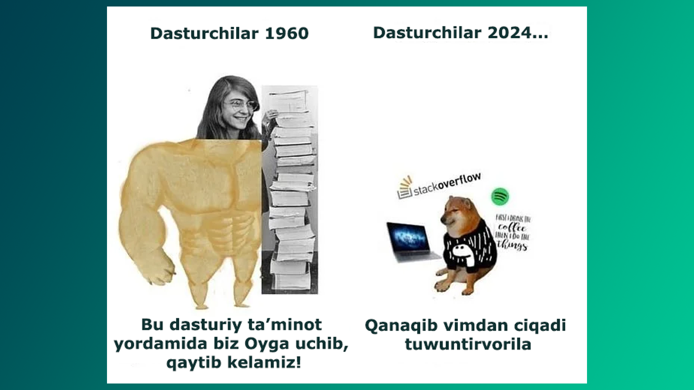
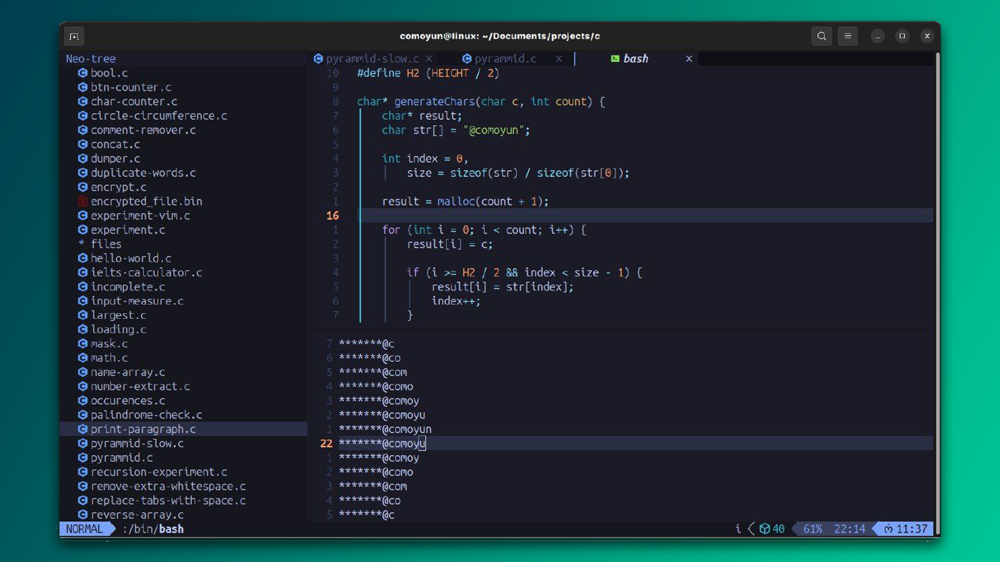
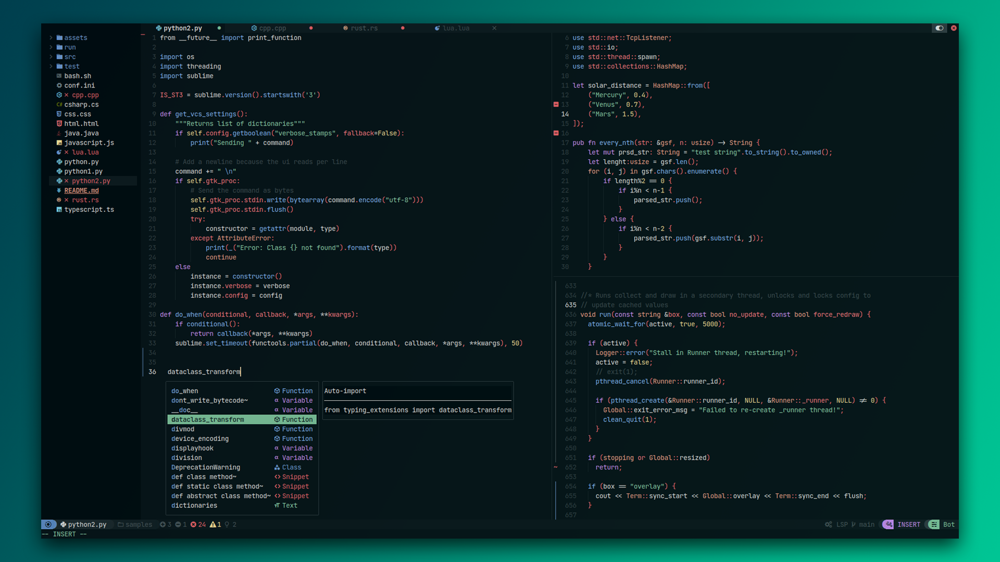

Vim ("Vi IMproved" - "Vi takomillashtirilgan") 1991-yildan buyon dasturchilar va yozuvchilar orasida sevimli bo‘lib kelayotgan yuqori samarali matn muharriridir. Vim sizga ko‘p narsani o‘rgatadi. Masalan, barcha barmoqlardan foydalanib yozishni, sichqonchaga kamroq tayanishni, tez va samarali yozishni o‘rgatadi. To‘g‘ri, boshida biroz aqliy zo‘riqish bo‘lishi mumkin, lekin vaqt o‘tishi bilan mushak xotirangiz rivojlanib, deyarli o‘ylamasdan ishlashni boshlaysiz - ayniqsa 16 yoshdan kichik bo‘lsangiz, bu ko‘nikmani o‘zlashtirish ancha oson bo‘ladi. Vim bel va bo‘yinni ham asraydi, chunki u to‘g‘ri holatda o‘tirib yozishni rag‘batlantiradi. Vim-da kod yozish maroqli, chunki qayta-qayta yozish yoki o‘zgartirish mumkin bo‘lgan matnlarni strategiyalar tuzib, Vim "tili" yordamida avtomatlashtirish imkoniyati bor. Dasturchi bo‘lmasangiz ham, undan foyda olishingiz mumkin. O‘rganing - afsuslanmaysiz ;)

Vim-ni tavsiya qilishimning yana bir sababi shuki, u barcha Linux tizimlarida standart holatda o‘rnatilgan bo‘ladi. Biror serverga SSH orqali ulanganingizda, qo‘shimcha dasturlar o‘rnatmasdan darhol ishga kirishishingiz mumkin.

Vim bilan matnni fikr tezligida tahrirlash mumkin, deyishadi, ammo buning uchun siz "touch typing" qobiliyatiga ega bo‘lishingiz va ancha tajriba orttirgan bo‘lishingiz kerak. Masalan, bu [dasturchi](https://youtu.be/7Hlb8YX2-W8?si=l8XfvYN99T-aZXRx)ni ko‘rib, "*Sun’iy intellekt mening ishimni olib qo‘yishi mumkin, lekin bu odamning ishini hech qachon egallay olmaydi*", deb o‘ylashingiz tabiiy.

>Vim-ning kuchi faqat sizning tasavvuringiz bilan cheklangan.

## O'rnatish

Vim deyarli barcha platformalarda mavjud. Avval aytilganidek, Linux-da standart o'rnatilgan bo'ladi, ammo u yo‘q bo‘lsa, `sudo apt install vim` yoki CentOS uchun `sudo yum install vim` kabi buyruqlar bilan osongina o‘rnatishingiz mumkin. MacOS tizimida `brew install vim`. Windows foydalanuvchilari Scoop yoki Chocolatey kabi paket menejerlari orqali o'rnatishlari mumkin.

## Maslahatlar

Avvalo, asosiy navigatsiya buyruqlarini o‘rganib oling: strelka tugmalar o‘rniga `h`, `j`, `k` va `l` tugmalaridan foydalaning. Keyinchalik bu ko‘nikmaning `man`, `less`, `more` va boshqa dasturlarda ham qo'l kelishini payqaysiz. Nega strelka tugmalari emas? Chunki ular asosiy qatordan (home row) uzoqroqda joylashgan, ularga erishish uchun barmoqlarni harakatlantirish dasturchi sifatida dangasalik bo‘lib tuyuladi. 

Faylni saqlash uchun `:w`, chiqish uchun esa `:q` buyrug‘ini yozing. Har safar bitta funksiyani o‘zlashtiring - murakkab buyruqlarga o‘tishdan oldin kiritish rejimi (`i`) va normal rejimni (`Esc`) yaxshilab o‘rganing. Bundan tashqari, terminalingizda `vimtutor` deb yozib, Vim qo‘llanmasini ishga tushirishingiz mumkin. Agar siz qat’iyat bilan davom etsangiz, tez orada Vim-ning tezligi va samaradorligi uni sizning eng sevimli tahrirlovchingizga aylantiradi. Quyidagi keng tarqalgan xatolarga e'tibor bering:

### **Faylni saqlashni unutish**

- **Muammo:** Ma'lumotlaringizni yo'qotishingiz mumkin.
- **Yechim:** Tez-tez `:w` ni kiritib, faylni saqlang.

### **Rejimlarni tushunmaslik**

- **Muammo:** Xato tahrirlar sodir bo'lishi mumkin.
- **Yechim:** Qaysi rejimda ekanligingizni chap pastgi qismdagi status orqali bilib turing.

### **Vim-dan noto'g'ri chiqish**

- **Muammo:** Qo'shimcha protsesslar paydo bo'lib qoladi.
- **Yechim:** Har doim `:q`, `:wq` yoki `:x` ni ishlatib dasturdan chiqing.

### **Vizual rejimidan foydalanmaslik**

- **Muammo:** Tezlikni kamaytiradi.
- **Yechim:** `v`, `V`, yoki `Ctrl+v` (vizual blok) dan foydalaning.

### **Plaginlardan foydalanmaslik**

- **Muammo:** Mahsuldorlikni kamaytiradi.
- **Yechim:** Zarur [plaginlar](https://vimawesome.com/)ni qo'shing. 

## Vim IDE sifatida

Vim IDE sifatida ishlashi mumkin, lekin undan maksimal darajada foydalanish uchun Vim-ning zamonaviy muqobili bo‘lgan Neovim (nvim)ni o‘rnatishingiz kerak. Neovim ko‘proq moslashuvchanlik va keng turdagi plaginlarni qo'llab-quvvatlaydi.

Tayyor yechimni afzal ko‘radiganlar uchun [LazyVim](https://www.lazyvim.org/), [NvChad](https://nvchad.com/) kabi oldindan sozlangan versiyalar ajoyib boshlang‘ich nuqta bo‘lib xizmat qiladi. Ular allaqachon o‘rnatilgan muhim plaginlar va sozlamalar bilan birga keladi.

## Xulosa

Vim sizni matn tahrirlashda yangi bosqichga olib chiqadi. Dastlab qiyin tuyulsa-da, vaqt o‘tishi bilan mahorat oshib boradi. Asosiy kalit - qat'iyat va muntazam amaliyotdir. Dasturchi bo‘lasizmi yoki shunchaki matn yozish bilan shug‘ullanasizmi, Vim sizning kuchli qurolingizga aylanishi aniq. Ingliz tilini biladiganlar uchun bu [kitob](https://github.com/theGioiLa/Translate/blob/master/Practical.Vim.2nd.Edition.2015.10.pdf)ni o'qishni tavsiya etaman.

>Ushbu sahifa hali ham to'ldirilishi kerak. Vim bilan ishlovchilar o‘z tajribalarini baham ko‘rishlari yoki yangi boshlovchilar uchun muhim ma’lumotlarni ulashishlari mumkin. Shunchaki "Tahrirlash" tugmasini bosing. Yangi ma'lumot qo'shishdan avval imlo va grammatik xatolarga e'tibor bering yoki shunchaki [tahrirchi.uz](tahrirchi.uz) saytidan tekshiruvdan o'tkazing. 