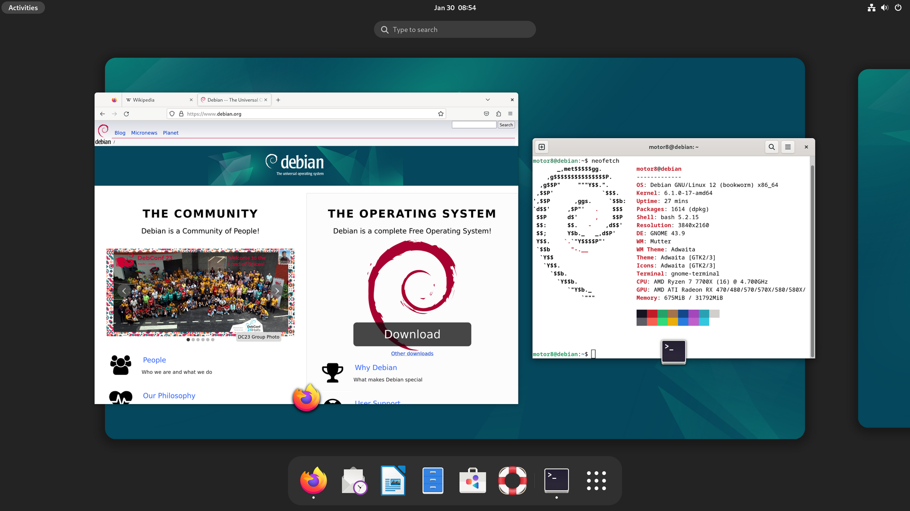
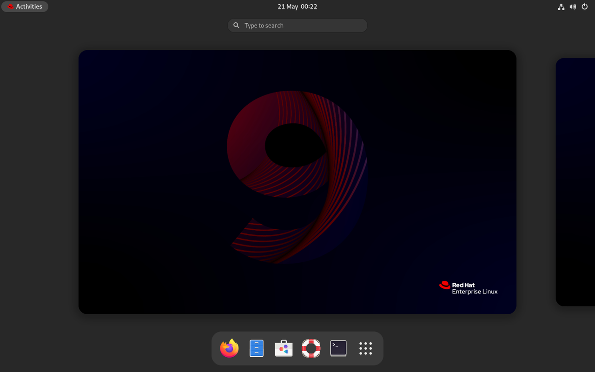
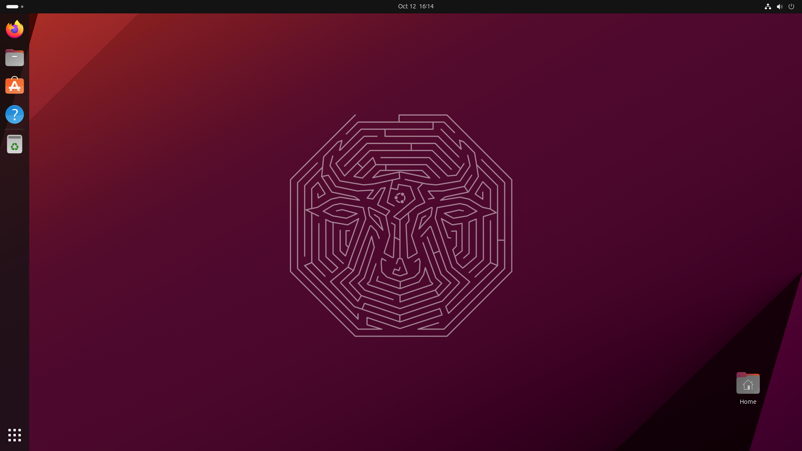
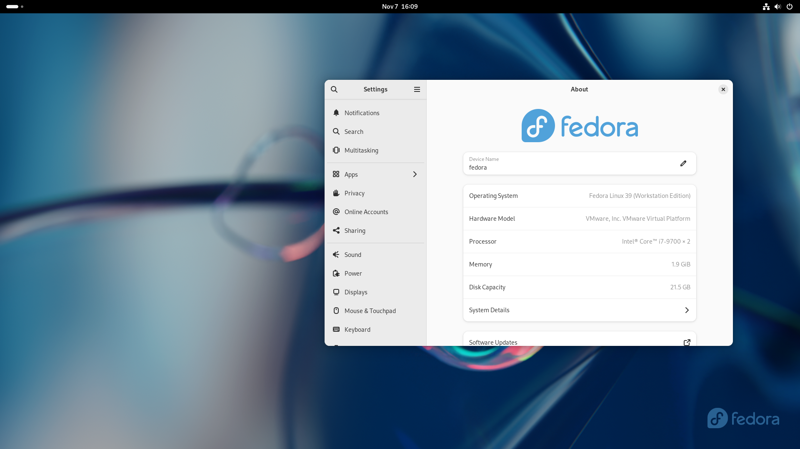
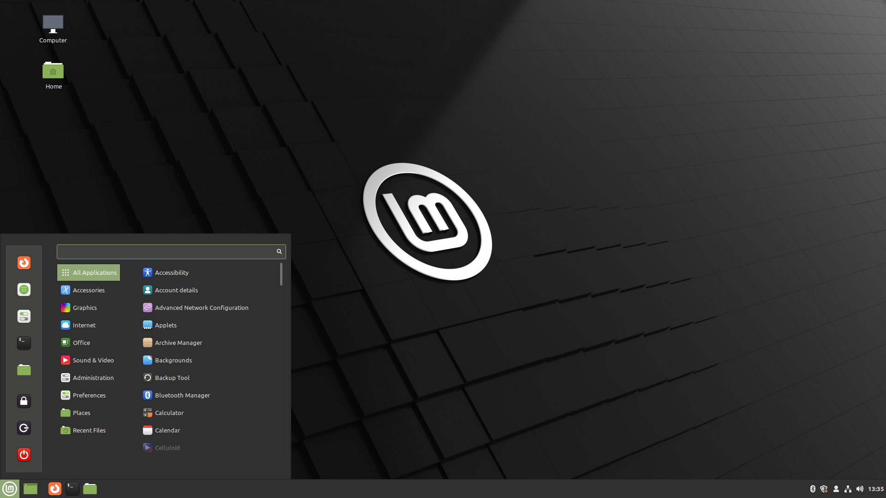
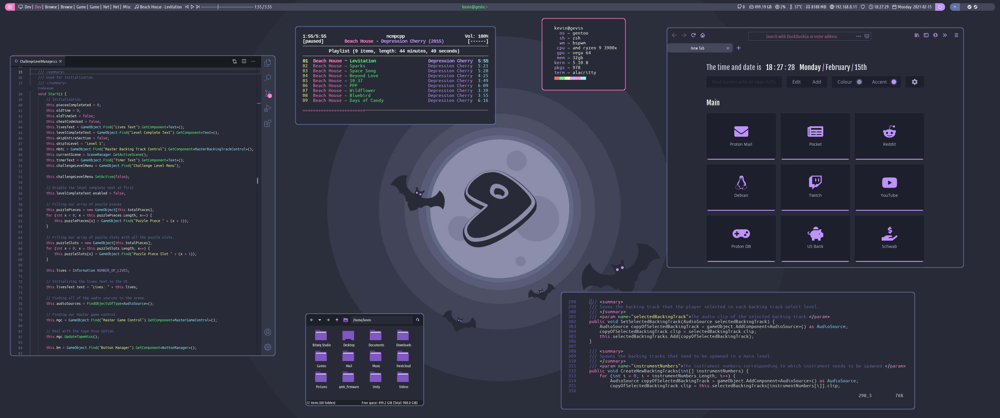
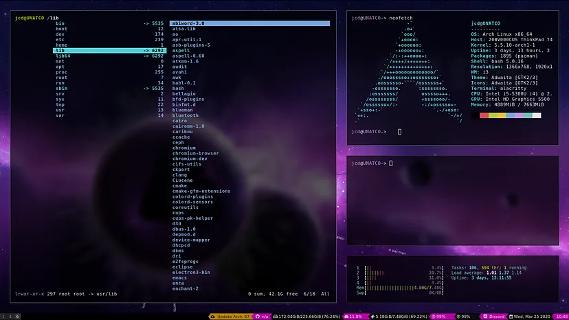
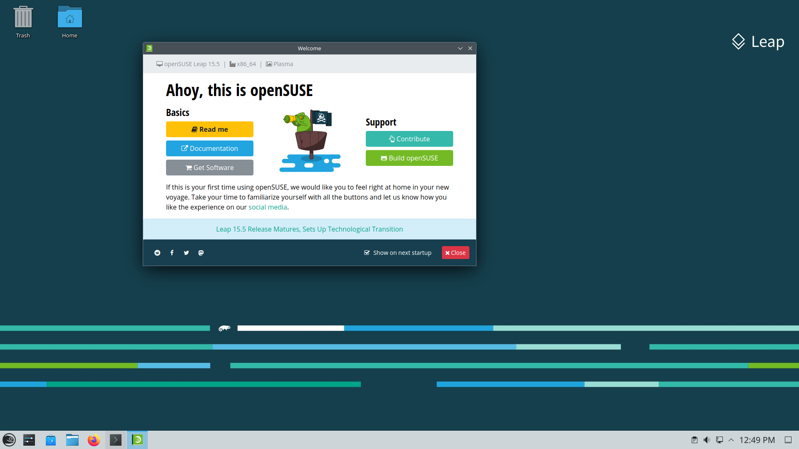

1000 dan ortiq Linux distributivlari mavjudligini bilarmidingiz? Shuncha ko‘pligidan odam qaysi birini tanlashni bilmay qoladi. Xullas, bugun biz eng keng tarqalgan 8 ta distributiv haqida so‘z yuritamiz va ular orasidan sizga mos variantni topishga harakat qilamiz. Umumiy qilib aytganda, kamida 4 GB tezkor xotira va 10 GB bo‘sh xotira yetarli bo‘ladi.

## Tezkor havolalar

1. [[#Debian]]
2. [[#Red Hat Enterprise Linux]]
3. [[#Ubuntu]]
4. [[#Fedora]]
5. [[#Linux Mint]]
6. [[#Gentoo]]
7. [[#Arch Linux]]
8. [[#OpenSUSE]]

## Debian

[Debian](https://debian.org) - bu butunlay bepul va ochiq kodli dasturlardan tashkil topgan operatsion tizim. U juda keng tanilgan va 20 yildan ortiq vaqt davomida ishlab chiqilmoqda. Siz ishlatishingiz mumkin bo'lgan uchta "branch" mavjud: stable, testing va unstable.

Stable siz uchun eng yaxshi variant hisoblanadi. Testing va unstable esa doimiy ravishda chiqariladi va ularga kafolat yo'q ya'ni tizim bilan bog'liq muommolar uchrashi mumkin. Debian eng so'nggi yangilanishlarni olmasada u juda barqaror ishlaydi. Agar siz stabillik va minimalizmni ustun ko'rsangiz, Debian siz uchun.

Debian - har qanday platformada ishlay oladigan operatsion tizim.

## Red Hat Enterprise Linux

[Red Hat Enterprise Linux](https://www.redhat.com/) o'z nomi bilan korporativ muhitda foydalanish uchun ishlab chiqilgan maxsus distributiv. U ishonchli dasturlardan iborat bo'lib, foydalanuvchi uchun to'liq funktsional tizimni taqdim etadi. 

Korporativ mahsulot bo'lgani bilan uni yuklab olish va o'rnatish mutlaqo bepul. Red Hat kompaniyasi sotadigan narsa mahsulotlari uchun texnik yordamdir. Ular sizga Linux-ni tashkilotingiz boʻylab oʻrnatishga yordam beradi, muntazam yangilanishlarni taqdim etadi va yuzaga kelgan muammolarni hal qilishga yordam beradi. Bunday operatsion tizimlar kuchli serverlar uchun mo'ljallangan.

## Ubuntu

[Ubuntu](https://ubuntu.com) Linux-ga kirishni istagan yangi foydalanuvchilar uchun tavsiya qilinadigan eng yaxshi operatsion tizimlardan biridir. Ubuntu Canonical tomonidan ishlab chiqilgan Debian-ga asoslangan operatsion tizim. Shuningdek, u Debian ilova-menejeridan foydalanadi. Ubuntu foydalanish qulayligi va qulay interfeysga egaligi bilan ajralib turadi. U juda keng tarqalgan va qulaylik nuqtai nazaridan Mac va Windows kabi tizimlarga o'xshaydi. Hullas, Ubuntu har qanday platforma, noutbuk va server uchun ajoyib tanlovdir.

## Fedora

Red Hat tomonidan qo'llab-quvvatlangan [Fedora](https://fedoraproject.org/) loyihasi hamjamiyat tomonidan boshqariladi, va u Red Hat ilova-menejeridan foydalanadi. Fedora-ni Debian o'rniga Red Hat-dan foydalanadigan Ubuntu ekvivalenti deb tasavvur qilsangiz ham bo'ladi. Fedora juda chiroyli interfeysga ega va bugungi kunda u juda barqaror va ba'zilari uni Ubuntu-dan afzal ko'rishadi. Qiziqarli fakt, **Linus Torvalds**ning o'zi ham Fedora-dan foydalanadi!

>Shuni esda tutingki, Fedora `apt` o'rniga `dnf` ilova-menejeridan foydalanadi.

## Linux Mint

[Linux Mint](https://linuxmint.com/) Ubuntu-ga asoslangan. Shunday ekan, Ubuntu-dagi ilovalar Mint-da ham mavjud. Agar siz Ubuntu-dan ko'ra yengilroq yoki Windows-ga o'xshash tizimni afzal ko'rsangiz, Linux Mint-ga bir qiziqib ko'ring. Eski noutbuklar uchun juda yaxshi variant.

## Gentoo

[Gentoo](https://www.gentoo.org/) juda ko'p personallashtirish imkoniyatlarini taklif qiladi. Gentoo o'zining ilova-menejeri Portage-dan foydalanadi. U tajribali foydalanuvchilar uchun mo'ljallangan bo'lsada Linux-ni endigina boshlayotgan va qiyinroq yo'lni bosib o'tmoqchi bo'lganlar uchun ham foydalanishlari mumkin shunchaki tajriba orttirish maqsadida.

## Arch Linux

[Arch Linux]([https://www.archlinux.org/](https://www.archlinux.org/)) - bu 100% hamjamiyat tomonidan boshqariladigan yengil va moslashuvchan distributiv. Debian-ga o'xshab, Arch rolling-release modelidan foydalanadi, shuning uchun bosqichma-bosqich yangilanishlar oxir-oqibat stabil versiyaga aylanadi. U ilova-menejeri sifatida Pacman-dan foydalanadi. Arch, yana bir bor ta'kidlab o'taman, juda ham yengil operatsion tizim bo'lib sizdagi kichik Raspberry Pi yoki Arduino-ga o'xshash qurilmalarga ham bemalol o'rnatsa bo'ladi. Tizimni nazorat qilish va uning funktsiyalarini tushunish uchun siz yuqori tajribaga ega bo'lishingiz kerak. Hullas, Arch Linux yangi foydalanuvchilar uchun tavsiya qilinmaydi.

## OpenSUSE

Debian-ga o'xshab, [openSUSE]([software.opensuse.org](https://software.opensuse.org/)) eng qadimgi distributivlardan biri, va u qulay va Windows-ga o'xshash interfeys bilan yangi foydalanuvchilar uchun yaxshi tanlovdir. OpenSUSE viruslardan xoli va unda rasm, video, musiqa yoki kodlaringiz bilan ijod qilishingiz uchun yetarlicha qulayliklar taqdim etilgan. OpenSUSE, shuningdek, RPM ilova-menejeridan foydalanadi.

## Foydali ro'liklar 

- [Linux tizimi haqida](https://youtu.be/GGupJiaOx8w?si=Ot-ltcEgrwAHtMGH)
- [Kali Linux haqida](https://youtu.be/XBj0IIOweIk?si=RGaLlenS7Ktc0WoP)