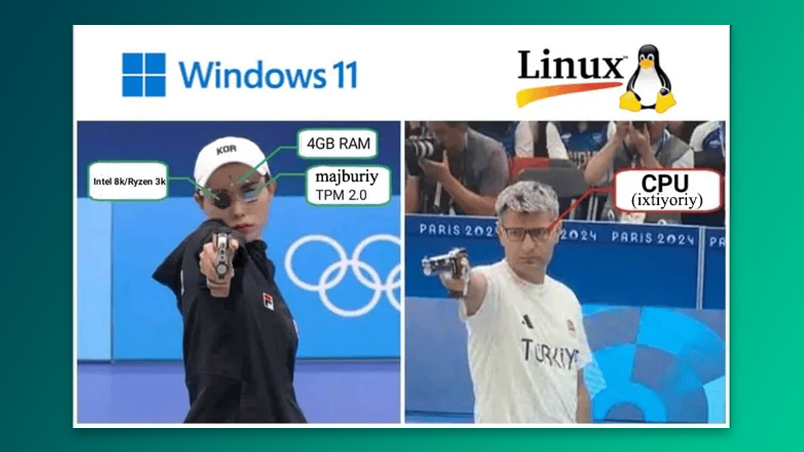
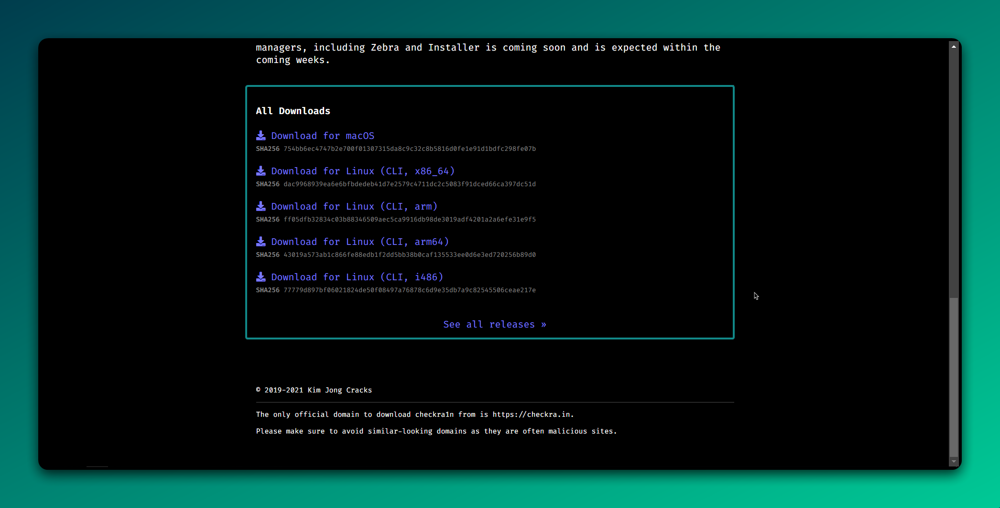

Protsessor kompyuterning “miyasi” hisoblanadi va u har xil arifmetik amallar va boshqa vazifalarni juda tez bajaradi. Kompyuter samarali ishlashi protsessorning sifatiga bog'liq. Protsessor tezligi odatda uning ustida yozilgan bo‘ladi (masalan, "2.8 GHz" yoki "2.6 GHz"). GHz (gigahertz) protsessorning tezligining o'lchash birligi. Misol uchun, agar protsessor 2.8 gigagertsli bo'lsa, u har soniyada 2.8 milliard operatsiyalarni bajaradi! Tezlik qanchalik yuqori bo‘lsa, shuncha yaxshi. Bir protsessorda 2 ta, 4 ta yoki eng ilg‘or protsessorlarda hattoki 8 tagacha yadro bo‘lishi mumkin. Yadro soni qancha ko‘p bo‘lsa, protsessor shuncha samarali ishlaydi va qizib ketmaydi.

## To'g'ri arxitekturani tanlash

Linux o‘rnatayotganingizda sizdan tizim arxitekturasini tanlash so‘raladi. To'g'ri arxitekturani tanlash apparatning barcha imkoniyatlaridan foydalanishga yordam beradi. Quyidagi ma’lumotlarga asoslanib o‘zingizga mos keladigan arxitekturani tanlashingiz mumkin:

- **macOS:** MacOS bilan ishlaydigan Apple tizimlari uchun. Unga mos protsessorlar - Apple Silicon, M1, M2 va h.k.
- **x86_64:** Zamonaviy 64-bitli kompyuterlar uchun. 
- **ARM/ARM64:** Raspberry Pi, telefonlar yoki ba'zi serverlar uchun. Snapdragon, Mediatek va Exynos protsessorlari ARM arxitekturasi bilan ishlaydi.
- **aarch64** (Arm Architecture x64): ARM 64-bitli protsessor arxitekturasini anglatadi. Bu arxitektura energiya samaradorligi va tezkor ishlash uchun mo‘ljallangan bo‘lib, asosan mobil qurilmalar (smartfonlar va planshetlar), o‘rnatilgan tizimlar hamda tobora ko‘proq serverlarda qo‘llanilmoqda.
- **ARMv7** - ARM (Advanced RISC Machine). U eski smartfonlarda keng qo'llanilgan 32-bitli arxitektura. Uning otasi *ARMv8* (bu AArch32 va AArch64ni o'z ichiga oladi) ya'ni 64-bitlik vazifalarni bajara oladi.
- **i486** (Intel 4-avlod x86): Eski 32-bitli kompyuterlarga mo'ljallangan. Shunga o'xshash boshqa nomlar - i386, i686.
- **AMD64:** Intel bilan bir xil (x86_64)

>Kompyuteringiz qaysi protsessorda ishlayotganini bilish uchun `lscpu` (list cpu) buyrug‘ini kiriting.

## Xulosa

Kompyuter xarid qilayotganingizda tizim arxitekturasi va protsessor xususiyatlariga e’tibor qarating:

1. **Dasturiy ta'minot bilan kelishuvchan**: Turli arxitekturalar ilovalarning moslashuviga ta’sir ko‘rsatishi mumkin. Muammolarning oldini olish uchun, siz foydalanmoqchi bo‘lgan dasturiy ta’minotning o‘zingiz tanlagan arxitekturani qo‘llab-quvvatlashiga ishonch hosil qiling. 

2. **Tezlik va quvvat samaradorligi**: Yuqori gigagertsli protsessorlar odatda yaxshiroq ishlaydi, ammo ko‘proq quvvat sarflaydi va ko‘proq issiqlik chiqaradi. 

3. **Virtualizatsiyani qo'llab-quvvatlash**: Ba’zi protsessorlar virtualizatsiya xususiyatlarini taqdim etadi. Agar siz virtual mashinalarni ishga tushirishni hoxlasangiz, virtualizatsiya xususiyati bo'lishi shart!

4. **Xarajatlarni hisobga olish**: Yuqori gigagertsli protsessorlar va ilg‘or arxitektura qimmatroq bo‘lishi mumkin. Ammo sun’iy intellekt yoki deep-fake bilan shug‘ullanmayotgan bo‘lsangiz, Linux uchun arzonroq va oddiyroq protsessor ham yetarli bo‘ladi.

