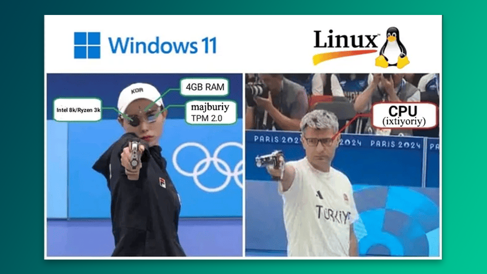

Protsessor kompyuterning "miyasi" bo‘lib, u arifmetik amallar va boshqa vazifalarni juda tez bajaradi. Kompyuterning ishlashi protsessor sifatiga bog‘liq. Protsessor tezligi, masalan "2.8 GHz" kabi, ustida yozilgan bo‘ladi. Bu qiymat protsessor bir soniyada qancha operatsiya bajarishini bildiradi: 2.8 GHz esa 2.8 milliard operatsiya degani. Tezlik qanchalik yuqori bo‘lsa, protsessor shuncha tez ishlaydi. Protsessorlarda odatda 2, 4 yoki 8 ta yadro bo‘lishi mumkin. Ko‘proq yadro protsessorning samaradorligini oshiradi va uni qizib ketishdan saqlaydi.

## To'g'ri arxitekturani tanlash

Linux o‘rnatayotganingizda sizdan tizim arxitekturasini tanlash so‘raladi. To'g'ri arxitekturani tanlash apparatning barcha imkoniyatlaridan foydalanishga yordam beradi. Quyidagi ma’lumotlarga asoslanib o‘zingizga mos keladigan arxitekturani tanlashingiz mumkin:

| **Arxitektura** | **Izoh**                                                                                                                                                           |
| --------------- | ------------------------------------------------------------------------------------------------------------------------------------------------------------------ |
| **macOS**       | Apple tizimlari uchun. Mos protsessorlar: Apple Silicon, M1, M2 va boshqalar.                                                                                      |
| **x86_64**      | Zamonaviy 64-bitli kompyuterlar uchun umumiy arxitektura.                                                                                                          |
| **ARM/ARM64**   | Raspberry Pi, telefonlar yoki ba'zi serverlar uchun. Snapdragon, Mediatek va Exynos protsessorlari bu arxitekturaga asoslangan.                                    |
| **aarch64**     | ARM 64-bitli arxitekturasi. Asosan mobil qurilmalar, o‘rnatilgan tizimlar va tobora ko‘proq serverlarda qo‘llaniladi. Energiya samaradorligi bilan ajralib turadi. |
| **ARMv7**       | Eski 32-bitli ARM arxitekturasi. Ko‘pincha eski smartfonlarda ishlatilgan. Yangi versiyasi *ARMv8* esa 64-bitlik imkoniyatlarni ham qo‘llab-quvvatlaydi.           |
| **i486**        | Intelning 4-avlod x86 arxitekturasi. Eski 32-bitli kompyuterlar uchun mo‘ljallangan (i386, i686 kabi nomlar ham ishlatiladi).                                      |
| **AMD64**       | Intelning x86_64 bilan bir xil 64-bitli arxitekturasi.                                                                                                             |

>Kompyuteringiz qaysi protsessorda ishlayotganini bilish uchun `lscpu` (list cpu) buyrug‘ini yozing.

## Xulosa

Kompyuter xarid qilayotganda tizim arxitekturasi va protsessor xususiyatlariga e’tibor bering:

1. **Moslik**: Tanlagan arxitektura ishlatmoqchi bo‘lgan dasturlarni qo‘llab-quvvatlashini tekshiring. Har xil arxitekturalar ilovalar bilan muammolar keltirib chiqarishi mumkin.

2. **Tezlik va samaradorlik**: Yuqori gigagertsli protsessorlar tezroq ishlaydi, lekin ko‘proq energiya iste’mol qiladi va ko‘proq qiziydi.

3. **Virtualizatsiya**: Virtual mashinalar ishlatmoqchi bo‘lsangiz, protsessor virtualizatsiya imkoniyatiga ega ekanligini tekshiring.

4. **Narx va ehtiyoj**: Yuqori tezlik va ilg‘or arxitektura qimmat. Ammo sun’iy intellekt yoki deep-fake bilan shug‘ullanmayotgan bo‘lsangiz, Linux uchun arzonroq va oddiyroq protsessor ham yetarli bo‘ladi.
